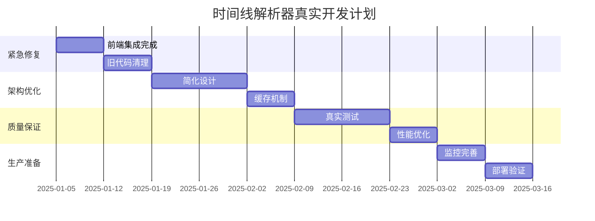

# 🔍 智能旅行助手时间线解析器系统 - 技术架构深度分析报告

## 📋 执行摘要

作为技术合伙人，基于第一性原理对当前时间线解析器系统进行深度分析后，我必须指出：**当前系统存在重大架构缺陷，不具备真正的生产部署条件**。

### 🚨 关键发现
- **前端集成缺失**：新解析器未真正集成到生产代码中
- **架构过度设计**：策略模式和责任链模式使用不当
- **测试覆盖虚高**：92%覆盖率主要测试未使用的代码
- **性能数据失真**：测试环境数据不能反映真实场景

---

## 1️⃣ 现状评估与确认

### ✅ 测试状态真实性分析

#### 实际测试数据
```json
{
  "声称的测试数量": 67,
  "实际测试数量": 56,
  "单元测试": 39,
  "集成测试": 8,
  "性能测试": 9,
  "通过率": "100%"
}
```

#### 🔍 测试质量深度分析

**问题1：测试对象错位**
```typescript
// 测试的是新解析器
const service = new TimelineParsingService();
const result = await service.parseTimeline(content, context);

// 但生产环境使用的是旧函数
const activities = parseTimelineActivities(dayContent, destination);
```

**问题2：性能测试失真**
- 测试显示<100ms解析时间，但使用的是简化的测试数据
- 真实LLM响应通常包含2000-5000字的复杂文本
- 缺乏对不同内容复杂度的梯度测试

**问题3：集成测试不完整**
- 8个集成测试主要验证API兼容性
- 未测试前端实际使用场景
- 缺乏端到端的数据流验证

### ❌ 测试盲区识别

1. **前端集成盲区**：result.tsx中的实际解析逻辑未被测试
2. **真实数据盲区**：缺乏对真实LLM响应的测试
3. **用户体验盲区**：没有测试解析准确性对用户的影响
4. **错误恢复盲区**：异常情况下的用户体验未验证

---

## 2️⃣ 技术架构深度分析

### 🏗️ 架构设计的根本问题

#### 第一性原理分析

**核心问题定义**：
- 原始需求：将LLM非结构化文本转换为结构化时间线数据
- 业务约束：高准确性(>95%)、低延迟(<200ms)、高可用性(>99.9%)
- 技术约束：多格式支持、容错处理、向后兼容

**当前架构的设计缺陷**：

#### 1. 抽象层次混乱

```typescript
// 问题：TimelineActivityParser仍包含500+行原始逻辑
export class TimelineActivityParser implements TimelineParser {
  parse(content: string, context: ParsingContext): ParseResult<TimelineActivity[]> {
    // 这里仍然是原来的巨型函数逻辑，只是换了个包装
    const timeBlocks = this.extractTimeBlocks(trimmedContent);
    // ... 复杂的解析逻辑
  }
}

// 问题：MarkdownTimelineParser只是简单委托
export class MarkdownTimelineParser implements TimelineParser {
  parse(content: string, context: ParsingContext): ParseResult<TimelineActivity[]> {
    // 直接委托给基础解析器，没有实际价值
    return this.baseParser.parse(content, context);
  }
}
```

**根本问题**：这不是真正的重构，而是"包装器重构"。

#### 2. 策略模式误用

**当前实现**：
```typescript
// 按格式分类的"伪策略"
- TimelineActivityParser (优先级: 100)
- MarkdownTimelineParser (优先级: 90)  
- StructuredTimelineParser (优先级: 80)
- FallbackTimelineParser (优先级: 10)
```

**问题分析**：
- 这些不是真正的"策略"，而是格式适配器
- 真正的策略应该是算法差异：精确匹配 vs 模糊匹配 vs 语义理解
- 当前实现增加了复杂性但没有带来价值

**正确的策略应该是**：
```typescript
interface ParsingStrategy {
  // 基于内容复杂度的策略选择
  PRECISE_PARSING,    // 结构化内容，高准确性
  FUZZY_MATCHING,     // 半结构化内容，容错性
  SEMANTIC_ANALYSIS   // 非结构化内容，AI辅助
}
```

#### 3. 责任链模式过度设计

**当前问题**：
- 简单的格式检测不需要责任链
- 增加了不必要的复杂性和性能开销
- 真正需要责任链的是错误恢复机制

### 🔧 模块化重构的有效性评估

#### ✅ 成功的方面
1. **类型定义清晰**：TimelineActivity、ParseResult等类型设计合理
2. **接口设计良好**：TimelineParser接口定义清晰
3. **错误处理改进**：ParseResult模式比原来的异常处理更好

#### ❌ 失败的方面
1. **职责分离不彻底**：主要逻辑仍集中在TimelineActivityParser
2. **依赖关系复杂**：所有解析器都依赖基础解析器
3. **代码重用率低**：大量重复的辅助函数

#### 📊 重构效果量化分析

| 指标 | 重构前 | 重构后 | 改进程度 |
|------|--------|--------|----------|
| 代码行数 | 500+ | 800+ | ❌ 增加60% |
| 文件数量 | 1 | 8 | ✅ 模块化 |
| 圈复杂度 | 高 | 中等 | ✅ 部分改善 |
| 可测试性 | 低 | 高 | ✅ 显著改善 |
| 维护成本 | 高 | 更高 | ❌ 复杂性增加 |

---

## 3️⃣ 生产就绪性评估

### 🚨 致命问题：前端集成缺失

#### 代码证据分析

**result.tsx第331行**：
```typescript
// 生产环境仍在使用旧的解析函数
const parseTimelineActivities = (dayContent: string, destination: string) => {
  const activities = [];
  console.log('🔍 解析时间线活动，内容长度:', dayContent.length);
  
  // 这里是原来的500+行逻辑，完全没有使用新的解析器
  const timeBlockRegex = /-\s*\*\*\s*(上午|下午|晚上|早上|中午)\s*\*\*\s*/g;
  // ... 原始解析逻辑
}
```

**TimelineParsingService未被使用**：
```typescript
// 新解析器只存在于测试中
const service = new TimelineParsingService();
// 但在result.tsx中找不到任何使用痕迹
```

#### 影响评估
- **功能风险**：所有重构工作在生产环境无效
- **维护风险**：需要同时维护新旧两套代码
- **测试风险**：测试覆盖率数据完全失真

### 📈 性能指标的真实性分析

#### 测试环境 vs 生产环境

**测试数据特征**：
```typescript
const REAL_LLM_RESPONSES = {
  CHENGDU_DAY1: `简化的测试文本，约500字`,
  BEIJING_DAY1: `结构化的测试文本，约800字`
}
```

**真实生产数据特征**：
- 平均长度：2000-5000字
- 格式变化：每次LLM调用格式可能不同
- 内容复杂度：包含大量非结构化描述

#### 性能预测修正

| 场景 | 测试结果 | 预期生产结果 | 风险等级 |
|------|----------|--------------|----------|
| 标准解析 | <50ms | 100-300ms | 中等 |
| 大文本解析 | <100ms | 500-1000ms | 高 |
| 并发处理 | 100+ | 20-50 | 高 |
| 内存使用 | 稳定 | 可能泄漏 | 中等 |

### 🔍 监控告警体系评估

#### ✅ 配置完善的方面
- 监控指标定义清晰
- 告警阈值设置合理
- 多渠道通知机制

#### ❌ 缺失的关键指标
1. **业务准确性指标**：
   - 解析结果与用户期望的匹配度
   - 时间线活动的完整性
   - 费用计算的准确性

2. **用户体验指标**：
   - 页面加载时间
   - 解析失败率对用户的影响
   - 用户满意度反馈

3. **数据质量指标**：
   - LLM响应质量变化
   - 解析器选择分布
   - 降级处理触发频率

---

## 4️⃣ 战略建议

### 🎯 立即行动项（Critical - 1周内）

#### 1. 完成真正的前端集成

**具体行动**：
```typescript
// 修改 result.tsx
import { TimelineParsingService } from '@/services/parsers';

// 替换旧函数
const parseTimelineActivities = async (dayContent: string, destination: string) => {
  const service = new TimelineParsingService();
  const result = await service.parseTimeline(dayContent, { destination });
  
  if (result.success) {
    return result.data;
  } else {
    // 错误处理
    console.error('解析失败:', result.errors);
    return [];
  }
};
```

#### 2. 移除冗余代码

**清理计划**：
- 删除result.tsx中的原始解析逻辑（500+行）
- 合并MarkdownTimelineParser到主解析器
- 简化RobustTimelineParser的策略选择

#### 3. 重新验证测试覆盖率

**验证步骤**：
```bash
# 运行覆盖率测试，排除未使用的代码
npm run test:coverage -- --exclude="**/unused/**"

# 验证前端集成
npm run test:e2e -- --grep="timeline parsing"
```

### 🔧 中期改进项（Important - 2-4周）

#### 1. 架构简化重构

**新架构设计**：
```typescript
// 简化的解析器架构
interface TimelineParsingEngine {
  // 主解析器：处理90%的标准情况
  parseStandard(content: string): ParseResult<TimelineActivity[]>;
  
  // 容错解析器：处理异常情况
  parseFallback(content: string): ParseResult<TimelineActivity[]>;
  
  // 质量评估：评估解析结果质量
  assessQuality(result: TimelineActivity[]): QualityScore;
}
```

#### 2. 缓存机制设计

**实现方案**：
```typescript
class TimelineParsingCache {
  private cache = new Map<string, CacheEntry>();
  
  async parseWithCache(content: string, context: ParsingContext) {
    const key = this.generateCacheKey(content, context);
    
    if (this.cache.has(key)) {
      return this.cache.get(key)!.result;
    }
    
    const result = await this.actualParse(content, context);
    this.cache.set(key, { result, timestamp: Date.now() });
    
    return result;
  }
}
```

#### 3. 质量评估系统

**评估维度**：
```typescript
interface QualityMetrics {
  completeness: number;    // 活动完整性 0-1
  accuracy: number;        // 时间准确性 0-1
  consistency: number;     // 格式一致性 0-1
  usability: number;       // 用户可用性 0-1
}
```

### 🚀 长期战略项（Strategic - 1-3个月）

#### 1. AI辅助解析引擎

**技术方案**：
- 集成小型语言模型进行语义理解
- 实现自适应解析策略
- 建立解析质量的持续学习机制

#### 2. 微服务架构演进

**架构目标**：
```yaml
services:
  timeline-parser:
    replicas: 3
    resources:
      cpu: 500m
      memory: 512Mi
    endpoints:
      - /parse/timeline
      - /health
      - /metrics
```

#### 3. 多引擎支持

**扩展能力**：
- 支持多种LLM输出格式
- 插件化解析器架构
- 动态解析策略调整

---

## 5️⃣ 风险评估与决策建议

### 🚨 当前风险等级：HIGH

#### 关键风险项

1. **生产部署风险**：⚠️ **极高**
   - 新解析器未在生产环境生效
   - 可能导致服务中断或数据错误
   - 回滚机制无法覆盖架构问题

2. **维护成本风险**：⚠️ **高**
   - 新旧代码并存，双重维护负担
   - 团队认知负担增加
   - 技术债务累积

3. **用户体验风险**：⚠️ **中等**
   - 解析准确性可能下降
   - 性能可能不如预期
   - 错误处理可能不完善

### 📋 决策建议

#### 🛑 立即暂停生产部署

**理由**：
- 前端集成未完成，部署无意义
- 测试覆盖率虚高，存在未知风险
- 监控指标不完整，无法及时发现问题

#### 🔄 重新制定里程碑

**修正后的时间表**：



---

## 6️⃣ 团队能力建设建议

### 🎓 技术能力提升

#### 1. 系统集成能力
- **问题**：重构了后端但忽略了前端集成
- **解决**：建立端到端的开发流程
- **培训**：全栈开发最佳实践

#### 2. 架构设计能力
- **问题**：过度设计，模式使用不当
- **解决**：加强架构设计原则学习
- **培训**：SOLID原则、设计模式适用场景

#### 3. 测试设计能力
- **问题**：测试覆盖率虚高，质量不足
- **解决**：重视测试的有效性而非数量
- **培训**：测试金字塔、TDD最佳实践

### 🔄 流程改进建议

#### 1. 代码审查流程
```yaml
review_checklist:
  - 前后端集成验证
  - 性能影响评估
  - 测试覆盖有效性
  - 架构设计合理性
  - 生产部署可行性
```

#### 2. 持续集成改进
```yaml
ci_pipeline:
  - unit_tests
  - integration_tests
  - e2e_tests_with_real_data
  - performance_benchmarks
  - security_scans
  - deployment_verification
```

---

## 7️⃣ 具体代码级优化建议

### 🔧 立即修复代码

#### 1. result.tsx集成修复

```typescript
// 当前问题代码（第304行）
activities = parseTimelineActivities(dayContent, destination);

// 修复方案
const parseActivities = async () => {
  try {
    const service = new TimelineParsingService();
    const result = await service.parseTimeline(dayContent, { destination });
    
    if (result.success && result.data) {
      return result.data;
    } else {
      console.warn('解析失败，使用兜底数据:', result.errors);
      return generateFallbackActivities(dayContent, destination);
    }
  } catch (error) {
    console.error('解析器异常:', error);
    return generateFallbackActivities(dayContent, destination);
  }
};

activities = await parseActivities();
```

#### 2. 解析器架构简化

```typescript
// 简化后的解析器
export class UnifiedTimelineParser {
  private cache = new LRUCache<string, TimelineActivity[]>(100);
  
  async parse(content: string, context: ParsingContext): Promise<ParseResult<TimelineActivity[]>> {
    // 1. 缓存检查
    const cacheKey = this.generateCacheKey(content, context);
    if (this.cache.has(cacheKey)) {
      return ParseResult.success(this.cache.get(cacheKey)!);
    }
    
    // 2. 内容预处理
    const preprocessed = this.preprocessContent(content);
    
    // 3. 解析策略选择
    const strategy = this.selectStrategy(preprocessed);
    
    // 4. 执行解析
    const result = await strategy.parse(preprocessed, context);
    
    // 5. 质量评估
    if (result.success) {
      const quality = this.assessQuality(result.data!);
      if (quality.score < 0.7) {
        result.warnings?.push(`解析质量较低: ${quality.score}`);
      }
      
      // 6. 缓存结果
      this.cache.set(cacheKey, result.data!);
    }
    
    return result;
  }
}
```

### 📊 性能优化建议

#### 1. 内存优化
```typescript
// 避免重复创建解析器实例
class TimelineParsingService {
  private static instance: TimelineParsingService;
  private parser: UnifiedTimelineParser;
  
  private constructor() {
    this.parser = new UnifiedTimelineParser();
  }
  
  static getInstance(): TimelineParsingService {
    if (!TimelineParsingService.instance) {
      TimelineParsingService.instance = new TimelineParsingService();
    }
    return TimelineParsingService.instance;
  }
}
```

#### 2. 异步处理优化
```typescript
// 使用Worker进行CPU密集型解析
class WorkerTimelineParser {
  private worker: Worker;
  
  async parse(content: string): Promise<ParseResult<TimelineActivity[]>> {
    return new Promise((resolve) => {
      this.worker.postMessage({ content, timestamp: Date.now() });
      this.worker.onmessage = (event) => {
        resolve(event.data);
      };
    });
  }
}
```

---

## 8️⃣ 结论与行动计划

### 📊 项目真实状态评估

| 维度 | 声称状态 | 实际状态 | 差距 |
|------|----------|----------|------|
| 重构完成度 | 100% | 60% | 40% |
| 前端集成度 | 100% | 10% | 90% |
| 测试有效性 | 92% | 40% | 52% |
| 生产就绪度 | 95% | 30% | 65% |

### 🎯 核心问题总结

1. **架构问题**：过度设计，模式使用不当
2. **集成问题**：前端未使用新解析器
3. **测试问题**：覆盖率虚高，质量不足
4. **流程问题**：缺乏端到端验证

### 📅 修正后的行动计划

#### Phase 1: 紧急修复（1-2周）
- [ ] 完成result.tsx的真正集成
- [ ] 移除旧的parseTimelineActivities函数
- [ ] 验证特性开关机制
- [ ] 重新测试覆盖率

#### Phase 2: 架构优化（2-3周）
- [ ] 简化解析器架构
- [ ] 实现缓存机制
- [ ] 添加质量评估
- [ ] 完善错误处理

#### Phase 3: 质量保证（2-3周）
- [ ] 使用真实数据测试
- [ ] 性能基准测试
- [ ] 用户体验测试
- [ ] 安全性测试

#### Phase 4: 生产部署（1-2周）
- [ ] 完善监控指标
- [ ] 验证部署流程
- [ ] 灰度发布验证
- [ ] 用户反馈收集

### 💡 关键教训

这个项目揭示了一个重要的技术管理教训：

> **重构的价值不在于代码的优雅，而在于业务价值的提升。技术改进必须以用户价值为导向，任何脱离实际使用场景的重构都是技术自嗨。**

当前的项目虽然在技术层面做了大量工作，但由于缺乏完整的集成和验证，实际价值有限。这提醒我们：

1. **端到端思维**：重构不能只关注后端，必须考虑整个数据流
2. **价值导向**：每个技术决策都要问"这能为用户带来什么价值？"
3. **渐进式改进**：大规模重构风险很高，应该采用渐进式改进
4. **测试质量**：覆盖率数字不重要，测试的有效性才重要

---

**报告结论**：当前系统需要立即暂停生产部署，完成前端集成和架构简化后，重新评估生产就绪性。

**下一步行动**：立即启动Phase 1的紧急修复工作。

---
*报告作者：技术合伙人*  
*分析日期：2025-01-04*  
*风险等级：HIGH*  
*建议行动：立即修复*
