# CI/CD流水线架构设计

**项目**: 智游助手v6.2  
**版本**: v6.2.0  
**模块**: CI/CD流水线  
**设计日期**: 2025年8月6日  

---

## 🚀 **CI/CD流水线架构**

### **整体流水线设计**

```mermaid
graph LR
    subgraph "代码管理"
        Dev[开发者]
        GitHub[GitHub仓库]
        PR[Pull Request]
    end
    
    subgraph "持续集成 (CI)"
        Trigger[触发器]
        Build[构建]
        Test[测试]
        Security[安全扫描]
        Quality[质量检查]
    end
    
    subgraph "制品管理"
        Registry[容器仓库]
        Artifacts[制品存储]
    end
    
    subgraph "持续部署 (CD)"
        Deploy[部署]
        Staging[预生产环境]
        Approval[人工审批]
        Production[生产环境]
    end
    
    subgraph "监控反馈"
        Monitor[监控]
        Alert[告警]
        Rollback[回滚]
    end
    
    Dev --> GitHub
    GitHub --> PR
    PR --> Trigger
    Trigger --> Build
    Build --> Test
    Test --> Security
    Security --> Quality
    Quality --> Registry
    Registry --> Deploy
    Deploy --> Staging
    Staging --> Approval
    Approval --> Production
    Production --> Monitor
    Monitor --> Alert
    Alert --> Rollback
```



### **GitHub Actions工作流配置**

#### 主工作流 (.github/workflows/main.yml)
```yaml
name: Smart Travel v6.2 CI/CD Pipeline

on:
  push:
    branches: [ main, develop, phase3a-* ]
  pull_request:
    branches: [ main, develop ]

env:
  NODE_VERSION: '18.x'
  DOCKER_REGISTRY: ghcr.io
  IMAGE_NAME: smart-travel/smart-travel-assistant

jobs:
  # 代码质量检查
  code-quality:
    runs-on: ubuntu-latest
    steps:
      - name: Checkout code
        uses: actions/checkout@v4
        
      - name: Setup Node.js
        uses: actions/setup-node@v4
        with:
          node-version: ${{ env.NODE_VERSION }}
          cache: 'npm'
          
      - name: Install dependencies
        run: npm ci
        
      - name: Lint check
        run: npm run lint
        
      - name: Type check
        run: npm run type-check
        
      - name: Format check
        run: npm run format:check

  # 单元测试
  unit-tests:
    runs-on: ubuntu-latest
    needs: code-quality
    steps:
      - name: Checkout code
        uses: actions/checkout@v4
        
      - name: Setup Node.js
        uses: actions/setup-node@v4
        with:
          node-version: ${{ env.NODE_VERSION }}
          cache: 'npm'
          
      - name: Install dependencies
        run: npm ci
        
      - name: Run unit tests
        run: npm run test:unit -- --coverage
        
      - name: Upload coverage to Codecov
        uses: codecov/codecov-action@v3
        with:
          file: ./coverage/lcov.info

  # 集成测试
  integration-tests:
    runs-on: ubuntu-latest
    needs: unit-tests
    services:
      mysql:
        image: mysql:8.0
        env:
          MYSQL_ROOT_PASSWORD: test_password
          MYSQL_DATABASE: smart_travel_test
        options: >-
          --health-cmd="mysqladmin ping"
          --health-interval=10s
          --health-timeout=5s
          --health-retries=3
      redis:
        image: redis:7-alpine
        options: >-
          --health-cmd="redis-cli ping"
          --health-interval=10s
          --health-timeout=5s
          --health-retries=3
    steps:
      - name: Checkout code
        uses: actions/checkout@v4
        
      - name: Setup Node.js
        uses: actions/setup-node@v4
        with:
          node-version: ${{ env.NODE_VERSION }}
          cache: 'npm'
          
      - name: Install dependencies
        run: npm ci
        
      - name: Run database migrations
        run: npm run db:migrate:test
        env:
          DB_HOST: localhost
          DB_PORT: 3306
          DB_USERNAME: root
          DB_PASSWORD: test_password
          DB_DATABASE: smart_travel_test
          
      - name: Run integration tests
        run: npm run test:integration
        env:
          DB_HOST: localhost
          DB_PORT: 3306
          DB_USERNAME: root
          DB_PASSWORD: test_password
          DB_DATABASE: smart_travel_test
          REDIS_HOST: localhost
          REDIS_PORT: 6379

  # 安全扫描
  security-scan:
    runs-on: ubuntu-latest
    needs: code-quality
    steps:
      - name: Checkout code
        uses: actions/checkout@v4
        
      - name: Run Snyk security scan
        uses: snyk/actions/node@master
        env:
          SNYK_TOKEN: ${{ secrets.SNYK_TOKEN }}
        with:
          args: --severity-threshold=high
          
      - name: Run CodeQL analysis
        uses: github/codeql-action/init@v2
        with:
          languages: typescript, javascript
          
      - name: Perform CodeQL analysis
        uses: github/codeql-action/analyze@v2
        
      - name: Run OWASP ZAP security scan
        uses: zaproxy/action-full-scan@v0.4.0
        with:
          target: 'http://localhost:3000'

  # 构建Docker镜像
  build-image:
    runs-on: ubuntu-latest
    needs: [unit-tests, integration-tests, security-scan]
    if: github.event_name == 'push'
    outputs:
      image-tag: ${{ steps.meta.outputs.tags }}
      image-digest: ${{ steps.build.outputs.digest }}
    steps:
      - name: Checkout code
        uses: actions/checkout@v4
        
      - name: Set up Docker Buildx
        uses: docker/setup-buildx-action@v3
        
      - name: Login to Container Registry
        uses: docker/login-action@v3
        with:
          registry: ${{ env.DOCKER_REGISTRY }}
          username: ${{ github.actor }}
          password: ${{ secrets.GITHUB_TOKEN }}
          
      - name: Extract metadata
        id: meta
        uses: docker/metadata-action@v5
        with:
          images: ${{ env.DOCKER_REGISTRY }}/${{ env.IMAGE_NAME }}
          tags: |
            type=ref,event=branch
            type=ref,event=pr
            type=sha,prefix={{branch}}-
            type=raw,value=latest,enable={{is_default_branch}}
            
      - name: Build and push Docker image
        id: build
        uses: docker/build-push-action@v5
        with:
          context: .
          push: true
          tags: ${{ steps.meta.outputs.tags }}
          labels: ${{ steps.meta.outputs.labels }}
          cache-from: type=gha
          cache-to: type=gha,mode=max

  # 部署到预生产环境
  deploy-staging:
    runs-on: ubuntu-latest
    needs: build-image
    if: github.ref == 'refs/heads/develop'
    environment: staging
    steps:
      - name: Deploy to staging
        run: |
          echo "Deploying to staging environment"
          # 这里添加实际的部署脚本
          
      - name: Run smoke tests
        run: |
          echo "Running smoke tests"
          # 这里添加冒烟测试脚本
          
      - name: Notify deployment
        uses: 8398a7/action-slack@v3
        with:
          status: ${{ job.status }}
          channel: '#deployments'
          webhook_url: ${{ secrets.SLACK_WEBHOOK }}

  # 部署到生产环境
  deploy-production:
    runs-on: ubuntu-latest
    needs: build-image
    if: github.ref == 'refs/heads/main'
    environment: production
    steps:
      - name: Deploy to production
        run: |
          echo "Deploying to production environment"
          # 这里添加实际的部署脚本
          
      - name: Run health checks
        run: |
          echo "Running health checks"
          # 这里添加健康检查脚本
          
      - name: Notify deployment
        uses: 8398a7/action-slack@v3
        with:
          status: ${{ job.status }}
          channel: '#deployments'
          webhook_url: ${{ secrets.SLACK_WEBHOOK }}
```

#### 性能测试工作流 (.github/workflows/performance.yml)
```yaml
name: Performance Testing

on:
  schedule:
    - cron: '0 2 * * *'  # 每天凌晨2点运行
  workflow_dispatch:

jobs:
  performance-test:
    runs-on: ubuntu-latest
    steps:
      - name: Checkout code
        uses: actions/checkout@v4
        
      - name: Setup JMeter
        run: |
          wget https://archive.apache.org/dist/jmeter/binaries/apache-jmeter-5.5.tgz
          tar -xzf apache-jmeter-5.5.tgz
          
      - name: Run performance tests
        run: |
          ./apache-jmeter-5.5/bin/jmeter -n -t tests/performance/load-test.jmx -l results.jtl
          
      - name: Generate performance report
        run: |
          ./apache-jmeter-5.5/bin/jmeter -g results.jtl -o performance-report/
          
      - name: Upload performance report
        uses: actions/upload-artifact@v3
        with:
          name: performance-report
          path: performance-report/
```

### **Docker配置**

#### Dockerfile
```dockerfile
# 多阶段构建
FROM node:18-alpine AS builder

WORKDIR /app

# 复制依赖文件
COPY package*.json ./
COPY tsconfig*.json ./

# 安装依赖
RUN npm ci --only=production && npm cache clean --force

# 复制源代码
COPY src/ ./src/

# 构建应用
RUN npm run build

# 生产镜像
FROM node:18-alpine AS production

# 创建非root用户
RUN addgroup -g 1001 -S nodejs
RUN adduser -S nextjs -u 1001

WORKDIR /app

# 复制构建产物
COPY --from=builder --chown=nextjs:nodejs /app/dist ./dist
COPY --from=builder --chown=nextjs:nodejs /app/node_modules ./node_modules
COPY --from=builder --chown=nextjs:nodejs /app/package.json ./package.json

# 健康检查
HEALTHCHECK --interval=30s --timeout=3s --start-period=5s --retries=3 \
  CMD curl -f http://localhost:3000/health || exit 1

# 切换到非root用户
USER nextjs

# 暴露端口
EXPOSE 3000

# 启动应用
CMD ["npm", "start"]
```

#### docker-compose.yml (开发环境)
```yaml
version: '3.8'

services:
  app:
    build:
      context: .
      target: development
    ports:
      - "3000:3000"
    environment:
      - NODE_ENV=development
      - DB_HOST=mysql
      - REDIS_HOST=redis
    volumes:
      - .:/app
      - /app/node_modules
    depends_on:
      - mysql
      - redis
    networks:
      - smart-travel-network

  mysql:
    image: mysql:8.0
    environment:
      MYSQL_ROOT_PASSWORD: dev_password
      MYSQL_DATABASE: smart_travel_dev
    ports:
      - "3306:3306"
    volumes:
      - mysql_data:/var/lib/mysql
    networks:
      - smart-travel-network

  redis:
    image: redis:7-alpine
    ports:
      - "6379:6379"
    volumes:
      - redis_data:/data
    networks:
      - smart-travel-network

  prometheus:
    image: prom/prometheus:latest
    ports:
      - "9090:9090"
    volumes:
      - ./monitoring/prometheus.yml:/etc/prometheus/prometheus.yml
    networks:
      - smart-travel-network

  grafana:
    image: grafana/grafana:latest
    ports:
      - "3001:3000"
    environment:
      - GF_SECURITY_ADMIN_PASSWORD=admin
    volumes:
      - grafana_data:/var/lib/grafana
    networks:
      - smart-travel-network

volumes:
  mysql_data:
  redis_data:
  grafana_data:

networks:
  smart-travel-network:
    driver: bridge
```

### **部署策略**

#### 蓝绿部署脚本
```bash
#!/bin/bash
# deploy-blue-green.sh

set -e

ENVIRONMENT=${1:-staging}
NEW_VERSION=${2:-latest}
HEALTH_CHECK_URL="http://localhost:3000/health"
TIMEOUT=300

echo "🚀 开始蓝绿部署到 $ENVIRONMENT 环境"
echo "📦 部署版本: $NEW_VERSION"

# 1. 部署到绿色环境
echo "📗 部署到绿色环境..."
docker-compose -f docker-compose.$ENVIRONMENT.yml up -d --scale app-green=2 app-green

# 2. 等待绿色环境就绪
echo "⏳ 等待绿色环境就绪..."
for i in $(seq 1 $TIMEOUT); do
  if curl -f $HEALTH_CHECK_URL-green > /dev/null 2>&1; then
    echo "✅ 绿色环境就绪"
    break
  fi
  if [ $i -eq $TIMEOUT ]; then
    echo "❌ 绿色环境启动超时"
    exit 1
  fi
  sleep 1
done

# 3. 运行冒烟测试
echo "🧪 运行冒烟测试..."
npm run test:smoke -- --env=green

# 4. 切换流量到绿色环境
echo "🔄 切换流量到绿色环境..."
# 更新负载均衡器配置
nginx -s reload

# 5. 验证切换成功
echo "✅ 验证流量切换..."
for i in $(seq 1 30); do
  if curl -f $HEALTH_CHECK_URL > /dev/null 2>&1; then
    echo "✅ 流量切换成功"
    break
  fi
  sleep 1
done

# 6. 停止蓝色环境
echo "🔵 停止蓝色环境..."
docker-compose -f docker-compose.$ENVIRONMENT.yml stop app-blue

echo "🎉 蓝绿部署完成"
```

### **质量门禁配置**

#### SonarQube质量门禁
```yaml
# sonar-project.properties
sonar.projectKey=smart-travel-v6.2
sonar.projectName=Smart Travel Assistant v6.2
sonar.projectVersion=6.2.0

sonar.sources=src
sonar.tests=tests
sonar.exclusions=**/node_modules/**,**/dist/**
sonar.test.exclusions=**/node_modules/**

sonar.typescript.lcov.reportPaths=coverage/lcov.info
sonar.javascript.lcov.reportPaths=coverage/lcov.info

# 质量门禁规则
sonar.qualitygate.wait=true
sonar.coverage.minimum=80
sonar.duplicated_lines_density.maximum=3
sonar.maintainability_rating.minimum=A
sonar.reliability_rating.minimum=A
sonar.security_rating.minimum=A
```

### **监控和告警集成**

#### Prometheus监控配置
```yaml
# monitoring/prometheus.yml
global:
  scrape_interval: 15s
  evaluation_interval: 15s

rule_files:
  - "alert_rules.yml"

alerting:
  alertmanagers:
    - static_configs:
        - targets:
          - alertmanager:9093

scrape_configs:
  - job_name: 'smart-travel-app'
    static_configs:
      - targets: ['app:3000']
    metrics_path: '/metrics'
    scrape_interval: 10s

  - job_name: 'mysql'
    static_configs:
      - targets: ['mysql-exporter:9104']

  - job_name: 'redis'
    static_configs:
      - targets: ['redis-exporter:9121']
```

#### 告警规则
```yaml
# monitoring/alert_rules.yml
groups:
  - name: smart-travel-alerts
    rules:
      - alert: HighErrorRate
        expr: rate(http_requests_total{status=~"5.."}[5m]) > 0.1
        for: 5m
        labels:
          severity: critical
        annotations:
          summary: "High error rate detected"
          description: "Error rate is {{ $value }} errors per second"

      - alert: HighResponseTime
        expr: histogram_quantile(0.95, rate(http_request_duration_seconds_bucket[5m])) > 2
        for: 5m
        labels:
          severity: warning
        annotations:
          summary: "High response time detected"
          description: "95th percentile response time is {{ $value }} seconds"

      - alert: DatabaseConnectionFailure
        expr: mysql_up == 0
        for: 1m
        labels:
          severity: critical
        annotations:
          summary: "Database connection failure"
          description: "MySQL database is down"
```

---

## 🔧 **工具链集成**

### 代码质量工具
- **ESLint**: 代码规范检查
- **Prettier**: 代码格式化
- **TypeScript**: 类型检查
- **SonarQube**: 代码质量分析

### 安全工具
- **Snyk**: 依赖漏洞扫描
- **CodeQL**: 静态代码分析
- **OWASP ZAP**: 动态安全测试
- **Trivy**: 容器镜像扫描

### 测试工具
- **Jest**: 单元测试框架
- **Supertest**: API测试
- **JMeter**: 性能测试
- **Playwright**: 端到端测试

### 监控工具
- **Prometheus**: 指标收集
- **Grafana**: 可视化监控
- **Jaeger**: 分布式追踪
- **ELK Stack**: 日志分析
