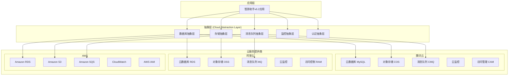

# 云服务集成策略

**项目**: 智游助手v6.2  
**版本**: v6.2.0  
**模块**: 云服务集成策略  
**设计日期**: 2025年8月6日  

---

## ☁️ **云服务集成战略概览**

### **多云架构设计原则**



## 🏗️ **当前阶段方案 (Pre-Cloud)**

### **云原生就绪架构**

#### 1. 容器化架构
```dockerfile
# 多阶段构建，优化镜像大小
FROM node:18-alpine AS builder
WORKDIR /app
COPY package*.json ./
RUN npm ci --only=production
COPY . .
RUN npm run build

FROM node:18-alpine AS production
RUN addgroup -g 1001 -S nodejs && adduser -S nextjs -u 1001
WORKDIR /app
COPY --from=builder --chown=nextjs:nodejs /app/dist ./dist
COPY --from=builder --chown=nextjs:nodejs /app/node_modules ./node_modules
COPY --from=builder --chown=nextjs:nodejs /app/package.json ./package.json

# 健康检查
HEALTHCHECK --interval=30s --timeout=3s --start-period=5s --retries=3 \
  CMD curl -f http://localhost:3000/health || exit 1

USER nextjs
EXPOSE 3000
CMD ["npm", "start"]
```

#### 2. 12-Factor App实现
```typescript
// config/app.config.ts
export class AppConfig {
  // I. 代码库 - 单一代码库，多环境部署
  static readonly APP_NAME = process.env.APP_NAME || 'smart-travel-v6.2';
  
  // II. 依赖 - 显式声明依赖
  static readonly NODE_VERSION = process.env.NODE_VERSION || '18.x';
  
  // III. 配置 - 配置存储在环境变量中
  static readonly DATABASE_URL = process.env.DATABASE_URL!;
  static readonly REDIS_URL = process.env.REDIS_URL!;
  static readonly JWT_SECRET = process.env.JWT_SECRET!;
  
  // IV. 后端服务 - 后端服务作为附加资源
  static readonly EXTERNAL_SERVICES = {
    paymentGateway: process.env.PAYMENT_GATEWAY_URL!,
    mapService: process.env.MAP_SERVICE_URL!,
    emailService: process.env.EMAIL_SERVICE_URL!,
  };
  
  // V. 构建、发布、运行 - 严格分离构建和运行
  static readonly BUILD_VERSION = process.env.BUILD_VERSION || 'dev';
  static readonly RELEASE_VERSION = process.env.RELEASE_VERSION || '6.2.0';
  
  // VI. 进程 - 应用作为无状态进程运行
  static readonly PORT = parseInt(process.env.PORT || '3000');
  static readonly WORKER_PROCESSES = parseInt(process.env.WORKER_PROCESSES || '1');
  
  // VII. 端口绑定 - 通过端口绑定提供服务
  static readonly BIND_ADDRESS = process.env.BIND_ADDRESS || '0.0.0.0';
  
  // VIII. 并发 - 通过进程模型进行扩展
  static readonly CLUSTER_MODE = process.env.CLUSTER_MODE === 'true';
  
  // IX. 易处理性 - 快速启动和优雅终止
  static readonly GRACEFUL_SHUTDOWN_TIMEOUT = parseInt(process.env.GRACEFUL_SHUTDOWN_TIMEOUT || '30000');
  
  // X. 开发环境与线上环境等价
  static readonly ENVIRONMENT = process.env.NODE_ENV || 'development';
  
  // XI. 日志 - 日志作为事件流
  static readonly LOG_LEVEL = process.env.LOG_LEVEL || 'info';
  static readonly LOG_FORMAT = process.env.LOG_FORMAT || 'json';
  
  // XII. 管理进程 - 管理任务作为一次性进程运行
  static readonly ENABLE_ADMIN_TASKS = process.env.ENABLE_ADMIN_TASKS === 'true';
}
```

#### 3. 云服务抽象层设计
```typescript
// abstractions/cloud-database.abstraction.ts
export interface ICloudDatabaseService {
  connect(): Promise<void>;
  disconnect(): Promise<void>;
  query<T>(sql: string, params?: any[]): Promise<T[]>;
  transaction<T>(callback: (trx: any) => Promise<T>): Promise<T>;
  healthCheck(): Promise<boolean>;
}

export class CloudDatabaseFactory {
  static create(provider: 'tencent' | 'aliyun' | 'aws'): ICloudDatabaseService {
    switch (provider) {
      case 'tencent':
        return new TencentCloudDatabaseService();
      case 'aliyun':
        return new AliyunRDSService();
      case 'aws':
        return new AWSRDSService();
      default:
        return new LocalMySQLService();
    }
  }
}

// abstractions/cloud-storage.abstraction.ts
export interface ICloudStorageService {
  uploadFile(key: string, file: Buffer, metadata?: any): Promise<string>;
  downloadFile(key: string): Promise<Buffer>;
  deleteFile(key: string): Promise<void>;
  generatePresignedUrl(key: string, expiresIn: number): Promise<string>;
  listFiles(prefix?: string): Promise<string[]>;
}

export class CloudStorageFactory {
  static create(provider: 'tencent' | 'aliyun' | 'aws'): ICloudStorageService {
    switch (provider) {
      case 'tencent':
        return new TencentCOSService();
      case 'aliyun':
        return new AliyunOSSService();
      case 'aws':
        return new AWSS3Service();
      default:
        return new LocalFileStorageService();
    }
  }
}

// abstractions/cloud-message-queue.abstraction.ts
export interface ICloudMessageQueueService {
  sendMessage(queueName: string, message: any): Promise<string>;
  receiveMessage(queueName: string): Promise<any[]>;
  deleteMessage(queueName: string, messageId: string): Promise<void>;
  createQueue(queueName: string, options?: any): Promise<void>;
  deleteQueue(queueName: string): Promise<void>;
}

export class CloudMessageQueueFactory {
  static create(provider: 'tencent' | 'aliyun' | 'aws'): ICloudMessageQueueService {
    switch (provider) {
      case 'tencent':
        return new TencentCMQService();
      case 'aliyun':
        return new AliyunMQService();
      case 'aws':
        return new AWSSQSService();
      default:
        return new RedisMessageQueueService();
    }
  }
}
```

## 🔄 **过渡策略**

### **阶段性迁移计划**

#### Phase 1: 基础设施云化 (Week 1-2)
```yaml
# terraform/main.tf
terraform {
  required_providers {
    tencentcloud = {
      source = "tencentcloudstack/tencentcloud"
      version = "~> 1.81"
    }
    alicloud = {
      source = "aliyun/alicloud"
      version = "~> 1.200"
    }
    aws = {
      source = "hashicorp/aws"
      version = "~> 5.0"
    }
  }
}

# 腾讯云配置
provider "tencentcloud" {
  region = var.tencent_region
}

# 阿里云配置
provider "alicloud" {
  region = var.aliyun_region
}

# AWS配置
provider "aws" {
  region = var.aws_region
}

# 多云VPC配置
module "tencent_vpc" {
  source = "./modules/tencent-vpc"
  count  = var.enable_tencent ? 1 : 0
  
  vpc_name = "smart-travel-vpc"
  cidr_block = "10.0.0.0/16"
}

module "aliyun_vpc" {
  source = "./modules/aliyun-vpc"
  count  = var.enable_aliyun ? 1 : 0
  
  vpc_name = "smart-travel-vpc"
  cidr_block = "10.1.0.0/16"
}

module "aws_vpc" {
  source = "./modules/aws-vpc"
  count  = var.enable_aws ? 1 : 0
  
  vpc_name = "smart-travel-vpc"
  cidr_block = "10.2.0.0/16"
}
```

#### Phase 2: 数据层云化 (Week 3-4)
```typescript
// services/cloud-database.service.ts
export class CloudDatabaseMigrationService {
  constructor(
    private sourceDb: ICloudDatabaseService,
    private targetDb: ICloudDatabaseService,
    private logger: ILogger
  ) {}

  async migrateData(tables: string[]): Promise<void> {
    this.logger.info('开始数据迁移...');
    
    for (const table of tables) {
      await this.migrateTable(table);
    }
    
    this.logger.info('数据迁移完成');
  }

  private async migrateTable(tableName: string): Promise<void> {
    const batchSize = 1000;
    let offset = 0;
    let hasMore = true;

    while (hasMore) {
      const data = await this.sourceDb.query(
        `SELECT * FROM ${tableName} LIMIT ${batchSize} OFFSET ${offset}`
      );

      if (data.length === 0) {
        hasMore = false;
        break;
      }

      await this.targetDb.transaction(async (trx) => {
        for (const row of data) {
          await this.insertRow(tableName, row, trx);
        }
      });

      offset += batchSize;
      this.logger.info(`已迁移 ${tableName} 表 ${offset} 条记录`);
    }
  }

  private async insertRow(tableName: string, row: any, trx: any): Promise<void> {
    const columns = Object.keys(row).join(', ');
    const placeholders = Object.keys(row).map(() => '?').join(', ');
    const values = Object.values(row);

    await trx.query(
      `INSERT INTO ${tableName} (${columns}) VALUES (${placeholders})`,
      values
    );
  }
}
```

#### Phase 3: 应用层云化 (Week 5-6)
```yaml
# kubernetes/deployment.yaml
apiVersion: apps/v1
kind: Deployment
metadata:
  name: smart-travel-app
  labels:
    app: smart-travel
    version: v6.2.0
spec:
  replicas: 3
  selector:
    matchLabels:
      app: smart-travel
  template:
    metadata:
      labels:
        app: smart-travel
        version: v6.2.0
    spec:
      containers:
      - name: smart-travel
        image: smart-travel:6.2.0
        ports:
        - containerPort: 3000
        env:
        - name: NODE_ENV
          value: "production"
        - name: DATABASE_URL
          valueFrom:
            secretKeyRef:
              name: database-secret
              key: url
        - name: REDIS_URL
          valueFrom:
            secretKeyRef:
              name: redis-secret
              key: url
        resources:
          requests:
            memory: "256Mi"
            cpu: "250m"
          limits:
            memory: "512Mi"
            cpu: "500m"
        livenessProbe:
          httpGet:
            path: /health
            port: 3000
          initialDelaySeconds: 30
          periodSeconds: 10
        readinessProbe:
          httpGet:
            path: /ready
            port: 3000
          initialDelaySeconds: 5
          periodSeconds: 5
```

### **配置管理策略**

#### 环境配置管理
```typescript
// config/cloud.config.ts
export interface CloudConfig {
  provider: 'tencent' | 'aliyun' | 'aws' | 'local';
  region: string;
  credentials: {
    accessKeyId: string;
    secretAccessKey: string;
  };
  services: {
    database: CloudServiceConfig;
    storage: CloudServiceConfig;
    messageQueue: CloudServiceConfig;
    monitoring: CloudServiceConfig;
  };
}

export class CloudConfigManager {
  private static configs: Map<string, CloudConfig> = new Map();

  static loadConfig(environment: string): CloudConfig {
    if (this.configs.has(environment)) {
      return this.configs.get(environment)!;
    }

    const config = this.loadFromEnvironment(environment);
    this.configs.set(environment, config);
    return config;
  }

  private static loadFromEnvironment(env: string): CloudConfig {
    return {
      provider: (process.env[`${env.toUpperCase()}_CLOUD_PROVIDER`] as any) || 'local',
      region: process.env[`${env.toUpperCase()}_CLOUD_REGION`] || 'us-east-1',
      credentials: {
        accessKeyId: process.env[`${env.toUpperCase()}_ACCESS_KEY_ID`] || '',
        secretAccessKey: process.env[`${env.toUpperCase()}_SECRET_ACCESS_KEY`] || '',
      },
      services: {
        database: {
          endpoint: process.env[`${env.toUpperCase()}_DB_ENDPOINT`] || '',
          port: parseInt(process.env[`${env.toUpperCase()}_DB_PORT`] || '3306'),
        },
        storage: {
          bucket: process.env[`${env.toUpperCase()}_STORAGE_BUCKET`] || '',
          region: process.env[`${env.toUpperCase()}_STORAGE_REGION`] || '',
        },
        messageQueue: {
          endpoint: process.env[`${env.toUpperCase()}_MQ_ENDPOINT`] || '',
          region: process.env[`${env.toUpperCase()}_MQ_REGION`] || '',
        },
        monitoring: {
          endpoint: process.env[`${env.toUpperCase()}_MONITOR_ENDPOINT`] || '',
          region: process.env[`${env.toUpperCase()}_MONITOR_REGION`] || '',
        },
      },
    };
  }
}
```

## 🌐 **多云兼容性设计**

### **云服务适配器模式**

#### 腾讯云适配器
```typescript
// adapters/tencent-cloud.adapter.ts
export class TencentCloudAdapter {
  private cdb: any; // 腾讯云数据库
  private cos: any; // 腾讯云对象存储
  private cmq: any; // 腾讯云消息队列

  constructor(config: TencentCloudConfig) {
    this.initializeServices(config);
  }

  // 数据库服务适配
  async queryDatabase(sql: string, params?: any[]): Promise<any[]> {
    return await this.cdb.query(sql, params);
  }

  // 存储服务适配
  async uploadFile(key: string, file: Buffer): Promise<string> {
    const result = await this.cos.putObject({
      Bucket: this.config.bucket,
      Key: key,
      Body: file,
    });
    return result.Location;
  }

  // 消息队列服务适配
  async sendMessage(queueName: string, message: any): Promise<string> {
    const result = await this.cmq.sendMessage({
      QueueName: queueName,
      MessageBody: JSON.stringify(message),
    });
    return result.MessageId;
  }
}
```

#### 阿里云适配器
```typescript
// adapters/aliyun-cloud.adapter.ts
export class AliyunCloudAdapter {
  private rds: any; // 阿里云RDS
  private oss: any; // 阿里云OSS
  private mq: any;  // 阿里云MQ

  constructor(config: AliyunCloudConfig) {
    this.initializeServices(config);
  }

  // 数据库服务适配
  async queryDatabase(sql: string, params?: any[]): Promise<any[]> {
    return await this.rds.query(sql, params);
  }

  // 存储服务适配
  async uploadFile(key: string, file: Buffer): Promise<string> {
    const result = await this.oss.put(key, file);
    return result.url;
  }

  // 消息队列服务适配
  async sendMessage(queueName: string, message: any): Promise<string> {
    const result = await this.mq.publishMessage({
      TopicName: queueName,
      MessageBody: JSON.stringify(message),
    });
    return result.MessageId;
  }
}
```

### **统一服务接口**

```typescript
// services/unified-cloud.service.ts
export class UnifiedCloudService {
  private adapter: TencentCloudAdapter | AliyunCloudAdapter | AWSCloudAdapter;

  constructor(provider: string, config: any) {
    this.adapter = this.createAdapter(provider, config);
  }

  private createAdapter(provider: string, config: any) {
    switch (provider) {
      case 'tencent':
        return new TencentCloudAdapter(config);
      case 'aliyun':
        return new AliyunCloudAdapter(config);
      case 'aws':
        return new AWSCloudAdapter(config);
      default:
        throw new Error(`Unsupported cloud provider: ${provider}`);
    }
  }

  // 统一的数据库操作接口
  async query(sql: string, params?: any[]): Promise<any[]> {
    return await this.adapter.queryDatabase(sql, params);
  }

  // 统一的文件上传接口
  async uploadFile(key: string, file: Buffer): Promise<string> {
    return await this.adapter.uploadFile(key, file);
  }

  // 统一的消息发送接口
  async sendMessage(queueName: string, message: any): Promise<string> {
    return await this.adapter.sendMessage(queueName, message);
  }
}
```

## 🔧 **云原生工具链**

### **容器编排**
- **Kubernetes**: 容器编排和管理
- **Helm**: 应用包管理
- **Istio**: 服务网格 (可选)

### **CI/CD工具**
- **GitHub Actions**: 持续集成
- **ArgoCD**: GitOps部署
- **Tekton**: 云原生CI/CD

### **监控工具**
- **Prometheus**: 指标收集
- **Grafana**: 可视化监控
- **Jaeger**: 分布式追踪
- **Fluentd**: 日志收集

### **安全工具**
- **Falco**: 运行时安全监控
- **OPA**: 策略引擎
- **Cert-Manager**: 证书管理

---

## 📊 **成本优化策略**

### **多云成本对比**
```typescript
interface CloudCostAnalysis {
  provider: string;
  monthlyEstimate: {
    compute: number;
    storage: number;
    database: number;
    network: number;
    monitoring: number;
    total: number;
  };
  features: {
    availability: string;
    performance: string;
    security: string;
    compliance: string;
  };
}

const costAnalysis: CloudCostAnalysis[] = [
  {
    provider: 'tencent',
    monthlyEstimate: {
      compute: 800,
      storage: 200,
      database: 600,
      network: 150,
      monitoring: 100,
      total: 1850,
    },
    features: {
      availability: '99.95%',
      performance: 'High',
      security: 'Enterprise',
      compliance: 'China',
    },
  },
  // ... 其他云服务商
];
```

### **成本优化建议**
1. **预留实例**: 长期使用的资源使用预留实例
2. **自动扩缩容**: 根据负载自动调整资源
3. **存储分层**: 根据访问频率选择存储类型
4. **网络优化**: 使用CDN减少带宽成本
5. **监控优化**: 定期清理无用的监控指标
