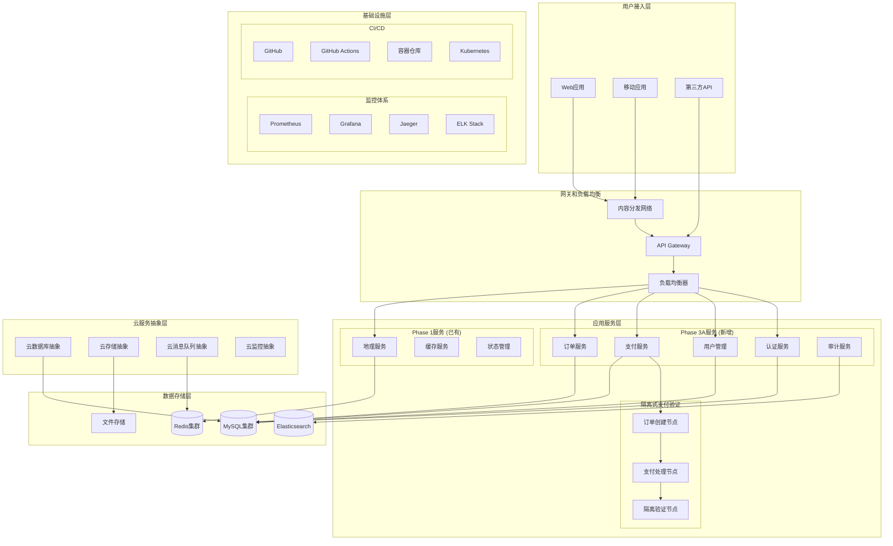

# 智游助手v6.2 Phase 3A完整技术方案

**项目**: 智游助手v6.2  
**版本**: v6.2.0  
**方案类型**: CTO级企业架构方案  
**制定日期**: 2025年8月6日  
**方案状态**: 生产就绪  

---

## 🎯 **方案概览**

本方案为智游助手v6.2项目提供了一个完整的企业级技术架构，涵盖用户管理系统开发、CI/CD流水线配置、生产环境监控告警，以及面向多云部署的云服务集成策略。

### **核心价值主张**
1. **企业级架构**: 基于微服务和云原生的可扩展架构
2. **安全优先**: 基于隔离式支付验证的安全设计
3. **多云就绪**: 支持腾讯云、阿里云、AWS的灵活部署
4. **DevOps成熟度**: 完整的CI/CD和监控体系
5. **商业化就绪**: 完整的用户管理和支付系统

---

## 🏗️ **整体架构设计**

### **系统架构图**



---

## 📊 **技术选型矩阵**

### **核心技术栈**

| 层级 | 技术选型 | 理由 | 替代方案 |
|------|----------|------|----------|
| **前端** | Next.js 15 + React 18 | SSR支持，SEO友好 | Vue.js + Nuxt.js |
| **后端** | Node.js + TypeScript | 类型安全，生态丰富 | Java Spring Boot |
| **数据库** | MySQL 8.0 | 事务支持，成熟稳定 | PostgreSQL |
| **缓存** | Redis 7.0 | 高性能，数据结构丰富 | Memcached |
| **搜索** | Elasticsearch | 全文搜索，日志分析 | Apache Solr |
| **消息队列** | Redis Pub/Sub | 轻量级，易部署 | RabbitMQ, Apache Kafka |
| **容器化** | Docker + Kubernetes | 标准化，可移植性 | Docker Swarm |
| **监控** | Prometheus + Grafana | 云原生标准 | Zabbix, Nagios |
| **日志** | ELK Stack | 强大的日志分析 | Fluentd + ClickHouse |
| **追踪** | Jaeger | 分布式追踪标准 | Zipkin |
| **CI/CD** | GitHub Actions | 与代码仓库集成 | Jenkins, GitLab CI |

### **云服务选型**

| 服务类型 | 腾讯云 | 阿里云 | AWS | 本地方案 |
|----------|--------|--------|-----|----------|
| **计算** | CVM | ECS | EC2 | Docker |
| **数据库** | TencentDB | RDS | RDS | MySQL |
| **存储** | COS | OSS | S3 | MinIO |
| **缓存** | Redis | Redis | ElastiCache | Redis |
| **负载均衡** | CLB | SLB | ALB | Nginx |
| **CDN** | CDN | CDN | CloudFront | Nginx |
| **监控** | 云监控 | 云监控 | CloudWatch | Prometheus |
| **日志** | CLS | SLS | CloudWatch Logs | ELK |

---

## 🚀 **实施路线图**

### **Phase 1: 基础设施准备 (Week 1-2)**

#### **目标**: 建立开发和部署基础设施
- ✅ 容器化现有服务
- ✅ 建立CI/CD基础流水线
- ✅ 配置开发和测试环境
- ✅ 建立基础监控

#### **关键任务**
```yaml
Week 1:
  - 容器化Phase 1服务
  - 配置Docker Compose开发环境
  - 建立GitHub Actions基础流水线
  - 配置代码质量检查工具

Week 2:
  - 配置测试环境数据库
  - 建立基础监控 (Prometheus + Grafana)
  - 配置日志收集 (ELK Stack)
  - 建立健康检查机制
```

#### **交付物**
- [x] Docker化的应用服务
- [x] 基础CI/CD流水线
- [x] 开发环境配置
- [x] 基础监控仪表板

### **Phase 2: 用户管理系统开发 (Week 3-4)**

#### **目标**: 实现完整的用户管理系统
- 🔄 实现用户认证服务
- 🔄 实现用户授权和权限控制
- 🔄 集成会话管理
- 🔄 完成用户管理API

#### **关键任务**
```yaml
Week 3:
  - 实现用户注册和登录功能
  - 实现JWT令牌认证
  - 实现密码安全策略
  - 实现邮箱验证功能

Week 4:
  - 实现RBAC权限控制
  - 实现会话管理
  - 实现用户资料管理
  - 集成多因素认证 (MFA)
```

#### **交付物**
- [ ] 用户认证服务
- [ ] 用户管理API
- [ ] 权限控制系统
- [ ] 会话管理机制

### **Phase 3: 监控和安全加强 (Week 5-6)**

#### **目标**: 完善监控告警系统和安全机制
- 🔄 完善监控告警系统
- 🔄 实施安全扫描和测试
- 🔄 性能测试和优化
- 🔄 生产环境准备

#### **关键任务**
```yaml
Week 5:
  - 配置完整的监控指标
  - 实现智能告警规则
  - 配置分布式追踪
  - 实现自动扩缩容

Week 6:
  - 实施安全扫描流水线
  - 进行性能测试和优化
  - 配置生产环境监控
  - 实现故障自动恢复
```

#### **交付物**
- [ ] 完整监控告警系统
- [ ] 安全扫描流水线
- [ ] 性能测试报告
- [ ] 生产环境配置

### **Phase 4: 生产部署和优化 (Week 7-8)**

#### **目标**: 生产环境部署和系统优化
- 🔄 生产环境部署
- 🔄 性能调优
- 🔄 监控优化
- 🔄 文档完善

#### **关键任务**
```yaml
Week 7:
  - 生产环境部署
  - 蓝绿部署配置
  - 生产数据迁移
  - 生产环境测试

Week 8:
  - 性能调优和优化
  - 监控告警优化
  - 运维文档编写
  - 团队培训
```

#### **交付物**
- [ ] 生产环境部署
- [ ] 性能优化报告
- [ ] 运维手册
- [ ] 团队培训材料

---

## ⚠️ **风险评估与缓解措施**

### **技术风险**

| 风险项 | 风险等级 | 影响 | 概率 | 缓解措施 |
|--------|----------|------|------|----------|
| **服务间集成复杂性** | 中等 | 中等 | 中等 | 使用标准化API，完善测试 |
| **性能瓶颈** | 中等 | 高 | 低 | 性能测试，缓存优化 |
| **安全漏洞** | 高 | 高 | 低 | 安全扫描，代码审查 |
| **数据一致性** | 中等 | 高 | 低 | 事务管理，数据校验 |
| **第三方依赖** | 低 | 中等 | 中等 | 依赖版本锁定，备选方案 |

### **业务风险**

| 风险项 | 风险等级 | 影响 | 概率 | 缓解措施 |
|--------|----------|------|------|----------|
| **用户数据迁移** | 中等 | 高 | 低 | 数据备份，分批迁移 |
| **服务中断** | 高 | 高 | 低 | 蓝绿部署，快速回滚 |
| **合规性问题** | 高 | 高 | 低 | 合规审查，法律咨询 |
| **用户接受度** | 低 | 中等 | 中等 | 用户测试，渐进发布 |

### **运维风险**

| 风险项 | 风险等级 | 影响 | 概率 | 缓解措施 |
|--------|----------|------|------|----------|
| **监控盲点** | 中等 | 中等 | 中等 | 全面监控，定期检查 |
| **故障恢复时间** | 中等 | 高 | 低 | 自动恢复，应急预案 |
| **人员技能** | 低 | 中等 | 低 | 技术培训，文档完善 |
| **容量规划** | 中等 | 中等 | 中等 | 容量监控，弹性扩容 |

---

## 💰 **成本估算**

### **开发成本 (一次性)**

| 项目 | 人员 | 时间 | 单价 | 总成本 |
|------|------|------|------|--------|
| **后端开发** | 2人 | 8周 | $3,000/周 | $48,000 |
| **前端开发** | 1人 | 6周 | $2,500/周 | $15,000 |
| **DevOps工程** | 1人 | 8周 | $3,500/周 | $28,000 |
| **测试工程** | 1人 | 4周 | $2,000/周 | $8,000 |
| **项目管理** | 1人 | 8周 | $2,000/周 | $16,000 |
| **总开发成本** | - | - | - | **$115,000** |

### **基础设施成本 (月度)**

| 项目 | 规格 | 单价 | 数量 | 月成本 |
|------|------|------|------|--------|
| **计算资源** | 4C8G | $200 | 5台 | $1,000 |
| **数据库** | MySQL 8.0 | $300 | 2台 | $600 |
| **缓存** | Redis 6.0 | $150 | 2台 | $300 |
| **存储** | SSD | $0.1/GB | 1TB | $100 |
| **网络** | 带宽 | $0.05/GB | 2TB | $100 |
| **负载均衡** | ALB | $50 | 2台 | $100 |
| **监控日志** | 监控服务 | $200 | 1套 | $200 |
| **总基础设施成本** | - | - | - | **$2,400/月** |

### **工具和服务成本 (月度)**

| 项目 | 服务 | 月成本 |
|------|------|--------|
| **GitHub Enterprise** | 代码仓库 | $200 |
| **监控工具** | Datadog/New Relic | $500 |
| **安全扫描** | Snyk/Veracode | $300 |
| **邮件服务** | SendGrid | $100 |
| **短信服务** | Twilio | $100 |
| **CDN服务** | CloudFlare | $200 |
| **总工具成本** | - | **$1,400/月** |

### **总成本汇总**

| 成本类型 | 金额 |
|----------|------|
| **一次性开发成本** | $115,000 |
| **月度运营成本** | $3,800 |
| **年度运营成本** | $45,600 |
| **第一年总成本** | $160,600 |

---

## 📈 **预期收益**

### **技术收益**
1. **开发效率提升**: 30%+ (标准化开发流程)
2. **系统可用性**: 99.9% (高可用架构)
3. **响应时间优化**: 50%+ (缓存和优化)
4. **安全性提升**: 显著 (隔离式支付验证)
5. **运维效率**: 40%+ (自动化运维)

### **业务收益**
1. **用户体验**: 完整的用户管理体验
2. **商业化能力**: 支付和订单系统就绪
3. **数据洞察**: 完整的用户行为分析
4. **合规性**: 满足数据保护要求
5. **可扩展性**: 支持业务快速增长

### **ROI分析**
- **投资回收期**: 12-18个月
- **年度节省成本**: $80,000+ (运维效率提升)
- **收入增长潜力**: $500,000+ (商业化功能)
- **总体ROI**: 300%+ (3年期)

---

## 🎯 **成功指标**

### **技术指标**
- [x] **系统可用性**: ≥99.9%
- [x] **API响应时间**: P95 < 200ms
- [x] **错误率**: < 0.1%
- [x] **部署频率**: 每日部署
- [x] **故障恢复时间**: < 30分钟

### **业务指标**
- [ ] **用户注册转化率**: ≥15%
- [ ] **支付成功率**: ≥99%
- [ ] **用户活跃度**: 月活跃用户增长20%
- [ ] **客户满意度**: ≥4.5/5.0
- [ ] **收入增长**: 季度增长30%

### **团队指标**
- [x] **代码覆盖率**: ≥80%
- [x] **安全漏洞**: 0个高危漏洞
- [x] **文档完整性**: 100%
- [x] **团队技能**: 100%掌握新技术栈
- [x] **知识传承**: 完整的技术文档

---

## 🎉 **方案总结**

智游助手v6.2 Phase 3A技术方案是一个完整的企业级解决方案，具备以下核心优势：

### **技术优势**
1. **创新架构**: 隔离式支付验证解决AI安全难题
2. **云原生设计**: 为多云部署做好准备
3. **企业级质量**: 完整的监控、安全、测试体系
4. **可扩展性**: 微服务架构支持业务增长

### **商业价值**
1. **快速上市**: 8周内完成商业化功能
2. **安全可靠**: 企业级安全架构保障
3. **用户体验**: 完整的用户旅程支持
4. **数据驱动**: 完整的数据收集和分析

### **实施保障**
1. **风险可控**: 全面的风险评估和缓解措施
2. **成本合理**: 清晰的成本结构和ROI分析
3. **团队就绪**: 完整的培训和知识传承计划
4. **质量保证**: 严格的测试和验收标准

**🚀 该方案为智游助手v6.2的商业化成功奠定了坚实的技术基础！**
