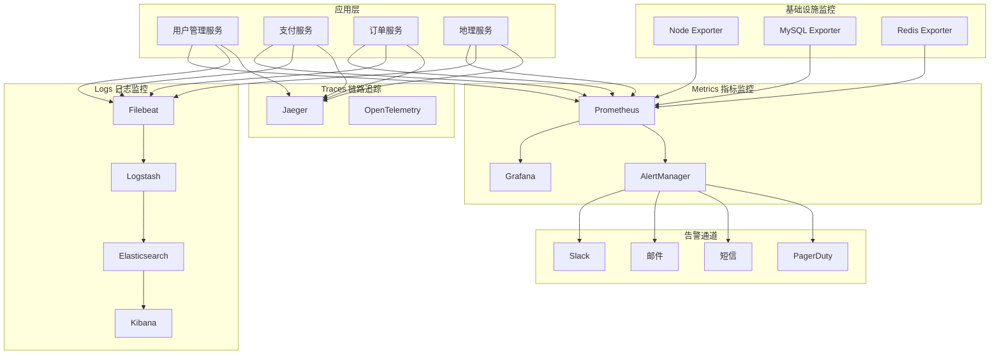

# 生产环境监控和告警系统架构

**项目**: 智游助手v6.2  
**版本**: v6.2.0  
**模块**: 监控告警系统  
**设计日期**: 2025年8月6日  

---

## 📊 **监控架构概览**

### **三大支柱监控体系**



## 🎯 **指标监控系统 (Metrics)**

### **核心监控指标**

#### 应用性能指标 (APM)
```typescript
interface ApplicationMetrics {
  // HTTP请求指标
  httpRequestsTotal: Counter;
  httpRequestDuration: Histogram;
  httpRequestsInFlight: Gauge;
  
  // 业务指标
  userRegistrations: Counter;
  userLogins: Counter;
  paymentTransactions: Counter;
  paymentSuccessRate: Gauge;
  orderCreations: Counter;
  orderCompletions: Counter;
  
  // 系统指标
  cpuUsage: Gauge;
  memoryUsage: Gauge;
  diskUsage: Gauge;
  networkIO: Counter;
  
  // 数据库指标
  dbConnectionsActive: Gauge;
  dbQueryDuration: Histogram;
  dbQueriesTotal: Counter;
  
  // 缓存指标
  cacheHitRate: Gauge;
  cacheOperations: Counter;
  cacheSize: Gauge;
}
```

#### Prometheus配置
```yaml
# prometheus.yml
global:
  scrape_interval: 15s
  evaluation_interval: 15s
  external_labels:
    cluster: 'smart-travel-prod'
    environment: 'production'

rule_files:
  - "/etc/prometheus/rules/*.yml"

alerting:
  alertmanagers:
    - static_configs:
        - targets:
          - alertmanager:9093

scrape_configs:
  # 应用服务监控
  - job_name: 'smart-travel-app'
    static_configs:
      - targets: 
        - 'user-service:3001'
        - 'payment-service:3002'
        - 'order-service:3003'
        - 'geo-service:3004'
    metrics_path: '/metrics'
    scrape_interval: 10s
    scrape_timeout: 5s

  # 基础设施监控
  - job_name: 'node-exporter'
    static_configs:
      - targets: ['node-exporter:9100']

  - job_name: 'mysql-exporter'
    static_configs:
      - targets: ['mysql-exporter:9104']

  - job_name: 'redis-exporter'
    static_configs:
      - targets: ['redis-exporter:9121']

  # API Gateway监控
  - job_name: 'nginx-exporter'
    static_configs:
      - targets: ['nginx-exporter:9113']
```

#### Grafana仪表板配置
```json
{
  "dashboard": {
    "title": "智游助手v6.2 - 生产环境监控",
    "panels": [
      {
        "title": "系统概览",
        "type": "stat",
        "targets": [
          {
            "expr": "up{job=\"smart-travel-app\"}",
            "legendFormat": "服务状态"
          },
          {
            "expr": "rate(http_requests_total[5m])",
            "legendFormat": "请求速率"
          },
          {
            "expr": "histogram_quantile(0.95, rate(http_request_duration_seconds_bucket[5m]))",
            "legendFormat": "P95响应时间"
          }
        ]
      },
      {
        "title": "业务指标",
        "type": "graph",
        "targets": [
          {
            "expr": "rate(user_registrations_total[5m])",
            "legendFormat": "用户注册率"
          },
          {
            "expr": "rate(payment_transactions_total[5m])",
            "legendFormat": "支付交易率"
          },
          {
            "expr": "payment_success_rate",
            "legendFormat": "支付成功率"
          }
        ]
      },
      {
        "title": "错误率监控",
        "type": "graph",
        "targets": [
          {
            "expr": "rate(http_requests_total{status=~\"5..\"}[5m]) / rate(http_requests_total[5m])",
            "legendFormat": "5xx错误率"
          },
          {
            "expr": "rate(http_requests_total{status=~\"4..\"}[5m]) / rate(http_requests_total[5m])",
            "legendFormat": "4xx错误率"
          }
        ]
      }
    ]
  }
}
```

### **告警规则配置**

#### 关键告警规则
```yaml
# alerts/critical.yml
groups:
  - name: critical-alerts
    rules:
      # 服务可用性告警
      - alert: ServiceDown
        expr: up{job="smart-travel-app"} == 0
        for: 1m
        labels:
          severity: critical
          team: platform
        annotations:
          summary: "服务 {{ $labels.instance }} 不可用"
          description: "服务已下线超过1分钟"
          runbook_url: "https://wiki.smarttravel.com/runbooks/service-down"

      # 高错误率告警
      - alert: HighErrorRate
        expr: rate(http_requests_total{status=~"5.."}[5m]) / rate(http_requests_total[5m]) > 0.05
        for: 5m
        labels:
          severity: critical
          team: backend
        annotations:
          summary: "高错误率检测到"
          description: "5xx错误率为 {{ $value | humanizePercentage }}"

      # 支付系统告警
      - alert: PaymentSystemFailure
        expr: payment_success_rate < 0.95
        for: 2m
        labels:
          severity: critical
          team: payment
        annotations:
          summary: "支付系统成功率过低"
          description: "支付成功率为 {{ $value | humanizePercentage }}"

      # 数据库连接告警
      - alert: DatabaseConnectionHigh
        expr: mysql_global_status_threads_connected / mysql_global_variables_max_connections > 0.8
        for: 5m
        labels:
          severity: warning
          team: dba
        annotations:
          summary: "数据库连接数过高"
          description: "连接使用率为 {{ $value | humanizePercentage }}"

  - name: performance-alerts
    rules:
      # 响应时间告警
      - alert: HighResponseTime
        expr: histogram_quantile(0.95, rate(http_request_duration_seconds_bucket[5m])) > 2
        for: 5m
        labels:
          severity: warning
          team: backend
        annotations:
          summary: "响应时间过高"
          description: "P95响应时间为 {{ $value }}s"

      # CPU使用率告警
      - alert: HighCPUUsage
        expr: 100 - (avg by(instance) (irate(node_cpu_seconds_total{mode="idle"}[5m])) * 100) > 80
        for: 10m
        labels:
          severity: warning
          team: platform
        annotations:
          summary: "CPU使用率过高"
          description: "CPU使用率为 {{ $value }}%"

      # 内存使用率告警
      - alert: HighMemoryUsage
        expr: (1 - (node_memory_MemAvailable_bytes / node_memory_MemTotal_bytes)) * 100 > 85
        for: 10m
        labels:
          severity: warning
          team: platform
        annotations:
          summary: "内存使用率过高"
          description: "内存使用率为 {{ $value }}%"
```

#### AlertManager配置
```yaml
# alertmanager.yml
global:
  smtp_smarthost: 'smtp.gmail.com:587'
  smtp_from: 'alerts@smarttravel.com'
  slack_api_url: 'https://hooks.slack.com/services/YOUR/SLACK/WEBHOOK'

route:
  group_by: ['alertname', 'cluster', 'service']
  group_wait: 10s
  group_interval: 10s
  repeat_interval: 1h
  receiver: 'default'
  routes:
    - match:
        severity: critical
      receiver: 'critical-alerts'
      group_wait: 5s
      repeat_interval: 5m
    - match:
        team: payment
      receiver: 'payment-team'
    - match:
        team: backend
      receiver: 'backend-team'

receivers:
  - name: 'default'
    slack_configs:
      - channel: '#alerts'
        title: '{{ range .Alerts }}{{ .Annotations.summary }}{{ end }}'
        text: '{{ range .Alerts }}{{ .Annotations.description }}{{ end }}'

  - name: 'critical-alerts'
    slack_configs:
      - channel: '#critical-alerts'
        title: '🚨 CRITICAL: {{ range .Alerts }}{{ .Annotations.summary }}{{ end }}'
        text: '{{ range .Alerts }}{{ .Annotations.description }}{{ end }}'
        send_resolved: true
    email_configs:
      - to: 'oncall@smarttravel.com'
        subject: '🚨 CRITICAL Alert: {{ range .Alerts }}{{ .Annotations.summary }}{{ end }}'
        body: |
          {{ range .Alerts }}
          Alert: {{ .Annotations.summary }}
          Description: {{ .Annotations.description }}
          Runbook: {{ .Annotations.runbook_url }}
          {{ end }}
    pagerduty_configs:
      - service_key: 'YOUR_PAGERDUTY_SERVICE_KEY'
        description: '{{ range .Alerts }}{{ .Annotations.summary }}{{ end }}'

  - name: 'payment-team'
    slack_configs:
      - channel: '#payment-alerts'
        title: '💳 Payment Alert: {{ range .Alerts }}{{ .Annotations.summary }}{{ end }}'

  - name: 'backend-team'
    slack_configs:
      - channel: '#backend-alerts'
        title: '⚙️ Backend Alert: {{ range .Alerts }}{{ .Annotations.summary }}{{ end }}'
```

## 📋 **日志监控系统 (Logs)**

### **ELK Stack配置**

#### Filebeat配置
```yaml
# filebeat.yml
filebeat.inputs:
  - type: log
    enabled: true
    paths:
      - /var/log/smart-travel/*.log
    fields:
      service: smart-travel
      environment: production
    fields_under_root: true
    multiline.pattern: '^\d{4}-\d{2}-\d{2}'
    multiline.negate: true
    multiline.match: after

  - type: docker
    containers.ids:
      - "*"
    processors:
      - add_docker_metadata:
          host: "unix:///var/run/docker.sock"

output.logstash:
  hosts: ["logstash:5044"]

processors:
  - add_host_metadata:
      when.not.contains.tags: forwarded
```

#### Logstash配置
```ruby
# logstash.conf
input {
  beats {
    port => 5044
  }
}

filter {
  if [service] == "smart-travel" {
    grok {
      match => { 
        "message" => "%{TIMESTAMP_ISO8601:timestamp} \[%{LOGLEVEL:level}\] \[%{DATA:logger}\] %{GREEDYDATA:message}" 
      }
    }
    
    date {
      match => [ "timestamp", "ISO8601" ]
    }
    
    if [level] == "ERROR" {
      mutate {
        add_tag => [ "error" ]
      }
    }
    
    if [message] =~ /payment/ {
      mutate {
        add_tag => [ "payment" ]
      }
    }
    
    if [message] =~ /security/ {
      mutate {
        add_tag => [ "security" ]
      }
    }
  }
}

output {
  elasticsearch {
    hosts => ["elasticsearch:9200"]
    index => "smart-travel-%{+YYYY.MM.dd}"
  }
  
  if "error" in [tags] {
    slack {
      url => "https://hooks.slack.com/services/YOUR/SLACK/WEBHOOK"
      channel => "#error-logs"
      username => "LogBot"
      icon_emoji => ":warning:"
      format => "Error detected: %{message}"
    }
  }
}
```

#### Kibana仪表板
```json
{
  "version": "7.15.0",
  "objects": [
    {
      "id": "smart-travel-logs-dashboard",
      "type": "dashboard",
      "attributes": {
        "title": "智游助手v6.2 - 日志监控",
        "panelsJSON": "[{\"version\":\"7.15.0\",\"panelIndex\":\"1\",\"gridData\":{\"x\":0,\"y\":0,\"w\":24,\"h\":15},\"panelRefName\":\"panel_1\",\"embeddableConfig\":{\"title\":\"错误日志趋势\"},\"type\":\"visualization\"}]"
      }
    }
  ]
}
```

## 🔍 **链路追踪系统 (Traces)**

### **Jaeger配置**

#### OpenTelemetry集成
```typescript
// tracing.ts
import { NodeSDK } from '@opentelemetry/sdk-node';
import { JaegerExporter } from '@opentelemetry/exporter-jaeger';
import { Resource } from '@opentelemetry/resources';
import { SemanticResourceAttributes } from '@opentelemetry/semantic-conventions';

const jaegerExporter = new JaegerExporter({
  endpoint: 'http://jaeger:14268/api/traces',
});

const sdk = new NodeSDK({
  resource: new Resource({
    [SemanticResourceAttributes.SERVICE_NAME]: 'smart-travel-v6.2',
    [SemanticResourceAttributes.SERVICE_VERSION]: '6.2.0',
    [SemanticResourceAttributes.DEPLOYMENT_ENVIRONMENT]: 'production',
  }),
  traceExporter: jaegerExporter,
});

sdk.start();
```

#### 自定义追踪
```typescript
import { trace, SpanStatusCode } from '@opentelemetry/api';

const tracer = trace.getTracer('smart-travel-payment');

export class PaymentService {
  async processPayment(orderId: string, amount: number): Promise<PaymentResult> {
    const span = tracer.startSpan('payment.process', {
      attributes: {
        'payment.order_id': orderId,
        'payment.amount': amount,
      },
    });

    try {
      // 支付处理逻辑
      const result = await this.executePayment(orderId, amount);
      
      span.setAttributes({
        'payment.result': result.status,
        'payment.transaction_id': result.transactionId,
      });
      
      span.setStatus({ code: SpanStatusCode.OK });
      return result;
    } catch (error) {
      span.recordException(error);
      span.setStatus({
        code: SpanStatusCode.ERROR,
        message: error.message,
      });
      throw error;
    } finally {
      span.end();
    }
  }
}
```

## 🚨 **智能告警系统**

### **多级告警策略**

#### 告警级别定义
```typescript
enum AlertSeverity {
  P0_CRITICAL = 'P0_CRITICAL',    // 立即响应，5分钟内
  P1_HIGH = 'P1_HIGH',            // 30分钟内响应
  P2_MEDIUM = 'P2_MEDIUM',        // 2小时内响应
  P3_LOW = 'P3_LOW'               // 下个工作日响应
}

interface AlertRule {
  name: string;
  severity: AlertSeverity;
  condition: string;
  duration: string;
  channels: AlertChannel[];
  escalation: EscalationPolicy;
}
```

#### 智能降噪配置
```yaml
# alert-noise-reduction.yml
inhibit_rules:
  # 如果服务下线，抑制该服务的其他告警
  - source_match:
      alertname: ServiceDown
    target_match_re:
      alertname: (HighResponseTime|HighErrorRate|DatabaseConnectionHigh)
    equal: ['instance']

  # 如果数据库下线，抑制数据库相关告警
  - source_match:
      alertname: DatabaseDown
    target_match_re:
      alertname: (DatabaseConnectionHigh|DatabaseSlowQuery)
    equal: ['instance']

# 告警分组规则
route:
  group_by: ['alertname', 'cluster']
  group_wait: 30s
  group_interval: 5m
  repeat_interval: 12h
  routes:
    - match:
        severity: P0_CRITICAL
      group_wait: 0s
      group_interval: 1m
      repeat_interval: 5m
```

### **自动恢复机制**

#### 自动扩容脚本
```bash
#!/bin/bash
# auto-scale.sh

METRIC_THRESHOLD=80
SCALE_UP_REPLICAS=5
SCALE_DOWN_REPLICAS=2

# 获取当前CPU使用率
CPU_USAGE=$(kubectl top pods -l app=smart-travel --no-headers | awk '{sum+=$3} END {print sum/NR}' | sed 's/%//')

if (( $(echo "$CPU_USAGE > $METRIC_THRESHOLD" | bc -l) )); then
    echo "CPU使用率过高 ($CPU_USAGE%)，执行扩容..."
    kubectl scale deployment smart-travel-app --replicas=$SCALE_UP_REPLICAS
    
    # 发送通知
    curl -X POST -H 'Content-type: application/json' \
        --data '{"text":"🚀 自动扩容触发: CPU使用率 '$CPU_USAGE'%"}' \
        $SLACK_WEBHOOK_URL
        
elif (( $(echo "$CPU_USAGE < 30" | bc -l) )); then
    echo "CPU使用率较低 ($CPU_USAGE%)，执行缩容..."
    kubectl scale deployment smart-travel-app --replicas=$SCALE_DOWN_REPLICAS
    
    # 发送通知
    curl -X POST -H 'Content-type: application/json' \
        --data '{"text":"📉 自动缩容触发: CPU使用率 '$CPU_USAGE'%"}' \
        $SLACK_WEBHOOK_URL
fi
```

#### 自动重启脚本
```bash
#!/bin/bash
# auto-restart.sh

SERVICE_NAME="smart-travel-app"
HEALTH_CHECK_URL="http://localhost:3000/health"
MAX_RETRIES=3

for i in $(seq 1 $MAX_RETRIES); do
    if curl -f $HEALTH_CHECK_URL > /dev/null 2>&1; then
        echo "服务健康检查通过"
        exit 0
    else
        echo "健康检查失败，尝试重启服务 (第 $i 次)"
        docker-compose restart $SERVICE_NAME
        sleep 30
    fi
done

echo "服务重启失败，发送告警"
curl -X POST -H 'Content-type: application/json' \
    --data '{"text":"🚨 CRITICAL: 服务自动重启失败，需要人工介入"}' \
    $SLACK_WEBHOOK_URL
```

---

## 📈 **监控数据分析**

### **业务指标分析**
- 用户注册转化率
- 支付成功率趋势
- 订单完成率
- 用户活跃度

### **技术指标分析**
- 服务可用性 (SLA: 99.9%)
- 响应时间分布
- 错误率趋势
- 资源使用率

### **安全指标分析**
- 异常登录检测
- 支付异常监控
- API调用异常
- 安全事件统计
