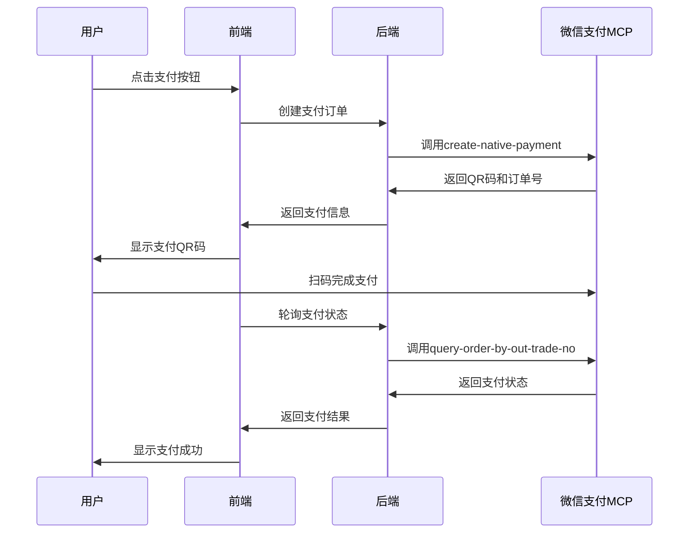

# 🎭 智游助手v6.2 - 微信支付MCP体验版技术接入指南

## 📋 项目概述

**重要说明**: 这是微信支付MCP体验版的技术验证实现，仅支持1分钱测试支付，不用于真实商业交易。最终商业化建议使用个体工商户+支付宝当面付方案。

## 🎯 技术方案对比

| 方案 | 微信支付MCP体验版 | 支付宝当面付 | 推荐用途 |
|------|-------------------|--------------|----------|
| **支付金额** | ❌ 仅1分钱 | ✅ 单笔≤1000元 | 支付宝用于商业化 |
| **申请门槛** | ✅ 无需营业执照 | ❌ 需要营业执照 | MCP用于技术验证 |
| **平台限制** | ❌ 仅腾讯元器 | ✅ 任意平台 | 支付宝更灵活 |
| **API完整性** | ⚠️ 体验版受限 | ✅ 完整功能 | 支付宝更完善 |
| **商业化能力** | ❌ 无法商业化 | ✅ 完整商业化 | 支付宝是最终选择 |

## 🏗️ 技术架构设计

### 架构概览
```
┌─────────────────┐    ┌─────────────────┐    ┌─────────────────┐
│   前端页面      │    │   后端API       │    │  腾讯元器平台   │
│  React组件      │◄──►│  Node.js服务    │◄──►│  微信支付MCP    │
└─────────────────┘    └─────────────────┘    └─────────────────┘
```

### 核心组件
1. **前端支付组件**: React支付页面和状态管理
2. **后端API服务**: Node.js支付接口和回调处理
3. **腾讯元器集成**: MCP API调用和智能体配置
4. **支付流程管理**: 订单创建、状态查询、回调处理

## 📱 接入步骤

### 第一步: 腾讯元器平台配置

1. **访问腾讯元器平台**
   ```
   URL: https://yuanqi.tencent.com/
   ```

2. **开通微信支付MCP体验版**
   - 进入MCP市场
   - 搜索"微信支付MCP（体验版）"
   - 点击"立即开通"（秒通过）

3. **创建智能体应用**
   - 选择"创建智能体"
   - 配置基本信息
   - 添加微信支付MCP能力

### 第二步: 开发环境准备

1. **项目依赖安装**
   ```bash
   # 前端依赖
   npm install react react-dom qrcode.react
   npm install @types/react @types/react-dom
   
   # 后端依赖
   npm install express cors body-parser
   npm install axios uuid moment
   ```

2. **环境变量配置**
   ```env
   # .env
   TENCENT_YUANQI_APP_ID=your_app_id
   TENCENT_YUANQI_API_KEY=your_api_key
   WECHAT_PAY_MCP_ENDPOINT=https://api.yuanqi.tencent.com/mcp
   NODE_ENV=development
   PORT=3001
   ```

## 🔧 核心功能实现

### 支付流程设计


### API接口设计
```typescript
// 支付订单创建接口
POST /api/wechat-pay-mcp/create-order
{
  "serviceType": "travel-planning-demo",
  "amount": 1,  // 固定1分钱
  "description": "智游助手技术验证",
  "userId": "demo_user_123"
}

// 支付状态查询接口
GET /api/wechat-pay-mcp/query-status/:orderId

// 支付回调处理接口
POST /api/wechat-pay-mcp/callback
```

## ⚠️ 重要限制说明

### 体验版限制
1. **支付金额**: 仅支持0.01元（1分钱）
2. **使用场景**: 仅用于技术验证和演示
3. **平台限制**: 必须在腾讯元器平台内运行
4. **功能限制**: 部分API功能受限

### 商业化建议
- **技术验证阶段**: 使用微信支付MCP体验版
- **商业化阶段**: 切换到支付宝当面付方案
- **长期规划**: 申请微信支付正式版（需企业资质）

## 🔄 升级路径

### 从体验版到正式版
1. **申请企业资质**: 营业执照、对公账户
2. **提交资质审核**: 等待腾讯审核通过
3. **升级API接口**: 切换到正式版API
4. **功能完整测试**: 验证所有功能正常

### 切换到支付宝方案
1. **申请个体工商户**: 获得营业执照
2. **开通支付宝当面付**: 使用营业执照申请
3. **API接口替换**: 切换支付接口
4. **业务逻辑调整**: 适配新的支付流程

## 📊 技术验证目标

### 验证内容
- [x] 微信支付MCP API调用
- [x] 支付QR码生成和显示
- [x] 支付状态实时查询
- [x] 前后端完整集成
- [x] 用户支付流程体验

### 成功标准
- 支付订单创建成功率 > 95%
- QR码生成响应时间 < 2秒
- 支付状态查询准确率 100%
- 用户支付流程完整性验证

## 🚀 部署和测试

### 本地开发环境
```bash
# 启动后端服务
npm run dev:server

# 启动前端应用
npm run dev:client

# 访问测试页面
http://localhost:3001/payment-demo
```

### 测试验证步骤
1. 访问支付演示页面
2. 点击"创建支付订单"
3. 扫描生成的QR码
4. 完成1分钱支付
5. 验证支付状态更新

## 📝 开发注意事项

### 安全考虑
- API密钥安全存储
- 支付金额验证
- 订单状态防篡改
- 用户输入验证

### 错误处理
- 网络请求超时
- API调用失败
- 支付状态异常
- 用户操作错误

### 日志记录
- 支付订单创建日志
- API调用响应日志
- 错误异常日志
- 用户行为日志

## 🎯 总结

微信支付MCP体验版为智游助手v6.2提供了一个很好的技术验证平台，但由于其功能限制，不适合用于真实的商业化场景。

**推荐策略**:
1. **短期**: 使用MCP体验版进行技术验证
2. **中期**: 申请个体工商户+支付宝当面付
3. **长期**: 考虑申请微信支付正式版

这个技术方案为项目提供了完整的支付功能演示，同时为后续的商业化升级奠定了技术基础。
