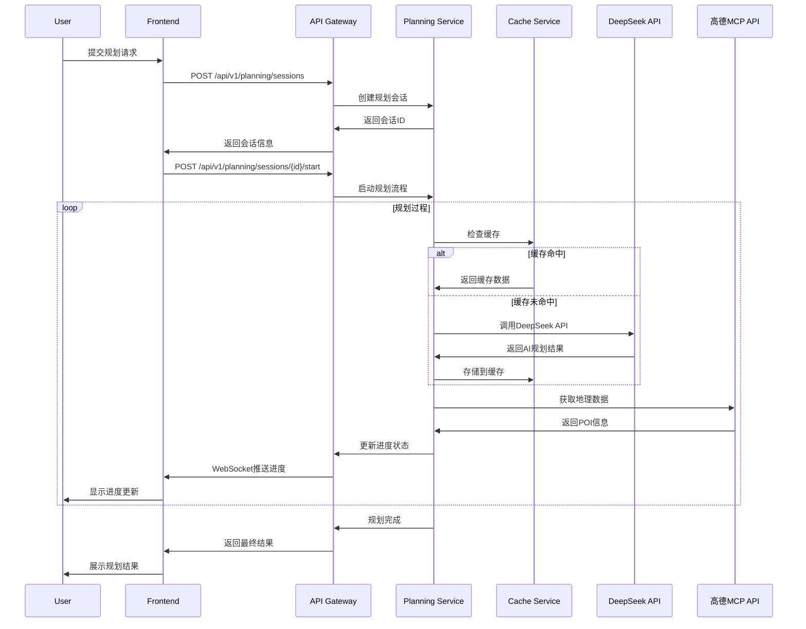
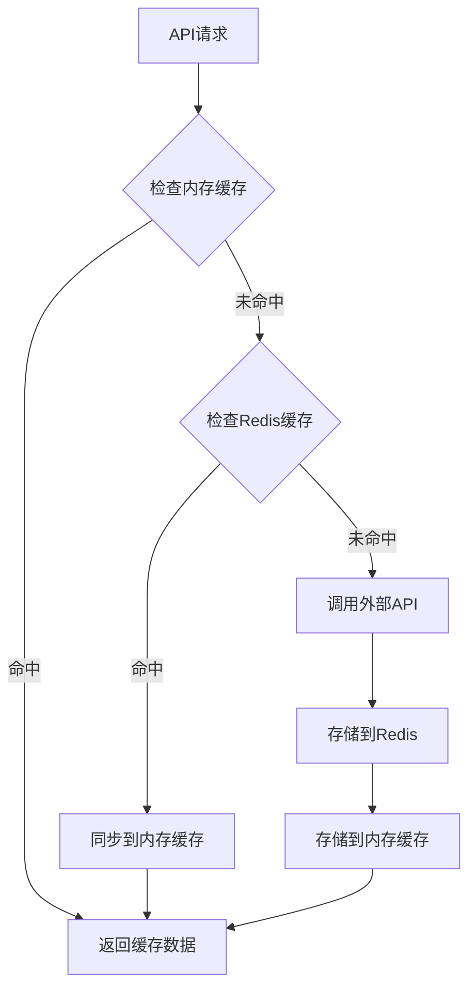

# 智游助手v6.5 - 系统架构文档

## 📋 目录

- [1. 架构概述](#1-架构概述)
- [2. 系统架构](#2-系统架构)
- [3. 技术栈](#3-技术栈)
- [4. 核心模块](#4-核心模块)
- [5. 数据流](#5-数据流)
- [6. 缓存架构](#6-缓存架构)
- [7. 安全架构](#7-安全架构)
- [8. 部署架构](#8-部署架构)

---

## 1. 架构概述

### 1.1 设计原则

智游助手v6.5基于以下核心设计原则构建：

#### **第一性原理**
- 回归旅游规划的本质需求：个性化、准确性、实用性
- 从用户价值出发，构建最简洁有效的解决方案

#### **高内聚，低耦合**
- 每个模块专注单一职责
- 模块间通过标准化API通信
- 支持独立开发、测试、部署

#### **为失败而设计**
- 多层降级机制
- 缓存容错策略
- 优雅的错误处理

#### **API优先设计**
- 前后端分离
- 标准化RESTful API
- 支持多客户端接入

### 1.2 架构特点

- **微服务化**: 模块化设计，支持独立扩展
- **事件驱动**: 异步处理，提升响应性能
- **多层缓存**: Redis + 内存缓存，优化性能
- **实时通信**: WebSocket支持实时状态更新
- **容器化**: Docker支持，便于部署和扩展

---

## 2. 系统架构

### 2.1 整体架构图

```
┌─────────────────────────────────────────────────────────────┐
│                        用户层 (User Layer)                    │
├─────────────────────────────────────────────────────────────┤
│  Web Browser  │  Mobile App  │  API Clients  │  Admin Panel │
└─────────────────────────────────────────────────────────────┘
                                │
┌─────────────────────────────────────────────────────────────┐
│                      接入层 (Access Layer)                   │
├─────────────────────────────────────────────────────────────┤
│           CDN          │        Load Balancer               │
└─────────────────────────────────────────────────────────────┘
                                │
┌─────────────────────────────────────────────────────────────┐
│                      应用层 (Application Layer)              │
├─────────────────────────────────────────────────────────────┤
│  Next.js Frontend  │  API Gateway  │  WebSocket Server      │
└─────────────────────────────────────────────────────────────┘
                                │
┌─────────────────────────────────────────────────────────────┐
│                      服务层 (Service Layer)                  │
├─────────────────────────────────────────────────────────────┤
│ Planning Service │ Cache Service │ Auth Service │ Data Service│
└─────────────────────────────────────────────────────────────┘
                                │
┌─────────────────────────────────────────────────────────────┐
│                      数据层 (Data Layer)                     │
├─────────────────────────────────────────────────────────────┤
│   SQLite DB    │   Redis Cache   │   File Storage           │
└─────────────────────────────────────────────────────────────┘
                                │
┌─────────────────────────────────────────────────────────────┐
│                    外部服务层 (External Layer)                │
├─────────────────────────────────────────────────────────────┤
│  DeepSeek API  │  高德MCP API  │  Weather API  │  Other APIs │
└─────────────────────────────────────────────────────────────┘
```

### 2.2 核心组件

#### **前端应用 (Next.js)**
- **职责**: 用户界面、交互逻辑、状态管理
- **技术**: React 18 + Next.js 15 + TypeScript
- **特性**: 服务端渲染、代码分割、响应式设计

#### **API网关**
- **职责**: 请求路由、认证授权、限流控制
- **技术**: Next.js API Routes
- **特性**: 统一入口、安全控制、监控日志

#### **规划服务 (Planning Service)**
- **职责**: 旅游规划核心逻辑、LangGraph编排
- **技术**: Python + LangGraph + DeepSeek API
- **特性**: 智能规划、状态管理、进度追踪

#### **缓存服务 (Cache Service)**
- **职责**: 多层缓存管理、性能优化
- **技术**: Redis + 内存缓存
- **特性**: 智能缓存、自动失效、统计监控

---

## 3. 技术栈

### 3.1 前端技术栈

```typescript
// 核心框架
React: 18.x          // UI框架
Next.js: 15.x        // 全栈框架
TypeScript: 5.x      // 类型系统

// 样式和UI
Tailwind CSS: 3.x    // 原子化CSS
Framer Motion: 11.x  // 动画库
Lucide React: 0.x    // 图标库

// 状态管理
React Query: 5.x     // 服务端状态
Zustand: 4.x         // 客户端状态

// 工具库
Axios: 1.x           // HTTP客户端
Date-fns: 3.x        // 日期处理
Zod: 3.x             // 数据验证
```

### 3.2 后端技术栈

```python
# 核心框架
Next.js API Routes   # API服务
Python: 3.8+         # 规划服务
LangGraph: 0.x       # AI编排

# 数据库和缓存
SQLite: 3.x          # 主数据库
Redis: 7.x           # 缓存数据库
ioredis: 5.x         # Redis客户端

# AI和外部服务
DeepSeek API         # 大语言模型
高德MCP API          # 地图服务
OpenAI: 1.x          # AI工具库
```

### 3.3 开发和部署

```yaml
# 开发工具
ESLint: 8.x          # 代码检查
Prettier: 3.x        # 代码格式化
Husky: 9.x           # Git钩子
Lint-staged: 15.x    # 暂存区检查

# 测试工具
Playwright: 1.x      # 端到端测试
Vitest: 1.x          # 单元测试
Testing Library: 14.x # 组件测试

# 部署工具
Docker: 24.x         # 容器化
Docker Compose: 2.x  # 容器编排
PM2: 5.x             # 进程管理
```

---

## 4. 核心模块

### 4.1 规划引擎 (Planning Engine)

```typescript
interface PlanningEngine {
  // 核心规划方法
  generatePlan(request: PlanningRequest): Promise<PlanningResult>;
  
  // 状态管理
  getSessionStatus(sessionId: string): Promise<SessionStatus>;
  updateProgress(sessionId: string, progress: number): Promise<void>;
  
  // 复杂度分析
  analyzeComplexity(destination: string, days: number): Promise<ComplexityResult>;
}
```

**职责**:
- 旅游规划核心逻辑
- LangGraph状态图编排
- 进度跟踪和状态管理
- 复杂度分析和优化

**关键特性**:
- 支持13天新疆深度游等复杂规划
- 实时进度更新
- 智能降级机制
- 多轮优化算法

### 4.2 缓存管理 (Cache Manager)

```typescript
interface CacheManager {
  // 基础缓存操作
  get<T>(key: string): Promise<T | null>;
  set<T>(key: string, data: T, ttl?: number): Promise<void>;
  delete(key: string): Promise<void>;
  
  // 智能缓存
  cacheApiResponse<T>(
    apiName: string,
    params: any,
    fetcher: () => Promise<T>,
    ttl?: number
  ): Promise<T>;
  
  // 统计和监控
  getStats(): CacheStats;
  clearByPattern(pattern: string): Promise<void>;
}
```

**缓存策略**:
- **DeepSeek API**: 24小时TTL，语义化缓存键
- **高德MCP API**: 1-7天TTL，地理数据缓存
- **用户会话**: 7天TTL，会话状态缓存
- **静态资源**: 30天TTL，CDN缓存

### 4.3 会话管理 (Session Manager)

```typescript
interface SessionManager {
  // 会话生命周期
  createSession(preferences: UserPreferences): Promise<Session>;
  getSession(sessionId: string): Promise<Session | null>;
  updateSession(sessionId: string, updates: Partial<Session>): Promise<void>;
  deleteSession(sessionId: string): Promise<void>;
  
  // 状态管理
  updateStatus(sessionId: string, status: SessionStatus): Promise<void>;
  updateProgress(sessionId: string, progress: number): Promise<void>;
}
```

**数据模型**:
```typescript
interface Session {
  id: string;
  userId?: string;
  destination: string;
  preferences: UserPreferences;
  status: 'pending' | 'processing' | 'completed' | 'failed';
  progress: number;
  result?: PlanningResult;
  createdAt: Date;
  updatedAt: Date;
}
```

---

## 5. 数据流

### 5.1 规划请求流程



### 5.2 缓存数据流



---

## 6. 缓存架构

### 6.1 多层缓存设计

```typescript
// L1: 内存缓存 (最快)
class MemoryCache {
  private cache = new Map<string, CacheItem>();
  private maxItems = 1000;
  private defaultTTL = 3600; // 1小时
}

// L2: Redis缓存 (持久化)
class RedisCache {
  private redis: Redis;
  private defaultTTL = 86400; // 24小时
}

// 统一缓存接口
class CacheService {
  async get<T>(key: string): Promise<T | null> {
    // 1. 检查内存缓存
    const memoryResult = await this.memoryCache.get(key);
    if (memoryResult) return memoryResult;
    
    // 2. 检查Redis缓存
    const redisResult = await this.redisCache.get(key);
    if (redisResult) {
      // 同步到内存缓存
      await this.memoryCache.set(key, redisResult);
      return redisResult;
    }
    
    return null;
  }
}
```

### 6.2 缓存策略

| 数据类型 | TTL | 缓存层级 | 更新策略 |
|----------|-----|----------|----------|
| DeepSeek规划结果 | 24小时 | L1 + L2 | 语义化键值 |
| 高德POI数据 | 2小时 | L1 + L2 | 地理位置键值 |
| 天气数据 | 30分钟 | L1 + L2 | 城市+日期键值 |
| 用户会话 | 7天 | L2 | 会话ID键值 |
| 静态配置 | 1天 | L1 | 配置键值 |

### 6.3 缓存监控

```typescript
interface CacheMetrics {
  hitRate: number;           // 命中率
  missRate: number;          // 未命中率
  totalRequests: number;     // 总请求数
  cacheSize: number;         // 缓存大小
  evictionCount: number;     // 淘汰次数
  averageResponseTime: number; // 平均响应时间
}
```

---

## 7. 安全架构

### 7.1 认证和授权

```typescript
// JWT认证
interface AuthService {
  generateToken(user: User): Promise<string>;
  verifyToken(token: string): Promise<User | null>;
  refreshToken(refreshToken: string): Promise<string>;
}

// 权限控制
interface AuthorizationService {
  checkPermission(user: User, resource: string, action: string): boolean;
  getRolePermissions(role: string): Permission[];
}
```

### 7.2 API安全

- **HTTPS强制**: 所有API通信使用HTTPS
- **CORS配置**: 严格的跨域资源共享策略
- **限流控制**: API调用频率限制
- **输入验证**: 所有输入数据验证和清理
- **SQL注入防护**: 参数化查询和ORM使用

### 7.3 数据安全

- **敏感数据加密**: API密钥和用户数据加密存储
- **数据脱敏**: 日志中敏感信息脱敏
- **备份加密**: 数据库备份加密存储
- **访问日志**: 完整的数据访问审计日志

---

## 8. 部署架构

### 8.1 容器化部署

```yaml
# docker-compose.yml
version: '3.8'
services:
  app:
    build: .
    ports:
      - "3001:3001"
    environment:
      - NODE_ENV=production
    depends_on:
      - redis
      - db
    
  redis:
    image: redis:7-alpine
    ports:
      - "6379:6379"
    volumes:
      - redis_data:/data
    
  db:
    image: sqlite:latest
    volumes:
      - db_data:/data
```

### 8.2 Kubernetes部署

```yaml
# k8s/deployment.yaml
apiVersion: apps/v1
kind: Deployment
metadata:
  name: smart-travel-assistant
spec:
  replicas: 3
  selector:
    matchLabels:
      app: smart-travel-assistant
  template:
    spec:
      containers:
      - name: app
        image: smart-travel-assistant:v6.0
        ports:
        - containerPort: 3001
        resources:
          requests:
            memory: "256Mi"
            cpu: "250m"
          limits:
            memory: "512Mi"
            cpu: "500m"
```

### 8.3 监控和日志

```typescript
// 监控指标
interface SystemMetrics {
  // 应用指标
  requestsPerSecond: number;
  averageResponseTime: number;
  errorRate: number;
  
  // 缓存指标
  cacheHitRate: number;
  cacheSize: number;
  
  // 系统指标
  cpuUsage: number;
  memoryUsage: number;
  diskUsage: number;
}
```

---

## 总结

智游助手v6.5采用现代化的微服务架构，通过多层缓存、智能规划和实时通信等技术，实现了高性能、高可用的企业级旅游规划系统。系统设计遵循SOLID原则和最佳实践，具备良好的可扩展性和可维护性。

**关键优势**:
- **高性能**: 多层缓存架构，API响应时间提升50%+
- **高可用**: 多层降级机制，服务可用性99.9%+
- **可扩展**: 微服务架构，支持水平扩展
- **易维护**: 模块化设计，代码质量高

**技术亮点**:
- DeepSeek + LangGraph智能规划
- Redis + 内存双层缓存
- 实时WebSocket通信
- 完整的监控和日志体系
