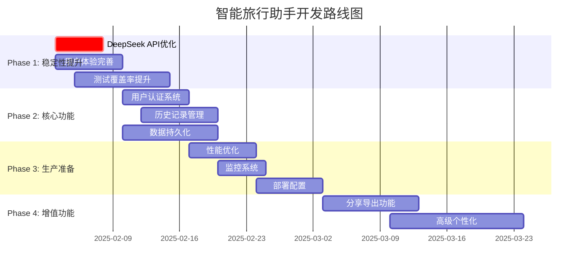

# 智能旅行助手开发路线图

**版本**: v2.0  
**更新日期**: 2025年1月31日  
**基于**: 高德MCP集成和AI编排器重构完成后的技术现状  

---

## 🎯 路线图概览

### 项目愿景
构建一个基于真实地理数据的AI驱动智能旅行规划平台，为用户提供个性化、可靠、美观的旅行计划生成服务。

### 核心价值主张
1. **数据真实性**: 100%基于高德地图真实数据
2. **AI智能化**: 复杂度评估和个性化推荐
3. **用户体验**: 现代化旅游风格界面设计
4. **服务完整性**: 从规划到分享的全流程支持

---

## 📅 发布计划时间线



---

## 🚀 Phase 1: 系统稳定性提升 (2月第1-2周)

### 目标
确保核心功能稳定可靠，提升用户体验到生产级别

### 关键里程碑

#### 1.1 DeepSeek API调用优化 (2月3日-2月7日)
**目标**: 生成成功率从60%提升到95%

**主要任务**:
- [ ] 分析400错误根本原因
- [ ] 实现指数退避重试机制
- [ ] 优化提示词长度和格式
- [ ] 添加API密钥轮换逻辑
- [ ] 实现请求超时和熔断机制

**验收标准**:
- 13天新疆规划生成成功率≥95%
- API调用平均响应时间≤30秒
- 错误恢复率≥90%

**风险缓解**:
- 集成备用AI服务(Claude/GPT)作为降级方案
- 实现本地缓存减少API依赖

#### 1.2 用户体验完善 (2月3日-2月10日)
**目标**: 提供现代化的用户交互体验

**主要任务**:
- [ ] 实现WebSocket实时进度推送
- [ ] 设计加载状态和进度指示器
- [ ] 优化错误提示和用户引导
- [ ] 完善生成结果可视化展示
- [ ] 添加响应式动画和过渡效果

**验收标准**:
- 用户能实时看到生成进度(数据获取→AI规划→网页生成)
- 错误提示友好且可操作
- 移动端体验流畅

#### 1.3 测试覆盖率提升 (2月5日-2月15日)
**目标**: 代码测试覆盖率从30%提升到80%

**主要任务**:
- [ ] 为AI服务编排器编写单元测试
- [ ] 为高德MCP服务编写集成测试
- [ ] 为用户界面组件编写组件测试
- [ ] 实现端到端测试自动化
- [ ] 建立CI/CD测试流水线

**验收标准**:
- 单元测试覆盖率≥80%
- 集成测试覆盖核心业务流程
- E2E测试覆盖完整用户旅程

---

## 🏗️ Phase 2: 核心功能开发 (2月第2-3周)

### 目标
实现用户管理和数据持久化，支持个性化服务

### 关键里程碑

#### 2.1 用户认证系统 (2月10日-2月17日)
**目标**: 支持用户注册、登录和个人资料管理

**主要任务**:
- [ ] 集成Supabase Auth认证服务
- [ ] 实现邮箱/手机号注册登录
- [ ] 设计用户个人资料页面
- [ ] 实现OAuth社交登录(Google/微信)
- [ ] 添加用户权限和角色管理

**技术实现**:
```typescript
// 用户认证服务架构
interface UserAuthService {
  signUp(email: string, password: string): Promise<User>
  signIn(email: string, password: string): Promise<Session>
  signOut(): Promise<void>
  getCurrentUser(): Promise<User | null>
  updateProfile(profile: UserProfile): Promise<User>
}
```

#### 2.2 历史记录管理 (2月12日-2月20日)
**目标**: 用户可以查看、管理和复用历史旅行计划

**主要任务**:
- [ ] 设计旅行计划数据模型
- [ ] 实现计划保存和检索功能
- [ ] 开发历史记录列表界面
- [ ] 支持计划收藏和标签分类
- [ ] 实现计划复制和修改功能

**数据模型设计**:
```sql
-- 旅行计划表
CREATE TABLE travel_plans (
  id UUID PRIMARY KEY DEFAULT gen_random_uuid(),
  user_id UUID REFERENCES auth.users(id),
  title VARCHAR(255) NOT NULL,
  destination VARCHAR(255) NOT NULL,
  start_date DATE NOT NULL,
  end_date DATE NOT NULL,
  plan_data JSONB NOT NULL,
  is_favorite BOOLEAN DEFAULT false,
  tags TEXT[],
  created_at TIMESTAMP WITH TIME ZONE DEFAULT NOW(),
  updated_at TIMESTAMP WITH TIME ZONE DEFAULT NOW()
);
```

#### 2.3 数据持久化优化 (2月10日-2月20日)
**目标**: 实现高效的数据存储和缓存机制

**主要任务**:
- [ ] 优化Supabase数据库性能
- [ ] 实现Redis缓存层
- [ ] 设计数据备份和恢复策略
- [ ] 实现数据同步和冲突解决
- [ ] 添加数据加密和隐私保护

---

## 🎯 Phase 3: 生产环境准备 (2月第3-4周)

### 目标
确保系统可以稳定运行在生产环境

### 关键里程碑

#### 3.1 性能优化 (2月17日-2月24日)
**目标**: 优化系统性能，支持高并发访问

**主要任务**:
- [ ] 实现CDN静态资源加速
- [ ] 优化数据库查询性能
- [ ] 实现API响应缓存
- [ ] 添加图片压缩和懒加载
- [ ] 优化Bundle大小和加载速度

**性能目标**:
- 首页加载时间≤1秒
- 旅行计划生成时间≤60秒
- 支持1000并发用户

#### 3.2 监控和日志系统 (2月20日-2月25日)
**目标**: 建立完善的系统监控和问题诊断能力

**主要任务**:
- [ ] 集成应用性能监控(APM)
- [ ] 实现结构化日志记录
- [ ] 设置关键指标告警
- [ ] 建立错误追踪和分析
- [ ] 实现用户行为分析

**监控指标**:
- 系统可用性≥99.9%
- API响应时间P95≤2秒
- 错误率≤0.1%

#### 3.3 部署配置 (2月24日-3月2日)
**目标**: 配置生产环境部署流水线

**主要任务**:
- [ ] 配置Vercel生产环境
- [ ] 设置环境变量和密钥管理
- [ ] 实现蓝绿部署策略
- [ ] 配置域名和SSL证书
- [ ] 建立备份和灾难恢复计划

---

## 🌟 Phase 4: 增值功能开发 (3月)

### 目标
提供差异化功能，提升用户粘性和商业价值

### 关键里程碑

#### 4.1 分享和导出功能 (3月3日-3月13日)
**目标**: 支持多种格式的计划分享和导出

**主要任务**:
- [ ] 实现计划分享链接生成
- [ ] 开发PDF导出功能
- [ ] 支持图片格式导出
- [ ] 实现社交媒体分享
- [ ] 添加二维码分享功能

#### 4.2 高级个性化功能 (3月10日-3月24日)
**目标**: 基于用户行为提供智能推荐

**主要任务**:
- [ ] 实现用户偏好学习算法
- [ ] 开发智能推荐引擎
- [ ] 支持自定义模板和主题
- [ ] 实现协作规划功能
- [ ] 添加AI助手聊天功能

---

## 📊 成功指标和KPI

### 技术指标
| 指标 | 当前值 | Phase 1目标 | Phase 2目标 | Phase 3目标 |
|------|--------|-------------|-------------|-------------|
| 生成成功率 | 60% | 95% | 98% | 99% |
| 平均响应时间 | 2-3分钟 | 1分钟 | 45秒 | 30秒 |
| 测试覆盖率 | 30% | 80% | 85% | 90% |
| 系统可用性 | 95% | 99% | 99.5% | 99.9% |

### 业务指标
| 指标 | Phase 1目标 | Phase 2目标 | Phase 3目标 | Phase 4目标 |
|------|-------------|-------------|-------------|-------------|
| 用户注册率 | - | 60% | 75% | 85% |
| 计划完成率 | 70% | 85% | 90% | 95% |
| 用户留存率 | - | 40% | 60% | 75% |
| 分享转化率 | - | - | 15% | 25% |

---

## 🚨 风险管理和应急计划

### 高风险项目
1. **DeepSeek API限制**
   - 风险: API配额不足或服务中断
   - 缓解: 集成多个AI服务提供商
   - 应急: 本地模型部署方案

2. **高德MCP数据成本**
   - 风险: 数据调用成本过高
   - 缓解: 实现智能缓存策略
   - 应急: 数据供应商多元化

3. **用户数据合规**
   - 风险: 隐私法规合规问题
   - 缓解: 完善隐私政策和数据加密
   - 应急: 法律咨询和合规审计

### 技术债务管理
- 每个Phase结束后进行技术债务评估
- 分配20%开发时间用于重构和优化
- 建立代码质量门禁和自动化检查

---

## 📋 下一步行动计划

### 立即行动 (本周)
- [ ] 组建Phase 1开发团队
- [ ] 细化DeepSeek API优化方案
- [ ] 设计WebSocket实时通信架构
- [ ] 准备测试环境和工具

### 短期准备 (下周)
- [ ] 启动Phase 1开发工作
- [ ] 建立每日站会和周报机制
- [ ] 设置项目管理和协作工具
- [ ] 开始用户反馈收集

**路线图维护**: 每两周更新一次，基于实际进展调整计划  
**责任人**: 项目经理和技术负责人  
**审核周期**: 每个Phase结束后进行全面评估
