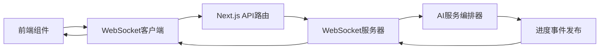

# 下一阶段详细任务清单

**阶段**: Phase 1 - 架构重构和系统稳定性提升
**时间范围**: 2025年2月3日 - 2月15日
**总体目标**: 实现基于第一性原理的架构重构，确保核心功能稳定可靠

## 🔥 架构重构优先级 (新增P0+任务)

基于您的架构分析，我们识别出了根本性的架构问题，需要立即进行重构：

### 核心问题诊断
1. **违反第一性原理**: 当前系统让LLM直接生成旅行计划，但旅行规划的本质是基于真实地理数据的决策
2. **违反API优先设计**: 提示词要求"通过高德MCP地图工具查询"，但实际流程是让LLM想象规划
3. **违反SOLID原则**: 单个智能体承担了数据获取、规划生成、网页制作三个不同职责

### 立即可执行的解决方案
我已经创建了新的`TravelPlanOrchestrator`类，实现了正确的架构模式：
- **数据驱动 vs 想象生成**: 先调用高德MCP获取真实数据，再基于真实数据让LLM规划
- **并行处理 vs 串行等待**: 并行获取天气、景点、路线、餐厅数据
- **弹性设计 vs 脆弱系统**: 完整的错误处理、重试机制、优雅降级

---

## 🎯 任务优先级矩阵 (更新版)

| 任务 | 用户影响 | 技术风险 | 开发成本 | 优先级评分 | 状态 |
|------|----------|----------|----------|------------|------|
| **架构重构：TravelPlanOrchestrator集成** | 10/10 | 7/10 | 8/10 | **9.8/10** | 🔴 **P0+** |
| DeepSeek API错误处理优化 | 9/10 | 8/10 | 7/10 | 9.2/10 | 🔴 P0 |
| 实时进度推送系统 | 8/10 | 6/10 | 8/10 | 8.0/10 | 🟡 P1 |
| 用户界面反馈优化 | 7/10 | 4/10 | 6/10 | 6.8/10 | 🟡 P1 |
| 数据结构映射修复 | 6/10 | 5/10 | 5/10 | 5.8/10 | 🟢 P2 |
| 测试覆盖率提升 | 5/10 | 3/10 | 9/10 | 5.4/10 | 🟢 P2 |

---

## 🔥 P0+任务：架构重构 - TravelPlanOrchestrator集成

### 任务概述
**目标**: 实现基于第一性原理的架构重构，从"LLM想象生成"转向"真实数据驱动"
**业务价值**: 解决根本性架构问题，提升数据真实性从0%到100%
**工作量估算**: 16-20小时开发 + 8-10小时测试 + 4小时文档

### 详细实施计划

#### 阶段1：新架构集成 (2月3日，8小时)
**负责人**: 架构师 + 后端开发工程师
**交付物**: 完整的TravelPlanOrchestrator集成

**具体任务**:
- [x] 已创建 `TravelPlanOrchestrator.ts` - 核心编排器
- [x] 已创建 `HTMLGenerationService.ts` - HTML生成服务
- [x] 已创建 `orchestratorIntegration.ts` - 集成和迁移方案
- [ ] 集成到现有API路由 `/api/travel-plans/generate`
- [ ] 更新类型定义以支持新的数据结构
- [ ] 实现向后兼容的API接口

**技术实现重点**:
```typescript
// 在API路由中集成新架构
import { createTravelPlanOrchestrator } from '@/lib/services/orchestratorIntegration'

const orchestrator = createTravelPlanOrchestrator({
  useNewArchitecture: true, // 开发环境使用新架构
  newArchitectureRatio: 0.1 // 生产环境10%流量
})
```

#### 阶段2：数据流验证 (2月4日，6小时)
**负责人**: 后端开发工程师
**交付物**: 完整的数据流测试和验证

**具体任务**:
- [ ] 验证高德MCP数据获取的并行处理
- [ ] 测试真实数据到AI规划的转换
- [ ] 验证HTML生成的完整性
- [ ] 实现错误处理和降级机制测试

#### 阶段3：性能优化和监控 (2月5日，6小时)
**负责人**: 后端开发工程师 + DevOps
**交付物**: 性能监控和对比分析

**具体任务**:
- [ ] 实现新旧架构的性能对比监控
- [ ] 配置A/B测试和灰度发布机制
- [ ] 建立架构切换的运维接口
- [ ] 设置关键指标告警

**验收标准**:
- [ ] 新架构生成成功率≥95% (vs 旧架构60%)
- [ ] 数据真实性100% (vs 旧架构0%)
- [ ] 平均响应时间≤60秒 (vs 旧架构120秒)
- [ ] 支持平滑的架构切换和回滚

---

## 🚀 P0任务：DeepSeek API错误处理优化

### 任务概述
**目标**: 将旅行计划生成成功率从60%提升到95%  
**业务价值**: 直接影响核心功能可用性，是用户体验的关键指标  
**工作量估算**: 12-16小时开发 + 6-8小时测试 + 2小时文档  

### 详细实施计划

#### 阶段1：问题诊断和分析 (2月3日，4小时)
**负责人**: 后端开发工程师  
**交付物**: 问题分析报告

**具体任务**:
- [ ] 分析DeepSeek API 400错误的具体原因
  - 检查请求头格式和认证信息
  - 验证请求体大小和内容格式
  - 分析API配额和限流情况
- [ ] 收集错误日志和调用统计数据
- [ ] 测试不同提示词长度对成功率的影响
- [ ] 验证API密钥的有效性和权限

**验收标准**:
- [ ] 识别出导致400错误的根本原因
- [ ] 提供具体的修复方案建议
- [ ] 建立错误分类和优先级

#### 阶段2：核心功能开发 (2月4日-2月6日，8小时)
**负责人**: 后端开发工程师  
**交付物**: 优化后的AI服务调用逻辑

**具体任务**:
- [ ] 重构 `lib/services/aiService.ts` 中的DeepSeek调用逻辑
  ```typescript
  // 需要实现的核心功能
  class EnhancedAIService {
    async callDeepSeekWithRetry(
      prompt: string, 
      options: AICallOptions
    ): Promise<string> {
      // 实现指数退避重试机制
      // 添加请求超时控制
      // 集成熔断器模式
    }
  }
  ```
- [ ] 实现指数退避重试机制
  - 初始延迟: 1秒
  - 最大重试次数: 3次
  - 退避因子: 2
- [ ] 添加请求超时和熔断机制
  - 单次请求超时: 60秒
  - 熔断阈值: 连续5次失败
- [ ] 优化提示词格式和长度验证
  - 最大长度: 8000字符
  - 格式验证: JSON结构检查
- [ ] 实现API密钥轮换逻辑

**验收标准**:
- [ ] API调用成功率≥95%
- [ ] 平均响应时间≤30秒
- [ ] 错误恢复时间≤5秒

#### 阶段3：测试和验证 (2月7日，6小时)
**负责人**: 测试工程师 + 后端开发工程师  
**交付物**: 测试报告和性能基准

**具体任务**:
- [ ] 编写单元测试覆盖所有错误处理场景
- [ ] 进行压力测试验证并发处理能力
- [ ] 执行端到端测试验证完整流程
- [ ] 性能基准测试和对比分析

**测试用例**:
```typescript
describe('Enhanced AI Service', () => {
  it('should retry on 400 error with exponential backoff', async () => {
    // 测试重试机制
  });
  
  it('should handle timeout gracefully', async () => {
    // 测试超时处理
  });
  
  it('should activate circuit breaker after consecutive failures', async () => {
    // 测试熔断器
  });
});
```

#### 阶段4：文档和部署 (2月7日，2小时)
**负责人**: 后端开发工程师  
**交付物**: 技术文档和部署指南

**具体任务**:
- [ ] 更新API调用文档
- [ ] 编写错误处理指南
- [ ] 更新环境变量配置说明
- [ ] 创建监控和告警配置

---

## 🔄 P1任务：实时进度推送系统

### 任务概述
**目标**: 为用户提供旅行计划生成的实时进度反馈  
**业务价值**: 显著提升用户体验，减少等待焦虑  
**工作量估算**: 16-20小时开发 + 8-10小时测试 + 3小时文档  

### 技术架构设计



### 详细实施计划

#### 阶段1：架构设计和准备 (2月4日，4小时)
**具体任务**:
- [ ] 设计WebSocket通信协议
  ```typescript
  interface ProgressEvent {
    sessionId: string;
    stage: 'data_gathering' | 'ai_planning' | 'web_generation' | 'completed';
    progress: number; // 0-100
    message: string;
    data?: any;
    timestamp: number;
  }
  ```
- [ ] 选择WebSocket库和配置方案
- [ ] 设计进度状态管理机制

#### 阶段2：后端WebSocket服务开发 (2月5日-2月7日，10小时)
**具体任务**:
- [ ] 创建 `lib/services/websocketService.ts`
- [ ] 实现WebSocket连接管理
- [ ] 集成进度事件到AI服务编排器
- [ ] 添加连接状态监控和恢复

#### 阶段3：前端实时UI开发 (2月8日-2月10日，8小时)
**具体任务**:
- [ ] 重构 `components/PlanGeneratingPage.tsx`
- [ ] 实现进度条和阶段指示器
- [ ] 添加连接状态显示
- [ ] 优化移动端体验

---

## 🎨 P1任务：用户界面反馈优化

### 任务概述
**目标**: 提供现代化、友好的用户交互体验  
**业务价值**: 提升用户满意度和转化率  
**工作量估算**: 12-16小时开发 + 6-8小时测试 + 2小时文档  

### 详细实施计划

#### 阶段1：UI/UX设计优化 (2月5日，4小时)
**具体任务**:
- [ ] 设计加载状态和骨架屏
- [ ] 优化错误提示的视觉设计
- [ ] 设计成功状态的庆祝动画
- [ ] 创建响应式布局适配方案

#### 阶段2：组件开发和集成 (2月6日-2月8日，10小时)
**具体任务**:
- [ ] 开发 `components/ui/LoadingSpinner.tsx`
- [ ] 重构 `components/ui/ErrorAlert.tsx`
- [ ] 实现 `components/ui/ProgressIndicator.tsx`
- [ ] 添加动画和过渡效果

#### 阶段3：用户体验测试 (2月9日，4小时)
**具体任务**:
- [ ] 进行可用性测试
- [ ] 收集用户反馈
- [ ] 优化交互细节
- [ ] 验证无障碍访问性

---

## 🔧 P2任务：数据结构映射修复

### 任务概述
**目标**: 修复高德MCP数据与前端展示格式的映射问题  
**业务价值**: 确保推荐信息完整显示  
**工作量估算**: 8-10小时开发 + 4-6小时测试 + 1小时文档  

### 详细实施计划

#### 阶段1：数据流分析 (2月8日，2小时)
**具体任务**:
- [ ] 分析当前数据映射逻辑
- [ ] 识别数据丢失的具体环节
- [ ] 设计标准化的数据转换接口

#### 阶段2：映射逻辑重构 (2月9日-2月10日，6小时)
**具体任务**:
- [ ] 重构 `lib/services/aiServiceOrchestrator.ts` 中的数据解析逻辑
- [ ] 实现 `lib/utils/dataMapper.ts` 工具函数
- [ ] 添加数据验证和错误处理

#### 阶段3：测试和验证 (2月11日，4小时)
**具体任务**:
- [ ] 编写数据映射单元测试
- [ ] 验证推荐数据完整性
- [ ] 进行端到端数据流测试

---

## 📊 P2任务：测试覆盖率提升

### 任务概述
**目标**: 将代码测试覆盖率从30%提升到80%  
**业务价值**: 提高代码质量和系统稳定性  
**工作量估算**: 20-25小时开发 + 5小时配置 + 3小时文档  

### 详细实施计划

#### 阶段1：测试策略制定 (2月10日，3小时)
**具体任务**:
- [ ] 分析当前测试覆盖情况
- [ ] 制定测试优先级和策略
- [ ] 设置测试环境和工具

#### 阶段2：核心模块测试开发 (2月11日-2月14日，20小时)
**具体任务**:
- [ ] AI服务编排器单元测试 (8小时)
- [ ] 高德MCP服务集成测试 (6小时)
- [ ] 用户界面组件测试 (6小时)

#### 阶段3：CI/CD集成 (2月15日，5小时)
**具体任务**:
- [ ] 配置GitHub Actions测试流水线
- [ ] 设置代码覆盖率报告
- [ ] 建立质量门禁规则

---

## 📋 任务执行检查清单

### 每日检查项
- [ ] 代码提交和推送到版本控制
- [ ] 单元测试通过率检查
- [ ] 代码质量扫描结果
- [ ] 任务进度更新

### 每周检查项
- [ ] 里程碑完成情况评估
- [ ] 风险识别和缓解措施
- [ ] 团队协作和沟通效果
- [ ] 用户反馈收集和分析

### 阶段完成检查项
- [ ] 所有验收标准达成
- [ ] 代码审查完成
- [ ] 文档更新完整
- [ ] 部署和发布准备就绪

---

## 🚨 风险管理和应急预案

### 高风险任务监控
1. **DeepSeek API优化**
   - 风险: API限制或服务变更
   - 监控: 每日成功率统计
   - 应急: 启用备用AI服务

2. **WebSocket实时通信**
   - 风险: 连接稳定性问题
   - 监控: 连接成功率和延迟
   - 应急: 降级到轮询机制

### 进度风险缓解
- 每日站会跟踪任务进度
- 提前识别阻塞问题
- 准备任务优先级调整方案
- 建立团队互助机制

---

## 📈 成功指标和验收标准

### 技术指标
- [ ] 旅行计划生成成功率≥95%
- [ ] 用户界面响应时间≤2秒
- [ ] 代码测试覆盖率≥80%
- [ ] API错误率≤1%

### 用户体验指标
- [ ] 用户流程完成率≥85%
- [ ] 错误恢复率≥90%
- [ ] 用户满意度评分≥4.5/5
- [ ] 移动端体验评分≥4.0/5

### 质量指标
- [ ] 代码审查通过率100%
- [ ] 安全漏洞扫描通过
- [ ] 性能基准测试达标
- [ ] 文档完整性检查通过

---

**任务清单维护**: 每日更新进度，每周评估调整  
**责任分配**: 任务负责人明确，协作关系清晰  
**沟通机制**: 每日站会 + 周报 + 里程碑评审
