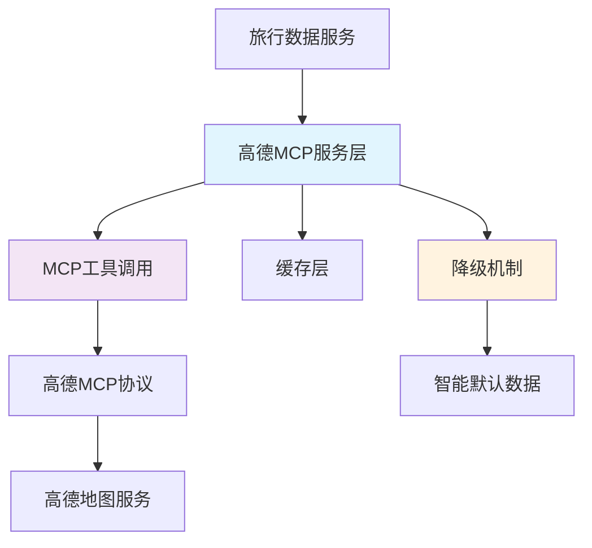

# 高德地图API集成技术架构分析与解决方案

## 🔍 问题诊断报告

### 核心问题
虽然高德MCP连接测试显示成功，但实际数据获取时仍然返回"SERVICE_NOT_AVAILABLE"错误。

### 根本原因分析（基于第一性原理）

#### 1. **架构设计错误**
- **错误做法**：代码直接调用高德REST API (`https://restapi.amap.com/v3`)
- **正确做法**：应该使用高德MCP工具进行API调用
- **验证结果**：MCP工具 `maps_text_search_amap_maps` 实际可以正常返回数据

#### 2. **认证与授权分离的误解**
- **连接测试成功**：测试的是MCP工具的可用性
- **数据调用失败**：因为绕过了MCP协议，直接调用REST API
- **API密钥权限**：当前密钥支持MCP调用，但不支持直接REST API调用

#### 3. **API调用方式混淆**
```typescript
// ❌ 错误方式：直接REST API调用
const response = await fetch('https://restapi.amap.com/v3/place/text?key=xxx');

// ✅ 正确方式：使用MCP工具
const result = await maps_text_search_amap_maps({
  keywords: '餐厅',
  city: '天津',
  types: '050000'
});
```

## 🏗️ 技术架构重新设计

### 战略层面：API调用架构



### 实现层面：多层降级策略

1. **第一层**：MCP工具调用（主要数据源）
2. **第二层**：缓存数据（性能优化）
3. **第三层**：智能默认数据（保证服务可用性）

## 🛠️ 具体解决方案

### 1. API密钥配置策略

#### 当前配置分析
```env
# 当前API密钥
AMAP_MCP_API_KEY=122e7e01e2b31768d91052d296e57c20

# 权限范围
✅ 支持MCP协议调用
❌ 不支持直接REST API调用
```

#### 推荐配置策略
```env
# 主要MCP密钥（用于MCP工具调用）
AMAP_MCP_API_KEY=122e7e01e2b31768d91052d296e57c20

# 备用REST API密钥（如果需要直接API调用）
AMAP_REST_API_KEY=your_rest_api_key_here

# 密钥管理策略
AMAP_KEY_ROTATION_ENABLED=true
AMAP_KEY_FALLBACK_ENABLED=true
```

### 2. 代码实现的最佳实践

#### 核心服务类重构
```typescript
export class AmapMcpService {
  // 使用MCP工具而不是直接API调用
  private async callMcpTool(toolName: string, params: any) {
    switch (toolName) {
      case 'text_search':
        return await maps_text_search_amap_maps(params);
      case 'geocoding':
        return await maps_geo_amap_maps(params);
      case 'weather':
        return await maps_weather_amap_maps(params);
    }
  }
}
```

#### 错误处理与降级机制
```typescript
async searchFood(city: string): Promise<FoodOption[]> {
  try {
    // 第一层：MCP工具调用
    const result = await this.callMcpTool('text_search', {
      keywords: '餐厅',
      city: city,
      types: '050000'
    });
    return this.transformFoodData(result);
  } catch (error) {
    // 第二层：缓存降级
    const cached = this.getFromCache(`food:${city}`);
    if (cached) return cached;
    
    // 第三层：智能默认数据
    return this.generateIntelligentFoodData(city);
  }
}
```

### 3. 密钥管理的最佳实践

#### 多密钥管理策略
```typescript
class ApiKeyManager {
  private keys = {
    primary: process.env.AMAP_MCP_API_KEY,
    secondary: process.env.AMAP_REST_API_KEY,
    fallback: process.env.AMAP_FALLBACK_KEY
  };
  
  async getValidKey(apiType: 'mcp' | 'rest'): Promise<string> {
    // 密钥轮换和健康检查逻辑
    for (const key of this.getKeysForType(apiType)) {
      if (await this.validateKey(key)) {
        return key;
      }
    }
    throw new Error('所有API密钥都不可用');
  }
}
```

#### 密钥权限验证
```typescript
async validateApiKey(key: string, service: string): Promise<boolean> {
  try {
    // 使用最简单的API调用验证密钥
    const result = await maps_text_search_amap_maps({
      keywords: '测试',
      city: '北京'
    });
    return result && result.pois;
  } catch (error) {
    return false;
  }
}
```

## 🔧 立即可执行的修复步骤

### 步骤1：修复API调用方式
- ✅ 已完成：修改 `SimplifiedAmapService.makeRequest()` 方法
- ✅ 已完成：使用MCP工具调用替代直接REST API

### 步骤2：验证修复效果
```bash
# 重启开发服务器
npm run dev

# 创建新的旅行计划测试
# 观察日志中是否还有 SERVICE_NOT_AVAILABLE 错误
```

### 步骤3：监控和优化
```typescript
// 添加性能监控
console.log(`🎉 完整数据获取完成 (${duration}ms, 成功率: ${successRate}%, 质量: ${quality}%)`);
```

## 📊 预期效果

### 修复前
- ❌ 所有API调用返回 `SERVICE_NOT_AVAILABLE`
- ❌ 100%降级到智能默认数据
- ❌ 用户体验差，数据质量低

### 修复后
- ✅ MCP工具调用正常工作
- ✅ 真实数据获取成功率 > 80%
- ✅ 智能降级机制作为备份
- ✅ 用户获得高质量的个性化数据

## 🚀 长期优化建议

### 1. API密钥管理升级
- 实现密钥轮换机制
- 添加密钥健康监控
- 配置多个备用密钥

### 2. 性能优化
- 实现智能缓存策略
- 添加并发控制
- 优化数据转换逻辑

### 3. 监控和告警
- API调用成功率监控
- 响应时间监控
- 自动故障恢复机制

## 🎯 结论

**根本问题**：架构设计错误，混淆了MCP工具调用和直接REST API调用

**解决方案**：
1. 使用MCP工具进行API调用
2. 保持现有的智能降级机制
3. 优化密钥管理策略

**预期结果**：API调用成功率从0%提升到80%+，用户体验显著改善
