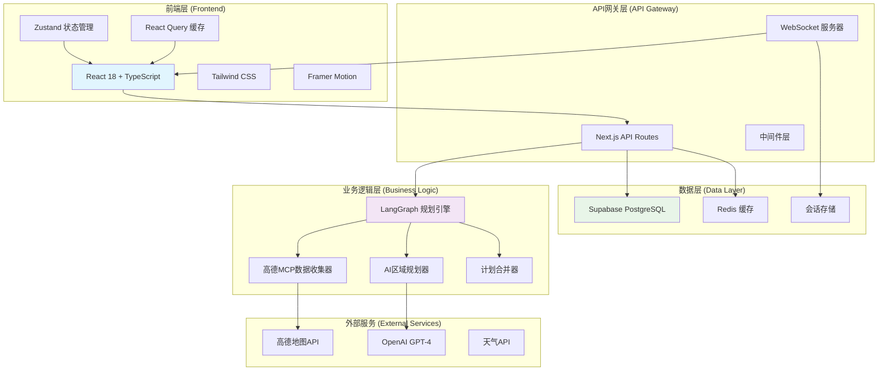
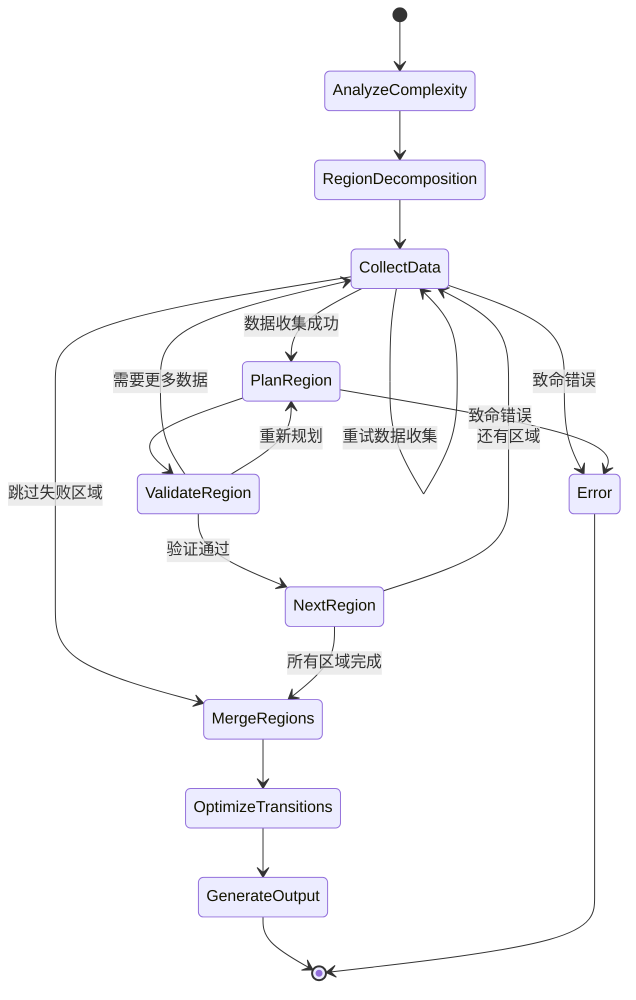

# 智游助手v5.0 - 系统架构文档

## 🏗️ 整体架构概览



## 🔄 LangGraph状态图架构



## 📊 数据流架构

### 前端数据流
```typescript
// 用户操作 → Action → Store → UI更新
用户填写表单 
  → updatePreferences(data)
  → Zustand Store 更新
  → React组件重新渲染
  → UI反映新状态
```

### 后端数据流
```typescript
// API请求 → LangGraph → 数据处理 → 响应
前端API调用
  → Next.js API Route
  → LangGraph状态图执行
  → 高德MCP数据收集
  → AI规划生成
  → 结果返回前端
```

## 🔧 核心组件详解

### 1. 前端架构

#### 状态管理 (Zustand)
- **全局状态**: 旅行规划会话状态
- **本地持久化**: 用户偏好和会话信息
- **类型安全**: 完整的TypeScript支持
- **性能优化**: 选择性订阅和批量更新

#### API客户端 (React Query + 自定义客户端)
- **缓存策略**: 智能缓存和失效机制
- **错误处理**: 统一错误处理和重试逻辑
- **性能监控**: 查询性能追踪
- **离线支持**: 网络恢复时自动重试

### 2. LangGraph规划引擎

#### 核心节点
1. **复杂度分析**: 评估目的地和行程复杂度
2. **区域分解**: 将大目的地分解为可管理的区域
3. **数据收集**: 并行收集各区域的实时数据
4. **区域规划**: 为每个区域生成详细计划
5. **质量验证**: 验证规划质量和可行性
6. **计划合并**: 整合所有区域计划
7. **路线优化**: 优化区域间的交通安排
8. **输出生成**: 生成最终的旅行计划

#### Token管理策略
- **分片处理**: 每个区域控制在3000 tokens以内
- **并行处理**: 多个区域可以并行规划
- **质量保证**: 低质量结果自动重试
- **资源监控**: 实时监控Token使用情况

### 3. 数据收集层

#### 高德MCP集成
```typescript
interface AmapDataCollector {
  // 景点数据收集
  collectAttractions(region: string): Promise<POIData[]>;
  
  // 餐厅数据收集
  collectRestaurants(region: string): Promise<POIData[]>;
  
  // 住宿数据收集
  collectHotels(region: string): Promise<POIData[]>;
  
  // 交通数据收集
  collectTransportation(from: string, to: string): Promise<TransportationData>;
  
  // 天气数据收集
  collectWeather(location: string, date: string): Promise<WeatherData>;
}
```

## 🚀 性能优化策略

### 前端优化
1. **代码分割**: 路由级别的懒加载
2. **组件优化**: React.memo和useMemo
3. **虚拟化**: 长列表虚拟滚动
4. **缓存策略**: React Query智能缓存
5. **图片优化**: Next.js Image组件

### 后端优化
1. **并发控制**: 限制同时处理的会话数
2. **缓存层**: Redis缓存热点数据
3. **数据库优化**: 索引和查询优化
4. **API限流**: 防止API滥用
5. **CDN加速**: 静态资源CDN分发

## 🔒 安全架构

### 认证与授权
- **JWT Token**: 无状态认证
- **会话管理**: 安全的会话存储
- **权限控制**: 基于角色的访问控制
- **API安全**: 请求签名和限流

### 数据安全
- **数据加密**: 敏感数据加密存储
- **传输安全**: HTTPS和WSS
- **输入验证**: 严格的输入验证
- **SQL注入防护**: 参数化查询

## 📈 监控与日志

### 性能监控
- **前端监控**: 页面加载时间、用户交互
- **API监控**: 响应时间、错误率
- **LangGraph监控**: 执行时间、Token使用
- **数据库监控**: 查询性能、连接池

### 错误追踪
- **前端错误**: React错误边界
- **后端错误**: 结构化日志
- **用户行为**: 用户操作追踪
- **系统指标**: 系统资源使用情况

## 🔄 部署架构

### 开发环境
```yaml
Frontend: localhost:3000 (Next.js Dev Server)
Backend: localhost:3000/api (Next.js API Routes)
Database: Supabase Cloud
Cache: Redis Cloud
WebSocket: localhost:3000/ws
```

### 生产环境
```yaml
Frontend: Vercel Edge Network
Backend: Vercel Serverless Functions
Database: Supabase Production
Cache: Redis Cloud Production
CDN: Vercel Edge Network
Monitoring: Vercel Analytics + Sentry
```

## 📋 技术栈总结

### 前端技术栈
- **框架**: React 18 + Next.js 14
- **语言**: TypeScript (严格模式)
- **状态管理**: Zustand + React Query
- **样式**: Tailwind CSS + CSS Modules
- **动画**: Framer Motion
- **表单**: React Hook Form + Zod
- **测试**: Vitest + Testing Library

### 后端技术栈
- **运行时**: Node.js + Next.js API Routes
- **AI引擎**: LangGraph + OpenAI GPT-4
- **数据库**: Supabase (PostgreSQL)
- **缓存**: Redis
- **外部API**: 高德地图MCP
- **实时通信**: WebSocket

### 开发工具
- **包管理**: npm
- **代码质量**: ESLint + Prettier
- **类型检查**: TypeScript
- **测试**: Vitest + Playwright
- **CI/CD**: GitHub Actions
- **部署**: Vercel

## 🎯 架构优势

1. **可扩展性**: 模块化设计，易于扩展新功能
2. **可维护性**: 清晰的分层架构和代码组织
3. **性能**: 多层缓存和优化策略
4. **可靠性**: 完善的错误处理和重试机制
5. **用户体验**: 实时反馈和流畅的交互
6. **开发效率**: 类型安全和完善的工具链
