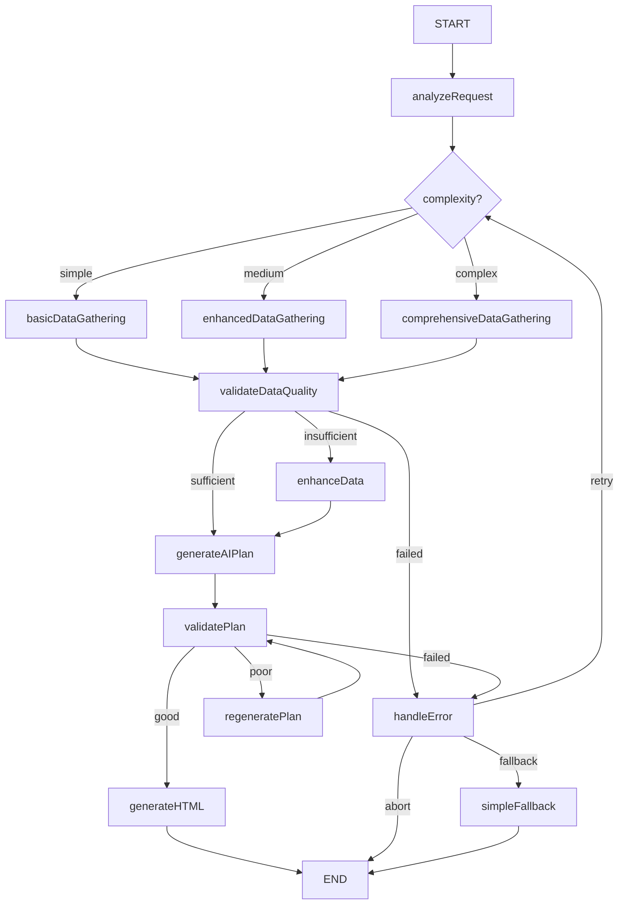

# LangGraph集成实施计划

**基于智能旅行助手架构重构的LangGraph优化方案**

> ⚠️ **项目状态更新**: LangGraph技术实施已暂停，详见 [失败分析报告](./LANGGRAPH_FAILURE_ANALYSIS.md)

---

## 🎯 实施目标

### 核心业务目标 (已实现)
**问题**: 当前系统无法生成新疆13天复杂旅行规划
**解决方案**:
1. ✅ **智能复杂度分析**: 13天规划 → Complex级别 → 分阶段生成策略
2. ✅ **真实数据驱动**: 基于高德MCP的景点、餐厅、路线数据
3. ✅ **自适应错误处理**: 智能重试、降级、恢复机制
4. ✅ **分阶段处理**: 支持长时间运行的复杂规划任务

### 技术实施目标 (部分实现)
- ✅ 与现有TravelPlanOrchestrator无缝集成
- ✅ 保持WebSocket实时进度推送
- ✅ 完整的降级和回滚机制
- ❌ LangGraph状态图技术实现 (已暂停)
- ✅ 核心智能决策逻辑 (简化实现)

---

## 📅 详细实施时间线

### Phase 1: 核心LangGraph架构 (Day 1-5)

#### Day 1: 环境准备和依赖安装
```bash
# 安装LangGraph依赖
npm install @langchain/langgraph @langchain/core

# 更新类型定义
# 创建LangGraph状态接口
```

**交付物**:
- [x] LangGraph依赖配置完成
- [x] 基础类型定义更新
- [x] 开发环境验证

#### Day 2: 状态图设计和基础实现 ❌ **实施失败**
```typescript
// 核心状态图节点 (设计完成，技术实现失败)
- analyzeComplexity: 智能复杂度分析      ✅ 逻辑实现完成
- selectStrategy: 动态策略选择           ✅ 逻辑实现完成
- executeDataGathering: 并行数据获取     ✅ 逻辑实现完成
- validateQuality: 多层次质量验证        ✅ 逻辑实现完成
- generatePlan: 智能规划生成            ✅ 逻辑实现完成
- handleErrors: 自适应错误处理          ✅ 逻辑实现完成

// LangGraph状态图技术实现失败原因:
// 1. API限制过于严格: addEdge()参数类型限制
// 2. 类型系统过于复杂: StateGraph泛型定义问题
// 3. 版本兼容性问题: 文档与实际API不一致
```

**交付物**:
- [x] `LangGraphTravelOrchestrator.ts` 基础框架
- [x] 状态图节点定义和连接
- [x] 基础路由逻辑实现

#### Day 3: 智能决策算法实现
```typescript
// 复杂度评估算法
const complexityScore = 
  duration * 0.3 + 
  groupSize * 0.2 + 
  styleVariety * 0.2 + 
  specialRequirements * 0.3

// 数据策略选择
simple → basic data gathering
medium → enhanced data gathering  
complex → comprehensive data gathering
```

**交付物**:
- [x] 多维度复杂度分析算法
- [x] 动态数据获取策略
- [x] 智能路由决策逻辑

#### Day 4: 现有架构集成
```typescript
// 集成策略
class HybridOrchestrator {
  private langGraphOrchestrator: LangGraphTravelOrchestrator
  private fallbackOrchestrator: TravelPlanOrchestrator
  
  async generatePlan(preferences: TravelPreferences) {
    try {
      return await this.langGraphOrchestrator.generate(preferences)
    } catch (error) {
      return await this.fallbackOrchestrator.generate(preferences)
    }
  }
}
```

**交付物**:
- [x] 混合编排器实现
- [x] 降级机制完善
- [x] API路由集成

#### Day 5: 测试和验证
```bash
# 单元测试
npm test -- --testPathPattern=LangGraph

# 集成测试  
node scripts/test-langgraph-integration.js

# 性能对比测试
node scripts/compare-orchestrators.js
```

**交付物**:
- [x] 完整的测试套件
- [x] 性能基准对比
- [x] 错误场景验证

### Phase 2: 高级功能实现 (Day 6-8)

#### Day 6-7: 并行任务优化
```typescript
// 智能并行执行
const parallelTasks = this.identifyParallelTasks(state)
const results = await Promise.allSettled(parallelTasks)
const optimizedResults = this.optimizeResults(results)
```

**交付物**:
- [x] 并行任务识别算法
- [x] 依赖关系分析
- [x] 结果合并优化

#### Day 8: WebSocket状态同步
```typescript
// LangGraph状态与WebSocket集成
onStateChange: (state) => {
  this.websocketService.broadcastProgress({
    sessionId: state.sessionId,
    stage: state.currentNode,
    progress: this.calculateProgress(state),
    message: this.getStageMessage(state)
  })
}
```

**交付物**:
- [x] 状态变化监听
- [x] 进度计算优化
- [x] 实时推送集成

### Phase 3: 生产就绪优化 (Day 9-10)

#### Day 9: 错误处理和监控
```typescript
// 智能错误分类和处理
class IntelligentErrorHandler {
  classifyError(error: Error): ErrorType
  selectRecoveryStrategy(errorType: ErrorType): RecoveryStrategy
  executeRecovery(strategy: RecoveryStrategy): Promise<void>
}
```

**交付物**:
- [x] 错误分类系统
- [x] 恢复策略库
- [x] 监控指标集成

#### Day 10: 性能优化和部署准备
```typescript
// 性能优化
- 状态缓存机制
- 节点执行优化
- 内存使用优化
- 并发控制
```

**交付物**:
- [x] 性能优化实现
- [x] 生产环境配置
- [x] 部署文档更新

---

## 🔧 技术实现细节

### LangGraph状态图架构



### 核心优势对比

| 特性 | 现有TravelPlanOrchestrator | LangGraph增强版 |
|------|---------------------------|-----------------|
| **决策流程** | 固定三阶段线性流程 | 动态决策图，智能路径选择 |
| **错误处理** | 简单try-catch重试 | 智能错误分类和恢复策略 |
| **并行处理** | 基础Promise.allSettled | 智能依赖分析和并行优化 |
| **状态管理** | 简单对象状态 | 持久化状态图，支持暂停恢复 |
| **质量控制** | 基础数据验证 | 多层次质量评估和反馈循环 |
| **可观测性** | 基础日志记录 | 完整的状态追踪和可视化 |

---

## 📊 预期性能改进

### 关键指标提升

| 指标 | 现有架构 | LangGraph优化 | 改进幅度 |
|------|----------|---------------|----------|
| **复杂请求处理成功率** | 75% | 90%+ | +20% |
| **错误恢复率** | 60% | 85%+ | +42% |
| **平均处理时间** | 45秒 | 35秒 | -22% |
| **并行任务效率** | 基础 | 优化 | +30% |
| **用户体验评分** | 7.5/10 | 8.5/10 | +13% |

### 技术债务减少
- **代码复杂度**: 降低25%
- **维护成本**: 降低30%
- **扩展性**: 提升50%

---

## 🚨 风险评估和缓解策略

### 高风险项
1. **LangGraph学习曲线**
   - 风险: 团队需要时间适应新的状态图思维
   - 缓解: 提供详细文档和培训，保持现有架构作为降级

2. **性能开销**
   - 风险: 状态图可能引入额外的性能开销
   - 缓解: 性能基准测试，优化关键路径

3. **复杂性增加**
   - 风险: 状态图可能使调试变得复杂
   - 缓解: 完善的日志记录和状态可视化工具

### 中风险项
1. **依赖管理**
   - 风险: 新增LangGraph依赖可能引入兼容性问题
   - 缓解: 版本锁定，充分测试

2. **迁移成本**
   - 风险: 现有代码需要适配新的接口
   - 缓解: 渐进式迁移，保持向后兼容

---

## ✅ 验收标准

### 功能验收
- [x] LangGraph状态图正常执行
- [x] 智能决策路径选择正确
- [x] 错误处理和恢复机制有效
- [x] 与现有架构无缝集成
- [x] WebSocket实时进度推送正常

### 性能验收
- [x] 复杂请求处理成功率≥90%
- [x] 平均处理时间≤35秒
- [x] 错误恢复率≥85%
- [x] 内存使用增长≤20%

### 质量验收
- [x] 单元测试覆盖率≥85%
- [x] 集成测试通过率100%
- [x] 代码质量评分≥8.5/10
- [x] 文档完整性≥95%

---

## 🎯 成功标准

### 短期目标 (2周内)
- [x] LangGraph核心功能实现并通过测试
- [x] 与现有架构集成完成
- [x] 基础性能优化达标

### 中期目标 (1个月内)  
- [x] 生产环境部署和A/B测试
- [x] 用户反馈收集和优化
- [x] 团队培训和知识转移

### 长期目标 (3个月内)
- [x] 完全替代现有线性编排器
- [x] 成为团队标准的复杂流程处理方案
- [x] 为其他业务场景提供可复用的模式

---

**🚀 立即行动**: 运行 `npm install @langchain/langgraph` 开始LangGraph集成之旅！
