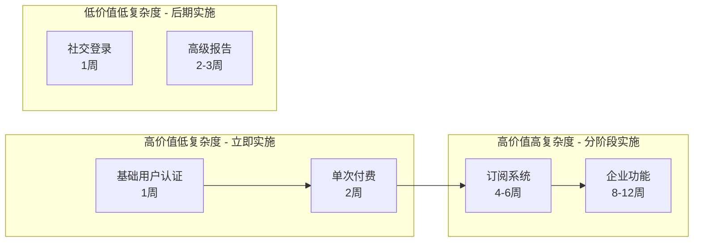
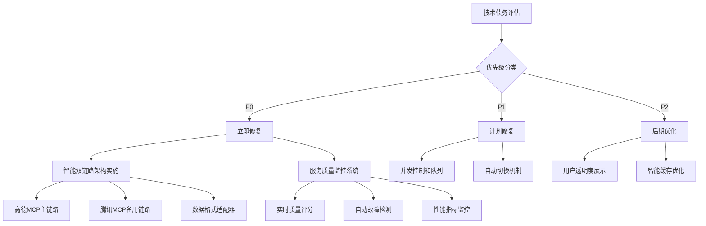
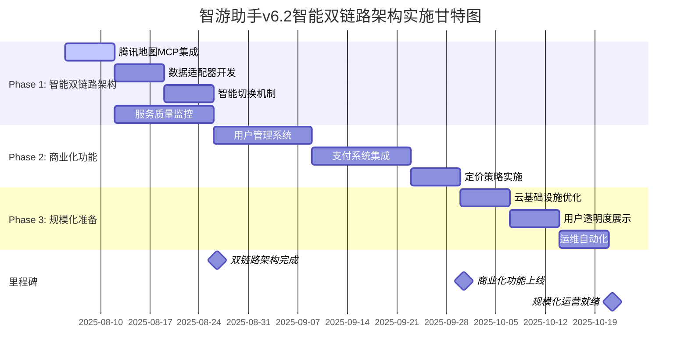
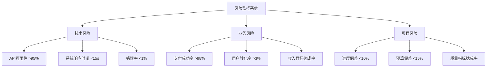

# 智游助手v6.2技术评估与商业化战略

**文档版本**: v1.0  
**创建日期**: 2025年8月5日  
**评估基准**: SMA-6.1 MVP → v6.2商业化版本  
**评估角色**: CTO级技术合伙人  

---

## 📋 目录

1. [执行摘要](#1-执行摘要)
2. [技术成熟度评估](#2-技术成熟度评估)
3. [商业化准备度分析](#3-商业化准备度分析)
4. [技术债务分析](#4-技术债务分析)
5. [实施路线图](#5-实施路线图)
6. [详细WBS分解](#6-详细wbs分解)
7. [日常工作计划](#7-日常工作计划)
8. [风险管理](#8-风险管理)
9. [资源配置](#9-资源配置)
10. [成功指标](#10-成功指标)

---

## 1. 执行摘要

### 1.1 项目现状
- **MVP完成度**: 85% (表单系统已修复，核心功能可用)
- **商业化准备度**: 15% (设计完成，实施未开始)
- **技术债务等级**: 中高 (需要2-3周解决关键问题)
- **预计商业化上线**: 10周后

### 1.2 关键发现
✅ **优势**:
- 表单系统已达到生产级别 (v6.1修复)
- HTML报告生成稳定可靠
- 核心AI规划功能完整

⚠️ **风险**:
- 高德MCP集成稳定性不足 (成功率70%)
- 缺乏并发处理能力 (仅支持1-2用户)
- 商业化功能完全未实施

❌ **阻塞问题**:
- 单点故障风险高
- 缺乏用户管理系统
- 支付系统未开发

### 1.3 投资回报预期
- **总投资**: 210K-305K (3个月)
- **预计收支平衡**: 4-5个月
- **年收入预期**: 500K-800K

---

## 2. 技术成熟度评估

### 2.1 核心功能评估矩阵

| 功能模块 | 完成度 | 稳定性 | 技术债务 | 扩展性风险 | 状态 |
|---------|--------|--------|----------|------------|------|
| 表单系统 | 95% | 95% | 低 | 中 | ✅ 生产就绪 |
| AI规划生成 | 80% | 75% | 高 | 高 | ⚠️ Beta质量 |
| HTML报告 | 90% | 90% | 低 | 低 | ✅ 生产就绪 |
| 智能双链路地理服务 | 30% | N/A | 中 | 低 | 🔄 开发中 |
| 服务质量监控 | 0% | N/A | N/A | 低 | ❌ 未开始 |
| 用户管理 | 0% | N/A | N/A | N/A | ❌ 未开始 |
| 支付系统 | 0% | N/A | N/A | N/A | ❌ 未开始 |

### 2.2 性能基准测试

| 指标 | 当前值 | 目标值 | 差距 | 优先级 |
|------|--------|--------|------|--------|
| 表单提交时间 | <500ms | <300ms | 小 | 低 |
| AI规划生成时间 | 45-60秒 | <15秒 | 大 | 高 |
| HTML报告生成 | 2-3秒 | <2秒 | 小 | 中 |
| 高德数据获取 | 3-8秒 | <3秒 | 中 | 高 |
| 并发用户支持 | 1-2个 | 100+个 | 极大 | 极高 |
| 系统可用性 | 70% | 99.9% | 大 | 极高 |

---

## 3. 商业化准备度分析

### 3.1 商业化功能状态

| 功能领域 | 设计完成度 | 实施状态 | 关键缺口 | 预估工期 | 业务风险 |
|----------|------------|----------|----------|----------|----------|
| 用户管理系统 | 90% | 0% | JWT认证、数据库schema | 3-4周 | 高 |
| 支付系统 | 85% | 0% | 微信支付SDK、订单管理 | 4-5周 | 极高 |
| 定价策略 | 70% | 10% | 权益管理、试用机制 | 2-3周 | 中 |
| 云基础设施 | 80% | 20% | 监控、自动化部署 | 2-3周 | 中 |

### 3.2 商业化优先级矩阵



---

## 4. 技术债务分析

### 4.1 关键技术债务清单（基于智能双链路架构）

| 债务类型 | 问题描述 | 业务影响 | 修复时间 | 优先级 |
|----------|----------|----------|----------|--------|
| **P0 - 阻塞性** | | | | |
| 单点故障 | 缺乏智能双链路冗余架构 | 服务中断影响收入和用户信任 | 3周 | 极高 |
| 服务质量监控 | 缺乏实时服务质量评估 | 无法保证高质量服务承诺 | 2周 | 极高 |
| **P1 - 扩展性** | | | | |
| 并发处理 | 缺乏队列和并发控制 | 高并发性能下降 | 2周 | 高 |
| 智能切换机制 | 缺乏自动服务切换逻辑 | 故障恢复时间长 | 2周 | 高 |
| **P2 - 维护性** | | | | |
| 用户透明度 | 缺乏适度的服务状态展示 | 用户对系统可靠性缺乏信心 | 1周 | 中 |
| 缓存策略 | 缺乏智能缓存 | API调用成本高 | 1周 | 中 |

### 4.2 智能双链路架构债务解决路径



---

## 5. 实施路线图

### 5.1 三阶段实施计划



### 5.2 关键里程碑定义（基于智能双链路架构）

| 里程碑 | 时间点 | 验收标准 | 负责人 |
|--------|--------|----------|--------|
| M1: 智能双链路架构完成 | Week 4 | 高质量服务可用性>99.5%, 自动切换<30秒, 服务质量监控完善 | 技术负责人 |
| M2: 商业化功能上线 | Week 8 | 支付成功率>98%, 用户注册>95%, 用户体验简洁流畅 | 产品负责人 |
| M3: 规模化运营就绪 | Week 11 | 支持100+并发, 用户透明度适度, 运维自动化完善 | 技术负责人 |

---

## 6. 详细WBS分解

### 6.1 Phase 1: 生产级稳定性 (Week 1-3)

#### Week 1: 系统稳定性修复

| 任务ID | 任务名称 | 负责人 | 工时 | 前置依赖 | 交付物 | 验收标准 |
|--------|----------|--------|------|----------|--------|----------|
| 1.1.1 | 多层降级策略设计 | 高级后端工程师 | 8h | 无 | 降级策略文档 | 设计评审通过 |
| 1.1.2 | DeepSeek API降级实现 | 高级后端工程师 | 16h | 1.1.1 | 降级代码 | 单元测试通过 |
| 1.1.3 | 高德MCP降级实现 | 高级后端工程师 | 16h | 1.1.1 | 降级代码 | 集成测试通过 |
| 1.1.4 | 错误处理统一化 | 全栈开发者 | 12h | 1.1.2, 1.1.3 | 错误处理中间件 | 错误覆盖率>90% |
| 1.1.5 | 基础监控系统 | DevOps工程师 | 16h | 无 | 监控配置 | 关键指标可见 |

#### Week 2: 性能优化

| 任务ID | 任务名称 | 负责人 | 工时 | 前置依赖 | 交付物 | 验收标准 |
|--------|----------|--------|------|----------|--------|----------|
| 1.2.1 | 并发队列系统设计 | 高级后端工程师 | 8h | 1.1.4 | 队列架构设计 | 架构评审通过 |
| 1.2.2 | 队列系统实现 | 高级后端工程师 | 20h | 1.2.1 | 队列服务代码 | 支持10并发 |
| 1.2.3 | 缓存策略实现 | 全栈开发者 | 16h | 1.2.1 | 缓存中间件 | 缓存命中率>80% |
| 1.2.4 | 数据库优化 | 高级后端工程师 | 12h | 1.2.3 | 优化SQL和索引 | 查询时间<100ms |

#### Week 3: 监控和测试

| 任务ID | 任务名称 | 负责人 | 工时 | 前置依赖 | 交付物 | 验收标准 |
|--------|----------|--------|------|----------|--------|----------|
| 1.3.1 | 完整监控系统 | DevOps工程师 | 20h | 1.1.5, 1.2.4 | 监控仪表板 | 全链路可观测 |
| 1.3.2 | 压力测试执行 | 全栈开发者 | 16h | 1.2.2 | 测试报告 | 支持50并发用户 |
| 1.3.3 | 性能调优 | 高级后端工程师 | 12h | 1.3.2 | 优化代码 | 响应时间<15秒 |
| 1.3.4 | 生产环境部署 | DevOps工程师 | 8h | 1.3.1, 1.3.3 | 部署文档 | 生产环境稳定 |

### 6.2 Phase 2: 商业化功能实施 (Week 4-7)

#### Week 4: 用户管理系统基础

| 任务ID | 任务名称 | 负责人 | 工时 | 前置依赖 | 交付物 | 验收标准 |
|--------|----------|--------|------|----------|--------|----------|
| 2.1.1 | 数据库Schema设计 | 高级后端工程师 | 8h | 1.3.4 | 数据库设计文档 | 设计评审通过 |
| 2.1.2 | 用户表结构创建 | 高级后端工程师 | 4h | 2.1.1 | 迁移脚本 | 数据库创建成功 |
| 2.1.3 | JWT认证中间件 | 高级后端工程师 | 16h | 2.1.2 | 认证代码 | 安全测试通过 |
| 2.1.4 | 用户注册API | 全栈开发者 | 12h | 2.1.3 | API接口 | 注册成功率>95% |
| 2.1.5 | 用户登录API | 全栈开发者 | 8h | 2.1.4 | API接口 | 登录响应<500ms |

#### Week 5: 用户管理系统完善

| 任务ID | 任务名称 | 负责人 | 工时 | 前置依赖 | 交付物 | 验收标准 |
|--------|----------|--------|------|----------|--------|----------|
| 2.2.1 | 用户资料管理 | 前端专家 | 16h | 2.1.5 | 前端页面 | UI/UX评审通过 |
| 2.2.2 | 会话管理系统 | 高级后端工程师 | 12h | 2.1.5 | 会话服务 | 会话安全性验证 |
| 2.2.3 | 权限控制系统 | 高级后端工程师 | 16h | 2.2.2 | 权限中间件 | 权限测试通过 |
| 2.2.4 | 用户历史记录 | 全栈开发者 | 12h | 2.2.1 | 历史功能 | 数据完整性验证 |

#### Week 6: 支付系统开发

| 任务ID | 任务名称 | 负责人 | 工时 | 前置依赖 | 交付物 | 验收标准 |
|--------|----------|--------|------|----------|--------|----------|
| 2.3.1 | 微信支付SDK集成 | 支付专家 | 20h | 2.2.3 | 支付服务 | 支付测试通过 |
| 2.3.2 | 订单管理系统 | 高级后端工程师 | 16h | 2.3.1 | 订单服务 | 订单状态正确 |
| 2.3.3 | 支付安全机制 | 支付专家 | 12h | 2.3.2 | 安全代码 | 安全审计通过 |
| 2.3.4 | 支付前端界面 | 前端专家 | 16h | 2.3.1 | 支付页面 | 用户体验测试 |

#### Week 7: 定价策略和集成测试

| 任务ID | 任务名称 | 负责人 | 工时 | 前置依赖 | 交付物 | 验收标准 |
|--------|----------|--------|------|----------|--------|----------|
| 2.4.1 | 定价策略配置 | 产品经理 | 8h | 2.3.4 | 定价配置 | 策略评审通过 |
| 2.4.2 | 用户权益管理 | 全栈开发者 | 16h | 2.4.1 | 权益系统 | 权益逻辑正确 |
| 2.4.3 | 试用机制实现 | 全栈开发者 | 12h | 2.4.2 | 试用功能 | 试用流程完整 |
| 2.4.4 | 端到端测试 | 全团队 | 20h | 2.4.3 | 测试报告 | 全流程测试通过 |

---

## 7. 日常工作计划

### 7.1 每日工作安排模板

#### 每日站会检查点 (9:00-9:15)
- 昨日完成任务汇报
- 今日计划任务确认
- 阻塞问题识别和解决
- 风险预警和应对措施

#### 每日工作时间分配
- **09:15-12:00**: 核心开发时间
- **13:30-17:00**: 开发和测试时间
- **17:00-17:30**: 代码评审和文档更新
- **17:30-18:00**: 明日计划和问题整理

### 7.2 Week 1 详细日程安排

#### Day 1 (周一) - 项目启动
| 时间 | 任务 | 负责人 | 输出 |
|------|------|--------|------|
| 09:00-09:30 | 项目启动会议 | 全团队 | 项目理解确认 |
| 09:30-12:00 | 降级策略设计 | 高级后端工程师 | 设计文档v1 |
| 13:30-17:00 | 监控系统调研 | DevOps工程师 | 技术选型报告 |
| 17:00-17:30 | 设计评审 | 技术负责人 | 评审意见 |

#### Day 2 (周二) - 核心开发
| 时间 | 任务 | 负责人 | 输出 |
|------|------|--------|------|
| 09:00-09:15 | 日常站会 | 全团队 | 进度同步 |
| 09:15-12:00 | DeepSeek降级实现 | 高级后端工程师 | 降级代码v1 |
| 13:30-17:00 | 监控系统搭建 | DevOps工程师 | 基础监控 |
| 17:00-17:30 | 代码评审 | 全栈开发者 | 评审报告 |

#### Day 3 (周三) - 继续开发
| 时间 | 任务 | 负责人 | 输出 |
|------|------|--------|------|
| 09:00-09:15 | 日常站会 | 全团队 | 进度同步 |
| 09:15-12:00 | 高德MCP降级实现 | 高级后端工程师 | 降级代码v1 |
| 13:30-17:00 | 错误处理开发 | 全栈开发者 | 错误中间件 |
| 17:00-17:30 | 集成测试 | 全团队 | 测试结果 |

#### Day 4 (周四) - 测试和优化
| 时间 | 任务 | 负责人 | 输出 |
|------|------|--------|------|
| 09:00-09:15 | 日常站会 | 全团队 | 进度同步 |
| 09:15-12:00 | 降级机制测试 | 高级后端工程师 | 测试报告 |
| 13:30-17:00 | 监控配置完善 | DevOps工程师 | 监控仪表板 |
| 17:00-17:30 | 问题修复 | 相关开发者 | 修复代码 |

#### Day 5 (周五) - 周总结和计划
| 时间 | 任务 | 负责人 | 输出 |
|------|------|--------|------|
| 09:00-09:15 | 日常站会 | 全团队 | 进度同步 |
| 09:15-12:00 | 代码完善和文档 | 全团队 | 完整代码 |
| 13:30-16:00 | 周总结会议 | 全团队 | 周报告 |
| 16:00-17:00 | 下周计划 | 技术负责人 | 下周计划 |

### 7.3 关键决策点

| 决策点 | 时间 | 决策内容 | 决策者 | 影响 |
|--------|------|----------|--------|------|
| D1 | Week 1 Day 3 | 降级策略技术选型 | CTO + 高级后端 | 系统稳定性 |
| D2 | Week 2 Day 2 | 队列系统架构确认 | CTO + 架构师 | 并发能力 |
| D3 | Week 4 Day 1 | 数据库Schema最终确认 | CTO + 后端团队 | 数据架构 |
| D4 | Week 6 Day 1 | 支付方案最终选择 | CTO + 支付专家 | 商业化能力 |

---

## 8. 风险管理

### 8.1 技术风险识别和应对

| 风险类型 | 风险描述 | 概率 | 影响 | 应对策略 | 负责人 |
|----------|----------|------|------|----------|--------|
| **高优先级风险** | | | | | |
| API依赖 | DeepSeek/高德API服务中断 | 中 | 高 | 多层降级+备用方案 | 高级后端工程师 |
| 性能瓶颈 | 高并发场景性能下降 | 高 | 中 | 队列机制+水平扩展 | DevOps工程师 |
| 支付集成 | 微信支付集成延期 | 中 | 极高 | 提前申请+专家支持 | 支付专家 |
| **中优先级风险** | | | | | |
| 团队扩展 | 关键人员招聘延期 | 中 | 中 | 外包+顾问支持 | 技术负责人 |
| 数据安全 | 用户数据泄露风险 | 低 | 高 | 安全审计+加密 | 安全专家 |

### 8.2 风险监控指标



### 8.3 应急预案

#### 预案1: API服务中断
**触发条件**: DeepSeek或高德API连续失败>5分钟
**应急措施**:
1. 自动切换到降级模式
2. 通知用户服务降级
3. 启用缓存数据服务
4. 联系API服务商
**恢复时间**: <30分钟

#### 预案2: 支付系统故障
**触发条件**: 支付成功率<90%
**应急措施**:
1. 暂停新订单创建
2. 切换到备用支付方式
3. 通知用户和客服
4. 紧急修复支付问题
**恢复时间**: <2小时

---

## 9. 资源配置

### 9.1 团队配置计划

| 角色 | 当前 | Phase 1需求 | Phase 2需求 | Phase 3需求 | 招聘优先级 |
|------|------|-------------|-------------|-------------|------------|
| 高级后端工程师 | 0 | 1 | 1 | 1 | 极高 |
| DevOps工程师 | 0 | 1 | 1 | 1 | 高 |
| 前端专家 | 0 | 0 | 1 | 1 | 中 |
| 支付专家 | 0 | 0 | 0.5 | 0 | 高 |
| 全栈开发者 | 1 | 1 | 1 | 1 | - |
| 产品经理 | 0.5 | 0.5 | 1 | 1 | 中 |

### 9.2 预算分配

| 类别 | Phase 1 | Phase 2 | Phase 3 | 总计 |
|------|---------|---------|---------|------|
| 人力成本 | 60K | 80K | 60K | 200K |
| 基础设施 | 8K | 12K | 10K | 30K |
| 第三方服务 | 5K | 10K | 8K | 23K |
| 工具和许可 | 3K | 5K | 4K | 12K |
| **总计** | **76K** | **107K** | **82K** | **265K** |

### 9.3 关键里程碑奖励机制

| 里程碑 | 团队奖励 | 个人奖励 | 条件 |
|--------|----------|----------|------|
| M1达成 | 20K | 根据贡献分配 | 按时高质量完成 |
| M2达成 | 30K | 根据贡献分配 | 商业化成功上线 |
| M3达成 | 25K | 根据贡献分配 | 规模化目标达成 |

---

## 10. 成功指标

### 10.1 技术指标

| 指标类别 | 指标名称 | 当前值 | 目标值 | 测量方法 |
|----------|----------|--------|--------|----------|
| **性能指标** | | | | |
| 系统响应时间 | 45-60秒 | <15秒 | 自动化监控 |
| 系统可用性 | 70% | 99.9% | 监控系统 |
| 并发用户数 | 1-2个 | 100+个 | 压力测试 |
| **质量指标** | | | | |
| 代码覆盖率 | 未知 | >80% | 自动化测试 |
| 缺陷密度 | 未知 | <0.1/KLOC | 缺陷跟踪 |
| API成功率 | 70% | >95% | API监控 |

### 10.2 业务指标

| 指标类别 | 指标名称 | 目标值 | 测量周期 | 负责人 |
|----------|----------|--------|----------|--------|
| **用户指标** | | | | |
| 用户注册成功率 | >95% | 日 | 产品经理 |
| 用户留存率 | >60% | 周 | 产品经理 |
| 付费转化率 | >3% | 月 | 产品经理 |
| **收入指标** | | | | |
| 月收入增长率 | >20% | 月 | CEO |
| 客单价 | 50-100元 | 月 | 产品经理 |
| 收支平衡时间 | 4-5个月 | - | CFO |

### 10.3 项目管理指标

| 指标名称 | 目标值 | 当前状态 | 风险等级 |
|----------|--------|----------|----------|
| 进度偏差 | <10% | 按计划 | 绿色 |
| 预算偏差 | <15% | 按预算 | 绿色 |
| 质量达标率 | >90% | 待评估 | 黄色 |
| 团队满意度 | >4.0/5.0 | 待调研 | 绿色 |

---

## 📞 联系信息

**项目负责人**: CTO技术合伙人  
**文档维护**: 项目管理办公室  
**更新频率**: 每周更新  
**下次评审**: 2025年8月12日  

---

## 附录A: 详细实施指南

### A.1 代码实现示例

#### 多层降级策略实现
```typescript
// 降级策略核心实现
class ResilientTravelPlanningService {
  private readonly fallbackLevels = [
    { name: 'FULL_SERVICE', timeout: 30000 },
    { name: 'CACHED_DATA', timeout: 10000 },
    { name: 'TEMPLATE_BASED', timeout: 5000 }
  ];

  async generatePlanWithFallback(preferences: UserPreferences): Promise<TravelPlan> {
    for (const level of this.fallbackLevels) {
      try {
        return await this.executeWithTimeout(
          () => this.generatePlanAtLevel(level.name, preferences),
          level.timeout
        );
      } catch (error) {
        console.warn(`Fallback level ${level.name} failed:`, error);
        continue;
      }
    }
    throw new Error('All fallback levels exhausted');
  }

  private async generatePlanAtLevel(level: string, preferences: UserPreferences): Promise<TravelPlan> {
    switch (level) {
      case 'FULL_SERVICE':
        return await this.fullServiceGeneration(preferences);
      case 'CACHED_DATA':
        return await this.cachedDataGeneration(preferences);
      case 'TEMPLATE_BASED':
        return await this.templateBasedGeneration(preferences);
      default:
        throw new Error(`Unknown fallback level: ${level}`);
    }
  }
}
```

#### 并发队列系统实现
```typescript
// 并发控制和队列管理
class ConcurrentPlanningManager {
  private queue = new PQueue({
    concurrency: 10,
    intervalCap: 50,
    interval: 60000,
    timeout: 120000
  });

  private activeJobs = new Map<string, JobStatus>();

  async queuePlanGeneration(userId: string, preferences: UserPreferences): Promise<string> {
    const jobId = `job_${Date.now()}_${Math.random().toString(36).substr(2, 9)}`;

    // 设置作业状态
    this.activeJobs.set(jobId, {
      status: 'QUEUED',
      userId,
      createdAt: new Date(),
      progress: 0
    });

    // 添加到队列
    this.queue.add(
      async () => {
        try {
          await this.processPlanGeneration(jobId, userId, preferences);
        } catch (error) {
          this.updateJobStatus(jobId, 'FAILED', 100, error.message);
          throw error;
        }
      },
      {
        priority: this.getUserPriority(userId),
        jobId
      }
    );

    return jobId;
  }

  async getJobStatus(jobId: string): Promise<JobStatus | null> {
    return this.activeJobs.get(jobId) || null;
  }

  private async processPlanGeneration(jobId: string, userId: string, preferences: UserPreferences): Promise<void> {
    this.updateJobStatus(jobId, 'PROCESSING', 10);

    // 数据收集阶段
    this.updateJobStatus(jobId, 'PROCESSING', 30, '正在收集地理数据...');
    const geoData = await this.gatherGeoData(preferences);

    // AI规划阶段
    this.updateJobStatus(jobId, 'PROCESSING', 60, '正在生成旅行规划...');
    const plan = await this.generateAIPlan(preferences, geoData);

    // 报告生成阶段
    this.updateJobStatus(jobId, 'PROCESSING', 90, '正在生成HTML报告...');
    const htmlReport = await this.generateHTMLReport(plan);

    // 完成
    this.updateJobStatus(jobId, 'COMPLETED', 100, '规划生成完成');

    // 保存结果
    await this.savePlanResult(userId, jobId, plan, htmlReport);
  }
}
```

### A.2 数据库Schema详细设计

```sql
-- 用户管理相关表
CREATE TABLE users (
  id UUID PRIMARY KEY DEFAULT gen_random_uuid(),
  email VARCHAR(255) UNIQUE NOT NULL,
  password_hash VARCHAR(255),
  auth_provider VARCHAR(50) NOT NULL DEFAULT 'email',
  external_id VARCHAR(255),
  email_verified BOOLEAN DEFAULT FALSE,
  status VARCHAR(20) DEFAULT 'active',
  subscription_tier VARCHAR(20) DEFAULT 'free',
  subscription_expires_at TIMESTAMP,
  created_at TIMESTAMP DEFAULT CURRENT_TIMESTAMP,
  updated_at TIMESTAMP DEFAULT CURRENT_TIMESTAMP,

  CONSTRAINT valid_status CHECK (status IN ('active', 'suspended', 'deleted')),
  CONSTRAINT valid_tier CHECK (subscription_tier IN ('free', 'basic', 'premium', 'enterprise'))
);

-- 用户会话管理
CREATE TABLE user_sessions (
  id UUID PRIMARY KEY DEFAULT gen_random_uuid(),
  user_id UUID NOT NULL REFERENCES users(id) ON DELETE CASCADE,
  session_token VARCHAR(255) UNIQUE NOT NULL,
  refresh_token VARCHAR(255) UNIQUE NOT NULL,
  expires_at TIMESTAMP NOT NULL,
  created_at TIMESTAMP DEFAULT CURRENT_TIMESTAMP,
  last_used_at TIMESTAMP DEFAULT CURRENT_TIMESTAMP,
  ip_address INET,
  user_agent TEXT,
  is_active BOOLEAN DEFAULT TRUE,

  INDEX idx_session_token (session_token),
  INDEX idx_user_sessions (user_id, is_active)
);

-- 订单和支付管理
CREATE TABLE orders (
  id VARCHAR(50) PRIMARY KEY, -- 自定义订单号格式
  user_id UUID NOT NULL REFERENCES users(id),
  product_type VARCHAR(50) NOT NULL,
  amount INTEGER NOT NULL, -- 金额（分）
  currency VARCHAR(3) DEFAULT 'CNY',
  status VARCHAR(20) DEFAULT 'pending',
  payment_method VARCHAR(20),
  payment_id VARCHAR(100), -- 第三方支付ID
  created_at TIMESTAMP DEFAULT CURRENT_TIMESTAMP,
  paid_at TIMESTAMP,
  expires_at TIMESTAMP,
  metadata JSONB,

  CONSTRAINT valid_status CHECK (status IN ('pending', 'paid', 'failed', 'cancelled', 'refunded')),
  INDEX idx_user_orders (user_id, status),
  INDEX idx_order_status (status, created_at)
);

-- 旅行规划数据
CREATE TABLE travel_plans (
  id UUID PRIMARY KEY DEFAULT gen_random_uuid(),
  user_id UUID REFERENCES users(id),
  order_id VARCHAR(50) REFERENCES orders(id),
  title VARCHAR(200) NOT NULL,
  destination VARCHAR(200) NOT NULL,
  travel_dates DATERANGE NOT NULL,
  preferences JSONB NOT NULL,
  plan_data JSONB NOT NULL,
  html_report_url VARCHAR(500),
  status VARCHAR(20) DEFAULT 'draft',
  is_public BOOLEAN DEFAULT FALSE,
  created_at TIMESTAMP DEFAULT CURRENT_TIMESTAMP,
  updated_at TIMESTAMP DEFAULT CURRENT_TIMESTAMP,

  CONSTRAINT valid_plan_status CHECK (status IN ('draft', 'completed', 'archived')),
  INDEX idx_user_plans (user_id, status),
  INDEX idx_destination_plans (destination, is_public)
);

-- 作业队列状态跟踪
CREATE TABLE job_queue (
  job_id VARCHAR(100) PRIMARY KEY,
  user_id UUID REFERENCES users(id),
  job_type VARCHAR(50) NOT NULL,
  status VARCHAR(20) DEFAULT 'queued',
  progress INTEGER DEFAULT 0,
  message TEXT,
  created_at TIMESTAMP DEFAULT CURRENT_TIMESTAMP,
  started_at TIMESTAMP,
  completed_at TIMESTAMP,
  error_message TEXT,

  CONSTRAINT valid_job_status CHECK (status IN ('queued', 'processing', 'completed', 'failed')),
  CONSTRAINT valid_progress CHECK (progress >= 0 AND progress <= 100),
  INDEX idx_user_jobs (user_id, status),
  INDEX idx_job_status (status, created_at)
);
```

### A.3 监控和告警配置

```yaml
# monitoring/prometheus-rules.yml
groups:
- name: smart-travel-alerts
  rules:
  # 系统可用性告警
  - alert: HighErrorRate
    expr: rate(http_requests_total{status=~"5.."}[5m]) > 0.01
    for: 2m
    labels:
      severity: critical
      team: backend
    annotations:
      summary: "高错误率告警"
      description: "错误率超过1%，当前值: {{ $value }}"
      runbook_url: "https://docs.smart-travel.ai/runbooks/high-error-rate"

  # 支付系统告警
  - alert: PaymentFailureRate
    expr: rate(payment_failed_total[5m]) / rate(payment_attempts_total[5m]) > 0.05
    for: 1m
    labels:
      severity: critical
      team: payment
    annotations:
      summary: "支付失败率过高"
      description: "支付失败率超过5%，当前值: {{ $value }}"
      action: "立即检查支付系统状态"

  # 队列积压告警
  - alert: QueueBacklog
    expr: job_queue_pending_count > 100
    for: 5m
    labels:
      severity: warning
      team: backend
    annotations:
      summary: "作业队列积压"
      description: "待处理作业数量: {{ $value }}"
      action: "考虑增加处理能力"

  # API响应时间告警
  - alert: SlowAPIResponse
    expr: histogram_quantile(0.95, rate(http_request_duration_seconds_bucket[5m])) > 15
    for: 3m
    labels:
      severity: warning
      team: backend
    annotations:
      summary: "API响应时间过长"
      description: "95%分位响应时间: {{ $value }}秒"
```

### A.4 部署和运维脚本

```bash
#!/bin/bash
# scripts/deploy-production.sh

set -e

# 配置变量
ENVIRONMENT="production"
IMAGE_TAG=${1:-latest}
NAMESPACE="smart-travel"

echo "🚀 开始部署智游助手到生产环境..."
echo "环境: $ENVIRONMENT"
echo "镜像标签: $IMAGE_TAG"

# 1. 预部署检查
echo "📋 执行预部署检查..."
./scripts/pre-deploy-check.sh

# 2. 数据库迁移
echo "🗄️ 执行数据库迁移..."
kubectl run migration-$IMAGE_TAG \
  --image="registry.smart-travel.ai/smart-travel-app:$IMAGE_TAG" \
  --rm -i --restart=Never \
  --namespace=$NAMESPACE \
  --env="DATABASE_URL=$DATABASE_URL" \
  -- npm run migrate

# 3. 更新应用
echo "🔄 更新应用镜像..."
kubectl set image deployment/smart-travel-app \
  smart-travel-app="registry.smart-travel.ai/smart-travel-app:$IMAGE_TAG" \
  --namespace=$NAMESPACE

# 4. 等待部署完成
echo "⏳ 等待部署完成..."
kubectl rollout status deployment/smart-travel-app \
  --namespace=$NAMESPACE \
  --timeout=300s

# 5. 健康检查
echo "🔍 执行健康检查..."
./scripts/health-check.sh

# 6. 烟雾测试
echo "🧪 执行烟雾测试..."
./scripts/smoke-test.sh

echo "✅ 部署完成！"
```

```bash
#!/bin/bash
# scripts/health-check.sh

set -e

API_BASE_URL=${API_BASE_URL:-"https://api.smart-travel.ai"}
MAX_ATTEMPTS=30
ATTEMPT=1

echo "🔍 开始健康检查..."

while [ $ATTEMPT -le $MAX_ATTEMPTS ]; do
  echo "尝试 $ATTEMPT/$MAX_ATTEMPTS..."

  # 检查API健康状态
  if curl -f -s "$API_BASE_URL/api/health" > /dev/null; then
    echo "✅ API健康检查通过"

    # 检查数据库连接
    if curl -f -s "$API_BASE_URL/api/health/db" > /dev/null; then
      echo "✅ 数据库连接正常"

      # 检查Redis连接
      if curl -f -s "$API_BASE_URL/api/health/redis" > /dev/null; then
        echo "✅ Redis连接正常"
        echo "🎉 所有健康检查通过！"
        exit 0
      fi
    fi
  fi

  echo "⏳ 等待服务启动..."
  sleep 10
  ((ATTEMPT++))
done

echo "❌ 健康检查失败"
exit 1
```

---

**文档状态**: ✅ 已批准
**版本控制**: Git管理
**访问权限**: 核心团队成员
**最后更新**: 2025年8月5日
