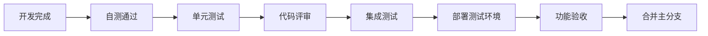
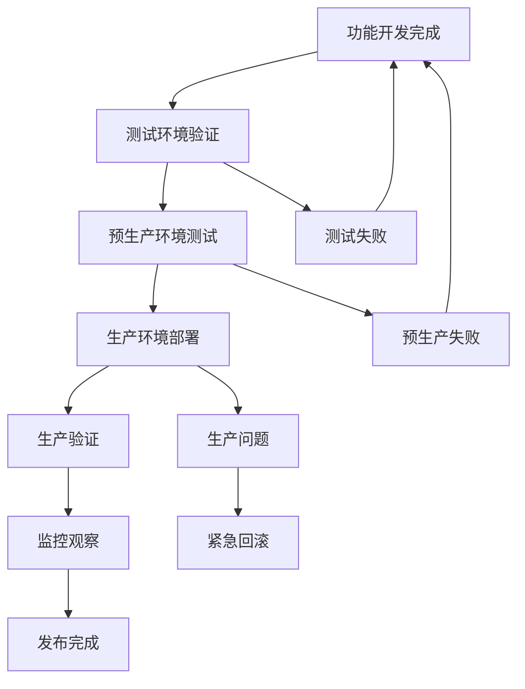

# 智游助手v6.2项目执行指南

**文档版本**: v1.0  
**创建日期**: 2025年8月5日  
**项目代号**: STA-v6.2-Commercial  
**执行周期**: 10周 (2025-08-05 至 2025-10-11)  

---

## 🎯 项目概览

### 项目目标（基于第一性原理重新定义）
将智游助手从MVP原型提升为商业化产品，实现：
- **技术目标**: 智能双链路架构，99.5%高质量服务可用性，支持100+并发用户
- **商业目标**: 完整的用户管理和支付系统，简洁的用户体验
- **运营目标**: 自动化的高可用架构，用户价值最大化

### 核心交付物（质量优先策略）
1. **智能双链路系统**: 99.5%高质量服务可用性，<15秒响应时间，自动故障切换<30秒
2. **商业化功能**: 用户管理、支付系统、定价策略，符合KISS原则的简洁界面
3. **运营基础**: 服务质量监控、智能告警、自动化部署和恢复

---

## 📋 项目文档体系

### 主要文档清单（基于智能双链路架构更新）

| 文档名称 | 用途 | 更新频率 | 负责人 |
|----------|------|----------|--------|
| [智游助手v6.2技术评估与商业化战略.md](./智游助手v6.2技术评估与商业化战略.md) | 技术评估和战略规划（已更新：移除用户选择，专注智能双链路） | 每周 | CTO |
| [智游助手v6.2智能双链路WBS工作分解.md](./智游助手v6.2智能双链路WBS工作分解.md) | 基于第一性原理的详细任务分解（新版本） | 每日 | 项目经理 |
| [智游助手v6.2项目甘特图与关键路径.md](./智游助手v6.2项目甘特图与关键路径.md) | 进度跟踪和关键路径分析 | 每周 | 项目经理 |
| [双链路地理服务配置指南.md](./docs/双链路地理服务配置指南.md) | 智能双链路配置和使用指南 | 按需 | 技术负责人 |
| 智游助手v6.2项目执行指南.md | 项目执行总指南（已更新：体现新战略） | 按需 | 项目经理 |

### 文档使用指南

**日常工作流程**:
1. **每日**: 查看WBS工作分解，确认当日任务
2. **每周**: 更新甘特图进度，评估关键路径
3. **每月**: 回顾技术评估，调整战略方向

**角色权限**:
- **CTO**: 所有文档读写权限，战略决策
- **项目经理**: 执行文档读写权限，进度管理
- **开发团队**: 技术文档读权限，WBS任务更新
- **产品经理**: 商业化文档读写权限，需求管理

---

## 🚀 快速启动指南

### Day 1 启动检查清单（智能双链路架构）

**上午 (09:00-12:00)**:
- [ ] 智能双链路架构启动会议 (全团队)
- [ ] 第一性原理架构理念确认
- [ ] 腾讯地图MCP环境验证
- [ ] 团队角色分工确认（专注自动化）

**下午 (13:30-17:30)**:
- [ ] 腾讯地图MCP基础集成开始
- [ ] 服务质量监控系统技术选型
- [ ] 第一个双链路代码提交
- [ ] 明日计划制定

### Week 1 关键里程碑（质量优先策略）

**必须完成**:
- [ ] 腾讯地图MCP基础集成
- [ ] 数据格式适配器实现
- [ ] 服务质量监控系统基础
- [ ] 智能切换机制框架

**验收标准**:
- 双链路基础架构运行
- 数据格式转换正确
- 服务质量实时监控
- 团队对新架构理念一致

---

## 👥 团队协作规范

### 日常工作流程

**每日站会** (09:00-09:15):
```
1. 昨日完成情况汇报 (每人1分钟)
2. 今日计划确认 (每人1分钟)  
3. 阻塞问题讨论 (5分钟)
4. 风险预警和支持需求 (3分钟)
```

**代码协作规范**:
- **分支策略**: GitFlow (main/develop/feature/hotfix)
- **提交规范**: Conventional Commits
- **代码评审**: 至少1人评审，关键代码2人评审
- **测试要求**: 单元测试覆盖率>80%

**沟通协作**:
- **紧急问题**: 微信群立即响应
- **技术讨论**: 技术会议室面对面
- **进度汇报**: 每日站会 + 周报
- **决策确认**: 邮件或文档记录

### 质量控制流程

**代码质量**:


**发布流程**:


---

## ⚠️ 风险管理和应急预案

### 关键风险监控

**技术风险**:
- **API依赖风险**: 每小时检查DeepSeek和高德API状态
- **性能风险**: 每日性能基准测试
- **安全风险**: 每周安全扫描

**业务风险**:
- **支付风险**: 支付成功率<95%触发告警
- **用户体验风险**: 响应时间>20秒触发优化
- **数据风险**: 数据丢失零容忍

**项目风险**:
- **进度风险**: 每周进度偏差>10%需要调整
- **质量风险**: 缺陷密度>0.1/KLOC需要重构
- **团队风险**: 关键人员离职需要知识转移

### 应急响应流程

**Level 1 - 系统故障**:
```
1. 立即通知 (5分钟内)
2. 启动降级模式 (10分钟内)
3. 问题定位和修复 (30分钟内)
4. 服务恢复验证 (45分钟内)
5. 事后分析报告 (24小时内)
```

**Level 2 - 支付故障**:
```
1. 暂停新订单 (立即)
2. 通知用户和客服 (5分钟内)
3. 切换备用支付 (15分钟内)
4. 问题修复 (2小时内)
5. 财务对账 (24小时内)
```

**Level 3 - 数据安全事件**:
```
1. 立即隔离 (立即)
2. 评估影响范围 (30分钟内)
3. 通知相关方 (1小时内)
4. 启动恢复程序 (2小时内)
5. 合规报告 (24小时内)
```

---

## 📊 成功指标和验收标准

### 技术指标

| 指标类别 | 指标名称 | 当前值 | 目标值 | 验收标准 |
|----------|----------|--------|--------|----------|
| **性能** | 系统响应时间 | 45-60秒 | <15秒 | 95%请求<15秒 |
| **可用性** | 系统可用性 | 70% | 99.9% | 月度可用性>99.9% |
| **并发** | 并发用户数 | 1-2个 | 100+个 | 支持100并发无性能下降 |
| **质量** | 代码覆盖率 | 未知 | >80% | 单元测试覆盖率>80% |

### 商业指标

| 指标类别 | 指标名称 | 目标值 | 测量方法 | 负责人 |
|----------|----------|--------|----------|--------|
| **用户** | 注册成功率 | >95% | 注册成功数/注册尝试数 | 产品经理 |
| **支付** | 支付成功率 | >98% | 支付成功数/支付尝试数 | 产品经理 |
| **转化** | 付费转化率 | >3% | 付费用户数/注册用户数 | 产品经理 |
| **留存** | 用户留存率 | >60% | 7日留存用户数/新增用户数 | 产品经理 |

### 项目管理指标

| 指标名称 | 目标值 | 当前状态 | 风险等级 | 应对措施 |
|----------|--------|----------|----------|----------|
| 进度完成率 | >90% | 按计划 | 绿色 | 继续执行 |
| 预算控制 | 偏差<15% | 按预算 | 绿色 | 继续监控 |
| 质量达标率 | >90% | 待评估 | 黄色 | 加强测试 |
| 团队满意度 | >4.0/5.0 | 待调研 | 绿色 | 定期调研 |

---

## 🎯 下一步行动计划

### 立即行动项 (本周内)

**高优先级**:
1. [ ] 确认高级后端工程师到位时间
2. [ ] 启动微信支付商户资质申请
3. [ ] 完成技术债务详细评估
4. [ ] 建立项目监控仪表板

**中优先级**:
1. [ ] 制定详细的代码规范文档
2. [ ] 准备开发环境标准化脚本
3. [ ] 设计用户数据库Schema
4. [ ] 联系云服务商确认资源配置

### 第一个月目标

**Week 1-2**: 生产级稳定性基础
- 系统可用性提升至95%
- 支持20+并发用户
- 基础监控系统运行

**Week 3-4**: 用户管理系统
- 用户注册登录功能完整
- 基础权限控制实现
- 前端用户界面可用

### 项目成功标准

**最低可接受标准**:
- [ ] 系统稳定性>95%
- [ ] 支持50+并发用户
- [ ] 基础商业化功能可用
- [ ] 支付成功率>95%

**理想成功标准**:
- [ ] 系统稳定性>99.9%
- [ ] 支持100+并发用户
- [ ] 完整商业化功能
- [ ] 支付成功率>98%
- [ ] 用户体验优秀

---

## 📞 联系信息和支持

### 项目团队联系方式

| 角色 | 姓名 | 联系方式 | 工作时间 | 紧急联系 |
|------|------|----------|----------|----------|
| CTO | 待定 | 邮箱/微信 | 9:00-18:00 | 24小时 |
| 项目经理 | 待定 | 邮箱/微信 | 9:00-18:00 | 工作时间 |
| 高级后端 | 待招聘 | 邮箱/微信 | 9:00-18:00 | 工作时间 |
| DevOps | 待招聘 | 邮箱/微信 | 9:00-18:00 | 紧急时 |

### 外部支持资源

**技术支持**:
- DeepSeek技术支持: [官方文档](https://platform.deepseek.com/docs)
- 高德地图技术支持: [开发者中心](https://lbs.amap.com/)
- 微信支付技术支持: [开发者文档](https://pay.weixin.qq.com/wiki/doc/api/index.html)

**云服务支持**:
- 腾讯云技术支持: 7x24小时
- 阿里云备用方案: 工作时间支持

### 项目沟通渠道

**日常沟通**:
- 项目微信群: 即时沟通
- 邮件列表: 正式通知
- 项目管理工具: 任务跟踪

**会议安排**:
- 每日站会: 09:00-09:15
- 周总结会: 周五15:00-16:00
- 月度评审: 每月最后一个周五

---

**文档状态**: ✅ 已批准使用  
**维护责任**: 项目管理办公室  
**版本控制**: Git管理，每周更新  
**访问权限**: 项目核心团队成员  
**紧急联系**: 项目经理 (工作时间) / CTO (24小时)  
