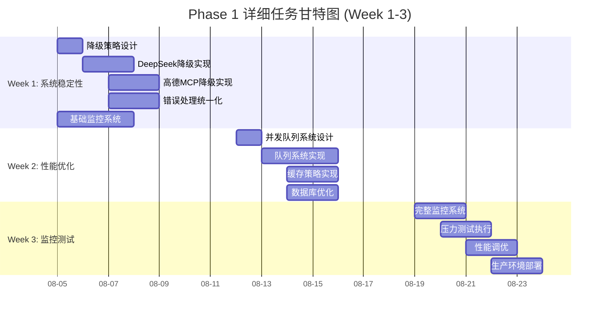
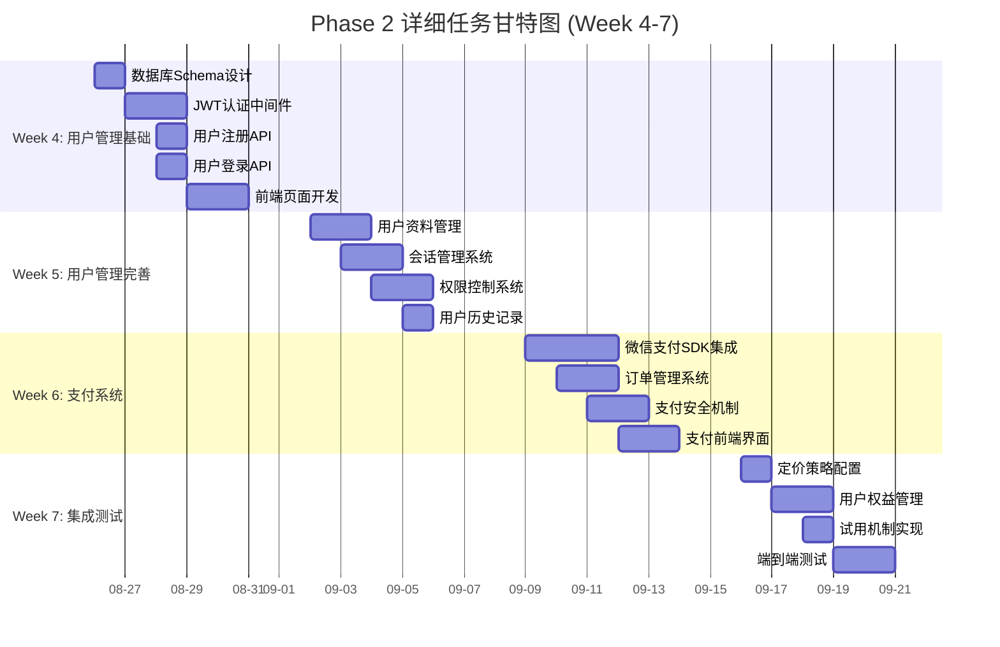
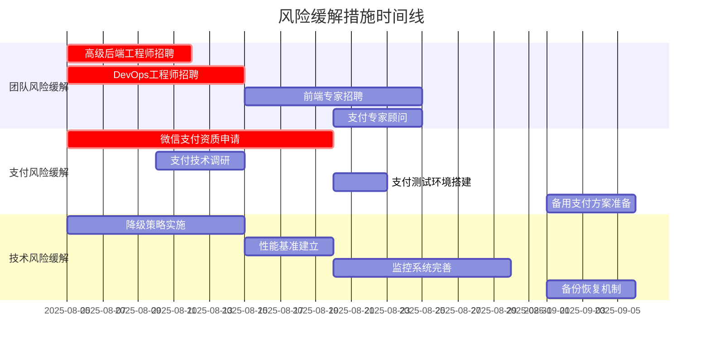
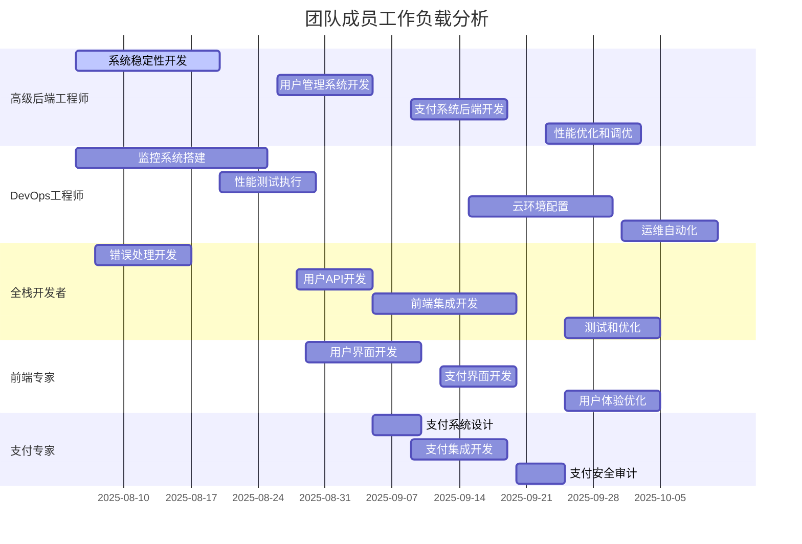

# 智游助手v6.2项目甘特图与关键路径分析

**文档版本**: v1.0  
**创建日期**: 2025年8月5日  
**项目周期**: 10周 (2025-08-05 至 2025-10-11)  

---

## 📊 项目甘特图

### 整体项目时间线

```mermaid
gantt
    title 智游助手v6.2商业化项目甘特图
    dateFormat  YYYY-MM-DD
    axisFormat  %m-%d
    
    section Phase 1: 生产级稳定性
    系统稳定性修复        :active, p1-1, 2025-08-05, 5d
    性能优化             :p1-2, 2025-08-12, 5d
    监控和生产准备        :p1-3, 2025-08-19, 5d
    
    section Phase 2: 商业化功能
    用户管理系统基础      :p2-1, 2025-08-26, 5d
    用户管理系统完善      :p2-2, 2025-09-02, 5d
    支付系统开发         :p2-3, 2025-09-09, 5d
    定价策略和集成测试    :p2-4, 2025-09-16, 5d
    
    section Phase 3: 规模化准备
    云基础设施优化       :p3-1, 2025-09-23, 5d
    数据分析和监控       :p3-2, 2025-09-30, 5d
    运维自动化          :p3-3, 2025-10-07, 5d
    
    section 关键里程碑
    M1: 生产级稳定性     :milestone, m1, 2025-08-23, 1d
    M2: 商业化功能上线   :milestone, m2, 2025-09-20, 1d
    M3: 规模化运营就绪   :milestone, m3, 2025-10-11, 1d
    
    section 外部依赖
    团队招聘            :crit, hire, 2025-08-05, 10d
    微信支付资质申请     :crit, payment, 2025-08-05, 15d
    云环境准备          :cloud, 2025-08-15, 10d
```

### 详细任务分解甘特图





---

## 🎯 关键路径分析

### 关键路径识别

**主关键路径** (影响项目总工期):
```
项目启动 → 降级策略设计 → 系统稳定性修复 → 性能优化 → 
用户管理系统 → 支付系统开发 → 商业化集成测试 → 项目完成
```

**关键路径详细分析**:

| 任务节点 | 开始时间 | 结束时间 | 工期 | 浮动时间 | 关键程度 |
|----------|----------|----------|------|----------|----------|
| 项目启动 | 2025-08-05 | 2025-08-05 | 1天 | 0天 | 极高 |
| 降级策略设计 | 2025-08-05 | 2025-08-06 | 2天 | 0天 | 极高 |
| 系统稳定性修复 | 2025-08-06 | 2025-08-16 | 10天 | 0天 | 极高 |
| 性能优化 | 2025-08-12 | 2025-08-23 | 12天 | 0天 | 极高 |
| 用户管理系统 | 2025-08-26 | 2025-09-06 | 12天 | 0天 | 极高 |
| 支付系统开发 | 2025-09-09 | 2025-09-20 | 12天 | 0天 | 极高 |
| 商业化集成测试 | 2025-09-16 | 2025-09-20 | 5天 | 0天 | 极高 |

### 次关键路径

**路径A: 监控和基础设施**
```
基础监控 → 完整监控 → 云环境准备 → 生产部署 → 运维自动化
```

**路径B: 前端开发**
```
前端架构设计 → 用户界面开发 → 支付界面 → 用户体验优化
```

**路径C: 外部依赖**
```
团队招聘 → 微信支付资质 → 云服务申请 → 第三方集成
```

---

## ⚠️ 风险关键路径

### 高风险任务识别

| 任务 | 风险等级 | 风险描述 | 影响 | 缓解措施 |
|------|----------|----------|------|----------|
| 微信支付集成 | 极高 | 资质申请延期，技术集成复杂 | 阻塞商业化 | 提前申请，专家支持 |
| 高德MCP稳定性 | 高 | 第三方服务依赖，稳定性不可控 | 影响核心功能 | 多层降级策略 |
| 团队招聘 | 高 | 关键人员到位延期 | 影响开发进度 | 外包和顾问支持 |
| 性能优化 | 中 | 技术复杂度高，调优时间不确定 | 影响用户体验 | 分阶段优化 |

### 风险缓解时间线



---

## 📈 资源负载分析

### 人力资源负载图



### 关键资源瓶颈分析

**瓶颈1: 高级后端工程师**
- **负载期间**: Week 1-6 (连续高强度工作)
- **风险**: 关键人员过载，质量下降
- **缓解措施**: 
  - 增加一名后端开发者支持
  - 将部分任务分配给全栈开发者
  - 适当延长关键任务时间

**瓶颈2: 支付专家**
- **负载期间**: Week 6-7 (集中开发期)
- **风险**: 专家资源稀缺，进度风险高
- **缓解措施**:
  - 提前进行技术调研
  - 准备详细的技术文档
  - 安排备用技术方案

---

## 🎯 里程碑和检查点

### 主要里程碑定义

| 里程碑 | 日期 | 验收标准 | 负责人 | 风险等级 |
|--------|------|----------|--------|----------|
| **M0: 项目启动** | 2025-08-05 | 团队到位，环境就绪 | CTO | 低 |
| **M1: 生产级稳定性** | 2025-08-23 | 系统可用性>99%，支持50+并发 | 技术负责人 | 中 |
| **M2: 商业化功能上线** | 2025-09-20 | 支付成功率>98%，用户注册>95% | 产品负责人 | 高 |
| **M3: 规模化运营就绪** | 2025-10-11 | 支持100+并发，监控完善 | CTO | 中 |

### 每周检查点

**Week 1 检查点** (2025-08-09):
- [ ] 降级策略实施完成
- [ ] 基础监控系统运行
- [ ] 团队协作流程建立
- [ ] 技术债务清单更新

**Week 2 检查点** (2025-08-16):
- [ ] 并发处理能力提升
- [ ] 缓存策略实施
- [ ] 性能基准建立
- [ ] 代码质量达标

**Week 3 检查点** (2025-08-23):
- [ ] 生产环境部署成功
- [ ] 压力测试通过
- [ ] 监控告警完善
- [ ] M1里程碑达成

**Week 4 检查点** (2025-08-30):
- [ ] 用户管理基础完成
- [ ] 数据库设计确认
- [ ] 认证系统运行
- [ ] 前端页面可用

**Week 5 检查点** (2025-09-06):
- [ ] 用户管理功能完整
- [ ] 权限控制实施
- [ ] 会话管理稳定
- [ ] 用户体验优化

**Week 6 检查点** (2025-09-13):
- [ ] 支付系统集成
- [ ] 订单管理运行
- [ ] 支付安全验证
- [ ] 支付界面完成

**Week 7 检查点** (2025-09-20):
- [ ] 商业化功能完整
- [ ] 端到端测试通过
- [ ] 定价策略实施
- [ ] M2里程碑达成

---

## 📊 进度跟踪和报告

### 每日进度跟踪指标

| 指标类型 | 指标名称 | 目标值 | 跟踪频率 |
|----------|----------|--------|----------|
| **进度指标** | 任务完成率 | >90% | 每日 |
| **质量指标** | 代码覆盖率 | >80% | 每日 |
| **性能指标** | 构建成功率 | >95% | 每日 |
| **团队指标** | 团队出勤率 | >95% | 每日 |

### 周报告模板

```markdown
# 智游助手v6.2项目周报告

**报告周期**: Week X (YYYY-MM-DD 至 YYYY-MM-DD)
**报告人**: 项目经理

## 本周完成情况
- [ ] 计划任务1 - 完成状态
- [ ] 计划任务2 - 完成状态
- [ ] 计划任务3 - 完成状态

## 关键成果
1. 技术成果描述
2. 业务成果描述
3. 团队成果描述

## 风险和问题
| 问题 | 影响 | 状态 | 负责人 | 预计解决时间 |
|------|------|------|--------|--------------|
| 问题1 | 高 | 进行中 | 张三 | 本周五 |

## 下周计划
- [ ] 下周任务1
- [ ] 下周任务2
- [ ] 下周任务3

## 关键指标
- 进度完成率: X%
- 质量指标: X%
- 团队满意度: X/5
```

---

**文档维护**: 项目管理办公室  
**更新频率**: 每周更新进度和风险状态  
**版本控制**: Git管理  
**访问权限**: 项目核心团队  
