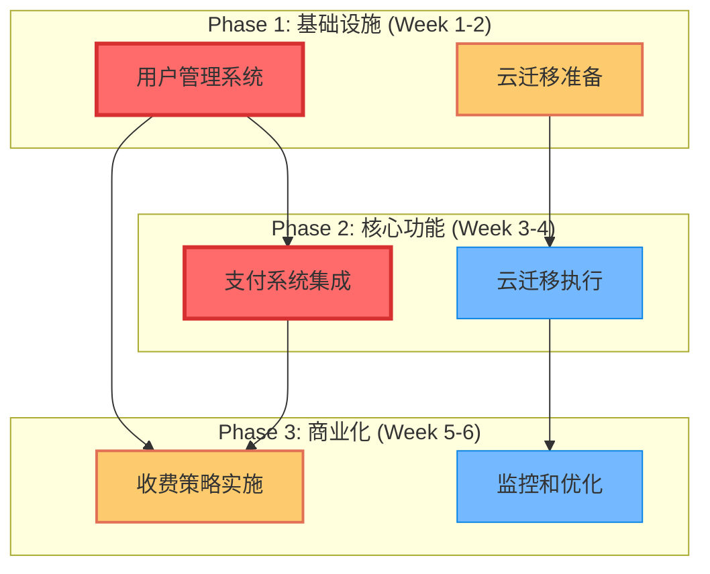
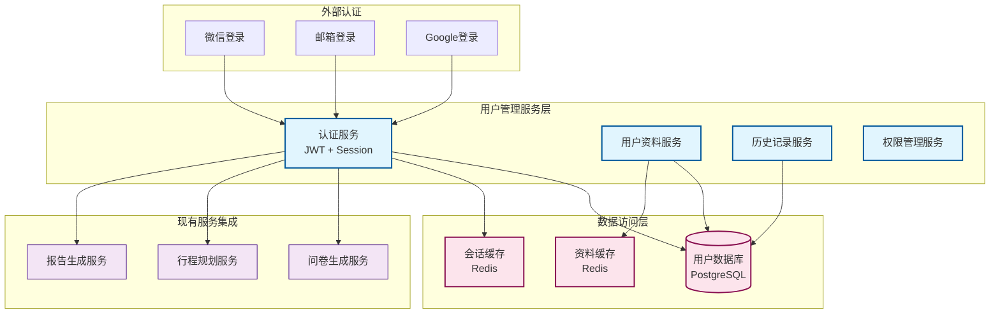
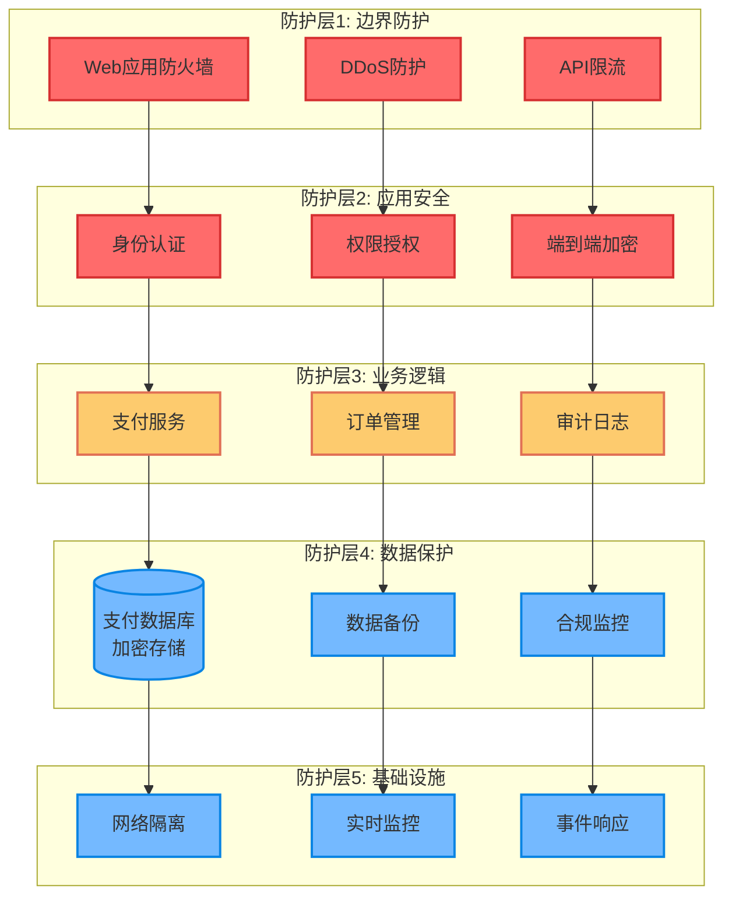
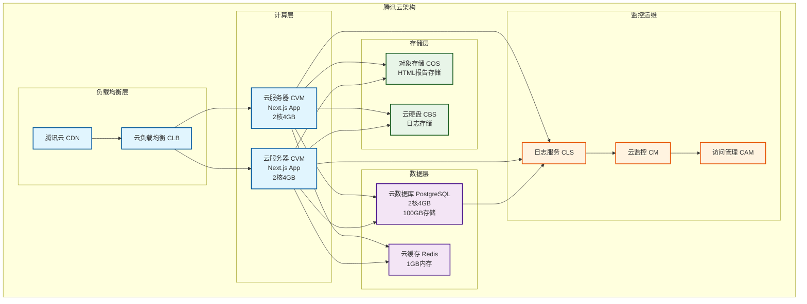

# 智游助手商业化技术实施方案 v6.2

**技术合伙人**: Claude (CTO级别技术方案)
**基准版本**: v6.1.0 (已修复表单提交，系统稳定)
**目标版本**: v6.2.0 (商业化就绪版本)
**方案日期**: 2025年8月5日

## 1. 战略分析（第一性原理）

### 1.1 根本业务价值识别

**用户账户管理系统**：
- **根本价值**: 从匿名服务转向个性化服务，建立用户资产和粘性
- **核心挑战**: 在保持当前无摩擦体验的同时引入用户身份，数据隐私合规
- **技术债务**: 当前系统设计为无状态，需要平滑过渡

**微信支付集成**：
- **根本价值**: 将用户价值转化为商业价值，实现可持续的商业模式
- **核心挑战**: 支付安全、合规性、用户体验不被打断
- **关键指标**: 支付转化率、客单价、用户留存

**公有云迁移**：
- **根本价值**: 降低运营成本，提升系统可扩展性和可靠性
- **核心挑战**: 零停机迁移、成本控制、性能保持
- **技术约束**: 必须境内云服务商，最小化迁移工作量

### 1.2 依赖关系和优先级分析



**优先级排序**：
1. **P0 (关键路径)**: 用户管理系统 → 支付系统
2. **P1 (并行进行)**: 云迁移准备工作
3. **P2 (优化阶段)**: 收费策略优化和监控

### 1.3 基于康威定律的团队协作模式

```typescript
interface TeamStructure {
  // 基于微服务架构的团队划分
  userManagementTeam: {
    frontend: "1名React专家";
    backend: "1名Node.js/Next.js专家";
    responsibility: "用户认证、权限管理、个人资料";
  };
  
  paymentTeam: {
    backend: "1名支付专家";
    security: "0.5名安全专家（兼职）";
    responsibility: "微信支付集成、订单管理、财务对账";
  };
  
  infrastructureTeam: {
    devops: "1名云原生专家";
    backend: "0.5名后端专家（支持）";
    responsibility: "云迁移、监控、性能优化";
  };
  
  // 跨团队协作机制
  crossTeamCollaboration: {
    apiDesign: "API优先设计，统一接口规范";
    dataConsistency: "统一数据模型和状态管理";
    securityReview: "跨团队安全审查机制";
  };
}
```

## 2. 架构设计方案

### 2.1 用户管理系统架构设计（SOLID原则）

#### 核心架构图



#### 核心代码实现

```typescript
// 1. 单一职责原则 - 用户认证服务
interface IAuthenticationService {
  login(credentials: LoginCredentials): Promise<AuthResult>;
  logout(sessionId: string): Promise<void>;
  refreshToken(refreshToken: string): Promise<TokenPair>;
  validateSession(sessionId: string): Promise<UserSession>;
}

class AuthenticationService implements IAuthenticationService {
  constructor(
    private userRepository: IUserRepository,
    private sessionManager: ISessionManager,
    private tokenService: ITokenService
  ) {}

  async login(credentials: LoginCredentials): Promise<AuthResult> {
    // 开放封闭原则 - 支持多种登录方式
    const authProvider = this.getAuthProvider(credentials.type);
    const user = await authProvider.authenticate(credentials);
    
    if (!user) {
      throw new AuthenticationError('Invalid credentials');
    }

    const session = await this.sessionManager.createSession(user.id);
    const tokens = await this.tokenService.generateTokens(user.id, session.id);

    return {
      user: this.sanitizeUser(user),
      tokens,
      session: session.id
    };
  }

  // 里氏替换原则 - 不同认证提供者可互换
  private getAuthProvider(type: AuthType): IAuthProvider {
    const providers = {
      email: new EmailAuthProvider(),
      wechat: new WeChatAuthProvider(),
      google: new GoogleAuthProvider()
    };
    return providers[type];
  }
}

// 2. 接口隔离原则 - 细分接口
interface IUserProfileService {
  getProfile(userId: string): Promise<UserProfile>;
  updateProfile(userId: string, updates: ProfileUpdates): Promise<UserProfile>;
  deleteProfile(userId: string): Promise<void>;
}

interface IUserHistoryService {
  getTravelHistory(userId: string, pagination: Pagination): Promise<TravelHistory[]>;
  saveTravelPlan(userId: string, plan: TravelPlan): Promise<void>;
  deleteTravelPlan(userId: string, planId: string): Promise<void>;
}

// 3. 依赖倒置原则 - 依赖抽象而非具体实现
class UserManagementFacade {
  constructor(
    private authService: IAuthenticationService,
    private profileService: IUserProfileService,
    private historyService: IUserHistoryService,
    private permissionService: IPermissionService
  ) {}

  async registerUser(registrationData: UserRegistration): Promise<UserAccount> {
    // 事务性操作，确保数据一致性
    return await this.executeTransaction(async (transaction) => {
      const user = await this.authService.createUser(registrationData, transaction);
      await this.profileService.initializeProfile(user.id, transaction);
      await this.permissionService.assignDefaultPermissions(user.id, transaction);
      return user;
    });
  }
}
```

#### 数据库设计

```sql
-- 用户基础表
CREATE TABLE users (
  id UUID PRIMARY KEY DEFAULT gen_random_uuid(),
  email VARCHAR(255) UNIQUE NOT NULL,
  password_hash VARCHAR(255),
  auth_provider VARCHAR(50) NOT NULL DEFAULT 'email',
  external_id VARCHAR(255),
  email_verified BOOLEAN DEFAULT FALSE,
  status VARCHAR(20) DEFAULT 'active',
  created_at TIMESTAMP DEFAULT CURRENT_TIMESTAMP,
  updated_at TIMESTAMP DEFAULT CURRENT_TIMESTAMP,
  
  CONSTRAINT valid_status CHECK (status IN ('active', 'suspended', 'deleted'))
);

-- 用户资料表
CREATE TABLE user_profiles (
  user_id UUID PRIMARY KEY REFERENCES users(id) ON DELETE CASCADE,
  display_name VARCHAR(100),
  avatar_url VARCHAR(500),
  phone VARCHAR(20),
  preferred_language VARCHAR(10) DEFAULT 'zh-CN',
  timezone VARCHAR(50) DEFAULT 'Asia/Shanghai',
  travel_preferences JSONB,
  created_at TIMESTAMP DEFAULT CURRENT_TIMESTAMP,
  updated_at TIMESTAMP DEFAULT CURRENT_TIMESTAMP
);

-- 用户会话表
CREATE TABLE user_sessions (
  id UUID PRIMARY KEY DEFAULT gen_random_uuid(),
  user_id UUID NOT NULL REFERENCES users(id) ON DELETE CASCADE,
  session_token VARCHAR(255) UNIQUE NOT NULL,
  refresh_token VARCHAR(255) UNIQUE NOT NULL,
  expires_at TIMESTAMP NOT NULL,
  created_at TIMESTAMP DEFAULT CURRENT_TIMESTAMP,
  last_used_at TIMESTAMP DEFAULT CURRENT_TIMESTAMP,
  ip_address INET,
  user_agent TEXT
);

-- 旅行历史表
CREATE TABLE travel_histories (
  id UUID PRIMARY KEY DEFAULT gen_random_uuid(),
  user_id UUID NOT NULL REFERENCES users(id) ON DELETE CASCADE,
  title VARCHAR(200) NOT NULL,
  destination VARCHAR(200) NOT NULL,
  travel_dates DATERANGE NOT NULL,
  travel_plan JSONB NOT NULL,
  html_report TEXT,
  is_public BOOLEAN DEFAULT FALSE,
  created_at TIMESTAMP DEFAULT CURRENT_TIMESTAMP,
  
  INDEX idx_user_travel_dates (user_id, travel_dates),
  INDEX idx_destination (destination)
);

-- 权限管理表
CREATE TABLE user_permissions (
  user_id UUID NOT NULL REFERENCES users(id) ON DELETE CASCADE,
  permission VARCHAR(100) NOT NULL,
  granted_at TIMESTAMP DEFAULT CURRENT_TIMESTAMP,
  expires_at TIMESTAMP,
  
  PRIMARY KEY (user_id, permission)
);
```

### 2.2 支付系统安全架构（纵深防御）

#### 安全架构层次



#### 微信支付集成核心代码

```typescript
// 支付安全配置
interface PaymentSecurityConfig {
  wechatAppId: string;
  wechatMchId: string;
  wechatApiKey: string; // 在环境变量中存储
  wechatCertPath: string;
  webhookSecret: string;
  encryptionKey: string; // AES-256密钥
}

// 支付服务接口
interface IPaymentService {
  createPayment(request: PaymentRequest): Promise<PaymentResult>;
  queryPayment(paymentId: string): Promise<PaymentStatus>;
  refundPayment(refundRequest: RefundRequest): Promise<RefundResult>;
  handleWebhook(signature: string, payload: string): Promise<void>;
}

class WeChatPaymentService implements IPaymentService {
  constructor(
    private config: PaymentSecurityConfig,
    private orderService: IOrderService,
    private auditLogger: IAuditLogger,
    private encryptionService: IEncryptionService
  ) {}

  async createPayment(request: PaymentRequest): Promise<PaymentResult> {
    // 1. 参数验证和清理
    const sanitizedRequest = this.sanitizePaymentRequest(request);
    
    // 2. 业务规则验证
    await this.validateBusinessRules(sanitizedRequest);
    
    // 3. 创建订单
    const order = await this.orderService.createOrder({
      userId: sanitizedRequest.userId,
      amount: sanitizedRequest.amount,
      productType: sanitizedRequest.productType,
      description: sanitizedRequest.description
    });

    // 4. 生成微信支付参数
    const wechatParams = await this.generateWeChatPayParams(order);
    
    // 5. 调用微信支付API
    try {
      const wechatResponse = await this.callWeChatPayAPI(wechatParams);
      
      // 6. 记录审计日志
      await this.auditLogger.log({
        action: 'PAYMENT_CREATED',
        userId: request.userId,
        orderId: order.id,
        amount: request.amount,
        timestamp: new Date(),
        ip: request.clientIp
      });

      return {
        orderId: order.id,
        paymentUrl: wechatResponse.code_url,
        qrCode: wechatResponse.code_url,
        expiresAt: new Date(Date.now() + 15 * 60 * 1000) // 15分钟过期
      };
    } catch (error) {
      // 7. 错误处理和回滚
      await this.orderService.cancelOrder(order.id);
      throw new PaymentError('Payment creation failed', error);
    }
  }

  async handleWebhook(signature: string, payload: string): Promise<void> {
    // 1. 验证签名
    if (!this.verifyWebhookSignature(signature, payload)) {
      throw new SecurityError('Invalid webhook signature');
    }

    // 2. 解析支付通知
    const notification = this.parseWeChatNotification(payload);
    
    // 3. 防重放攻击
    if (await this.isReplayAttack(notification.id)) {
      return; // 忽略重复通知
    }

    // 4. 更新订单状态
    await this.processPaymentNotification(notification);

    // 5. 记录处理结果
    await this.auditLogger.log({
      action: 'WEBHOOK_PROCESSED',
      orderId: notification.out_trade_no,
      paymentId: notification.transaction_id,
      status: notification.trade_state,
      timestamp: new Date()
    });
  }

  // 安全验证方法
  private verifyWebhookSignature(signature: string, payload: string): boolean {
    const expectedSignature = crypto
      .createHmac('sha256', this.config.webhookSecret)
      .update(payload)
      .digest('hex');
    
    return crypto.timingSafeEqual(
      Buffer.from(signature, 'hex'),
      Buffer.from(expectedSignature, 'hex')
    );
  }

  // 业务规则验证
  private async validateBusinessRules(request: PaymentRequest): Promise<void> {
    // 金额验证
    if (request.amount < 1 || request.amount > 100000) {
      throw new ValidationError('Invalid payment amount');
    }

    // 用户验证
    const user = await this.userService.getUser(request.userId);
    if (!user || user.status !== 'active') {
      throw new ValidationError('Invalid user');
    }

    // 频率限制
    const recentPayments = await this.getRecentPayments(request.userId);
    if (recentPayments.length > 10) {
      throw new ValidationError('Too many payment attempts');
    }
  }
}

// 订单管理服务
class OrderManagementService implements IOrderService {
  async createOrder(orderData: CreateOrderRequest): Promise<Order> {
    const order: Order = {
      id: this.generateOrderId(),
      userId: orderData.userId,
      amount: orderData.amount,
      productType: orderData.productType,
      status: 'pending',
      createdAt: new Date(),
      expiresAt: new Date(Date.now() + 15 * 60 * 1000),
      metadata: {
        clientIp: orderData.clientIp,
        userAgent: orderData.userAgent
      }
    };

    // 使用事务确保数据一致性
    return await this.executeTransaction(async (transaction) => {
      await this.orderRepository.create(order, transaction);
      await this.inventoryService.reserve(orderData.productType, transaction);
      return order;
    });
  }

  private generateOrderId(): string {
    // 生成唯一订单号: 时间戳 + 随机数 + 校验位
    const timestamp = Date.now().toString();
    const random = Math.random().toString(36).substring(2, 8);
    const checksum = this.calculateChecksum(timestamp + random);
    return `ST${timestamp}${random}${checksum}`;
  }
}
```

#### 收费策略设计

```typescript
// 收费策略接口
interface IPricingStrategy {
  calculatePrice(user: User, service: ServiceType): Promise<PriceResult>;
  validatePurchase(user: User, service: ServiceType): Promise<boolean>;
  applyDiscount(basePrice: number, discountCode?: string): Promise<number>;
}

// 分层收费策略
class TieredPricingStrategy implements IPricingStrategy {
  private readonly pricingTiers = {
    // 按次收费
    singleUse: {
      questionnaire: 9.9,   // 智能问卷生成
      planning: 19.9,       // 完整行程规划
      htmlReport: 5.9       // HTML报告生成
    },
    
    // 套餐收费
    packages: {
      basic: {
        price: 39.9,
        services: ['questionnaire', 'planning', 'htmlReport'],
        limit: 3  // 3次完整规划
      },
      premium: {
        price: 99.9,
        services: ['questionnaire', 'planning', 'htmlReport', 'prioritySupport'],
        limit: 10
      },
      unlimited: {
        price: 199.9,
        services: ['questionnaire', 'planning', 'htmlReport', 'prioritySupport', 'customization'],
        limit: -1  // 无限制
      }
    },
    
    // 会员制
    subscription: {
      monthly: {
        price: 29.9,
        services: ['questionnaire', 'planning', 'htmlReport'],
        limit: 10
      },
      yearly: {
        price: 299.9,
        services: ['questionnaire', 'planning', 'htmlReport', 'prioritySupport'],
        limit: 120
      }
    }
  };

  async calculatePrice(user: User, service: ServiceType): Promise<PriceResult> {
    // 1. 检查用户当前权益
    const userSubscription = await this.getUserSubscription(user.id);
    
    // 2. 应用定价逻辑
    if (userSubscription && this.isServiceIncluded(userSubscription, service)) {
      return {
        price: 0,
        reason: 'included_in_subscription',
        subscription: userSubscription
      };
    }

    // 3. 计算单次价格
    const basePrice = this.pricingTiers.singleUse[service];
    
    // 4. 应用用户等级折扣
    const discount = await this.getUserDiscount(user);
    const finalPrice = basePrice * (1 - discount);

    return {
      price: finalPrice,
      basePrice,
      discount,
      reason: 'pay_per_use'
    };
  }
}
```

### 2.3 云迁移技术架构选型和成本分析

#### 云服务商对比分析

```typescript
interface CloudProviderAnalysis {
  provider: string;
  pros: string[];
  cons: string[];
  monthlyEstimate: number;
  migrationComplexity: 'low' | 'medium' | 'high';
  complianceLevel: 'basic' | 'standard' | 'premium';
}

const cloudProviderComparison: CloudProviderAnalysis[] = [
  {
    provider: '阿里云',
    pros: [
      '生态完整，与微信支付集成友好',
      'CDN覆盖好，国内访问速度快',
      '文档完善，中文支持好',
      'Redis和PostgreSQL托管服务成熟'
    ],
    cons: [
      '价格相对较高',
      '某些服务与AWS/GCP差异较大'
    ],
    monthlyEstimate: 2500, // RMB
    migrationComplexity: 'low',
    complianceLevel: 'premium'
  },
  {
    provider: '腾讯云',
    pros: [
      '微信生态集成最佳',
      '价格相对便宜',
      '与微信支付API距离最近',
      '游戏和社交场景经验丰富'
    ],
    cons: [
      '部分服务稳定性待验证',
      'PostgreSQL托管服务相对简单'
    ],
    monthlyEstimate: 1800, // RMB
    migrationComplexity: 'low',
    complianceLevel: 'standard'
  },
  {
    provider: '华为云',
    pros: [
      '价格最便宜',
      '技术实力强',
      '政府和企业客户多',
      '安全合规等级高'
    ],
    cons: [
      '生态相对薄弱',
      '第三方集成支持一般',
      'Next.js部署经验较少'
    ],
    monthlyEstimate: 1500, // RMB
    migrationComplexity: 'medium',
    complianceLevel: 'premium'
  }
];
```

#### 推荐方案：腾讯云（最佳性价比）

**选择理由**：
1. **成本最优**: 月度成本1800元，比阿里云节省28%
2. **微信生态**: 与微信支付API同在腾讯生态，网络延迟最低
3. **迁移简单**: 支持Docker部署，与当前架构兼容度高
4. **技术栈匹配**: 对Next.js、Redis、PostgreSQL支持良好

#### 云架构设计



#### 成本明细分析

```typescript
interface TencentCloudCostBreakdown {
  compute: {
    cvm: {
      instances: 2;
      spec: "2核4GB";
      unitPrice: 200; // RMB/月
      total: 400;
    };
    clb: {
      instances: 1;
      unitPrice: 100;
      total: 100;
    };
  };
  
  data: {
    postgresql: {
      spec: "2核4GB, 100GB存储";
      unitPrice: 500;
      total: 500;
    };
    redis: {
      spec: "1GB内存";
      unitPrice: 150;
      total: 150;
    };
  };
  
  storage: {
    cos: {
      storage: "100GB";
      unitPrice: 30;
      total: 30;
    };
    cbs: {
      storage: "200GB SSD";
      unitPrice: 100;
      total: 100;
    };
  };
  
  network: {
    cdn: {
      traffic: "1TB/月";
      unitPrice: 200;
      total: 200;
    };
    bandwidth: {
      spec: "100Mbps";
      unitPrice: 300;
      total: 300;
    };
  };
  
  monitoring: {
    cls: { unitPrice: 50; total: 50; };
    cm: { unitPrice: 20; total: 20; };
  };
  
  monthlyTotal: 1850; // RMB
  yearlyTotal: 22200; // RMB (含折扣)
}
```

## 3. 实施路线图

### 3.1 开发优先级和时间规划

```mermaid
gantt
    title 智游助手商业化实施甘特图
    dateFormat  YYYY-MM-DD
    section Phase 1: 基础设施
    用户管理系统开发    :active, user-mgmt, 2025-08-05, 10d
    云迁移环境准备      :cloud-prep, 2025-08-05, 7d
    
    section Phase 2: 核心功能
    微信支付集成       :pay-integration, after user-mgmt, 10d
    云迁移执行        :cloud-migration, after cloud-prep, 5d
    
    section Phase 3: 商业化
    收费策略实施      :pricing-impl, after pay-integration, 7d
    监控和优化        :monitoring, after pricing-impl, 5d
    
    section 里程碑
    用户系统上线      :milestone, m1, after user-mgmt, 1d
    支付功能上线      :milestone, m2, after pay-integration, 1d
    商业化正式启动    :milestone, m3, after pricing-impl, 1d