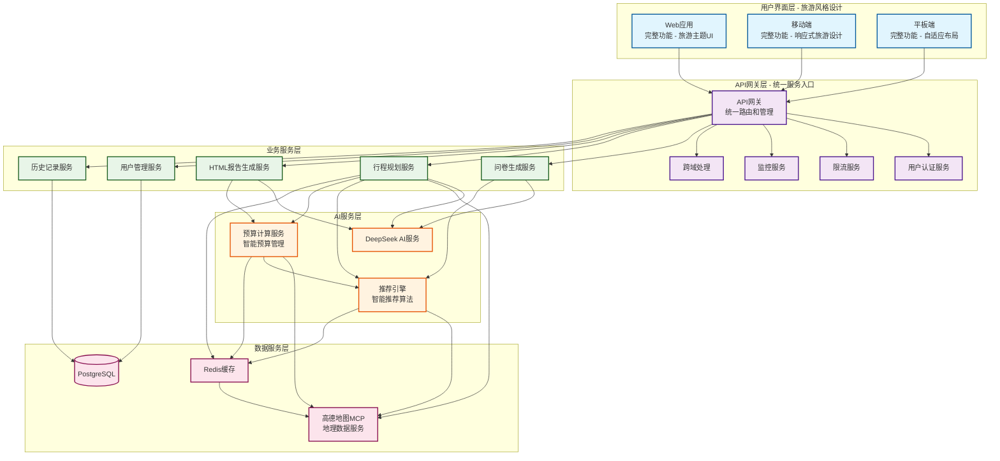
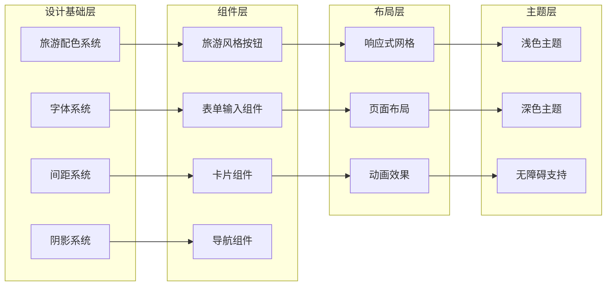
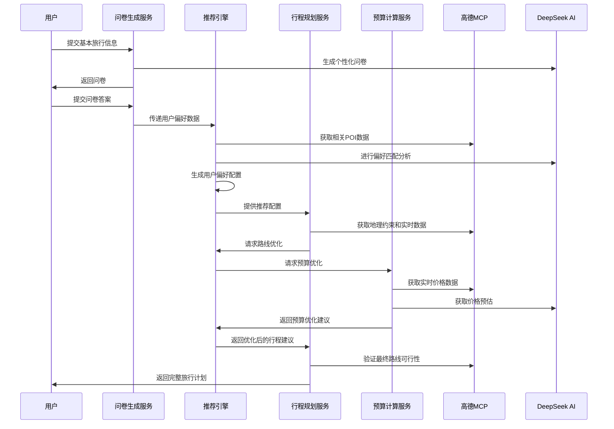

# 智能旅行助手统一设计文档

## Overview

智能旅行助手是一个基于AI的旅行规划平台，采用现代化的旅游风格UI设计。系统通过三步式流程收集用户偏好，利用AI服务生成个性化旅行计划，并以精美的HTML报告形式呈现结果。设计理念融合了自然元素和现代化交互，营造温暖、探索和冒险的用户体验。

## Architecture

### 系统架构图



#### 架构层次说明

**用户界面层**：所有客户端（Web、移动端、平板端）都提供完整的三步式旅行规划功能，确保用户在任何设备上都能获得一致的体验。每个客户端都通过统一的API网关访问后端服务。

**API网关层**：作为系统的统一入口点，负责：

- **统一路由**：将客户端请求路由到相应的业务服务
- **认证授权**：统一的用户身份验证和权限控制
- **限流保护**：防止服务过载，确保系统稳定性
- **监控日志**：统一的请求监控和日志记录
- **跨域处理**：处理不同域名间的API调用
- **版本管理**：支持API版本演进和向后兼容

**业务服务层**：核心业务逻辑的实现，每个服务都可以被所有客户端通过网关访问：

- 问卷生成服务：智能生成个性化旅行偏好问卷
- 行程规划服务：基于用户偏好和地理数据生成旅行计划
- HTML报告生成服务：生成精美的旅行报告
- 用户管理服务：处理用户账户和偏好设置
- 历史记录服务：管理用户的旅行历史和收藏

**AI服务层**：提供智能化功能支持：

- DeepSeek AI服务：自然语言处理和内容生成
- 推荐引擎：基于用户偏好和地理数据的智能推荐
- 预算计算服务：智能预算规划和费用估算

**数据服务层**：提供数据存储和外部数据源：

- PostgreSQL：持久化数据存储
- Redis缓存：提高数据访问性能
- 高德地图MCP：真实地理数据和位置服务

### 旅游风格设计系统架构



## 核心服务详细设计

### 预算计算服务 (Budget Calculation Service)

#### 服务职责和作用
预算计算服务是智能旅行助手的核心AI服务之一，负责为用户提供准确、实时的旅行费用估算和预算管理功能。

#### 数据来源和集成策略

```typescript
interface BudgetDataSources {
  // 高德MCP实时价格数据
  gaodeRealTimeData: {
    attractionTickets: TicketPrice[];      // 景点门票价格
    transportationCosts: TransportCost[];  // 交通费用（公交、地铁、出租车）
    parkingFees: ParkingCost[];           // 停车费用
    fuelPrices: FuelPrice[];              // 油价信息
  };

  // AI服务预估数据
  aiEstimatedData: {
    accommodationPrices: HotelPriceRange[];  // 住宿价格区间
    diningCosts: RestaurantPriceRange[];     // 餐饮费用预估
    shoppingBudgets: ShoppingEstimate[];     // 购物预算建议
    emergencyFunds: EmergencyBudget[];       // 应急资金建议
  };

  // 用户偏好数据
  userPreferences: {
    totalBudget: number;                     // 总预算
    budgetDistribution: BudgetAllocation;    // 预算分配偏好
    priceRange: 'budget' | 'mid' | 'luxury'; // 价格档次偏好
    priorityCategories: string[];            // 优先支出类别
  };

  // 历史数据和市场趋势
  historicalData: {
    seasonalPriceVariations: SeasonalPrice[]; // 季节性价格变化
    marketTrends: PriceTrend[];              // 市场价格趋势
    userSpendingPatterns: SpendingPattern[]; // 用户消费模式
    regionalPriceIndex: RegionalPrice[];     // 地区价格指数
  };
}
```

#### 预算计算算法和处理流程

```typescript
class BudgetCalculationService {
  async calculateTravelBudget(
    travelPlan: TravelPlan,
    userPreferences: UserBudgetPreferences
  ): Promise<DetailedBudget> {

    // 1. 获取实时价格数据
    const realTimeData = await this.gaodeMCPService.getRealTimePrices(
      travelPlan.destinations,
      travelPlan.travelDates
    );

    // 2. 获取AI预估数据
    const aiEstimates = await this.deepSeekService.estimatePrices(
      travelPlan,
      userPreferences
    );

    // 3. 分析历史数据和趋势
    const historicalAnalysis = await this.analyzeHistoricalData(
      travelPlan.destinations,
      travelPlan.travelDates
    );

    // 4. 执行智能预算计算
    const budgetBreakdown = this.calculateBudgetBreakdown({
      realTimeData,
      aiEstimates,
      historicalAnalysis,
      userPreferences
    });

    // 5. 应用动态调整算法
    const optimizedBudget = this.optimizeBudgetAllocation(
      budgetBreakdown,
      userPreferences.priorityCategories
    );

    // 6. 生成预算建议和警告
    const budgetRecommendations = this.generateBudgetRecommendations(
      optimizedBudget,
      userPreferences.totalBudget
    );

    return {
      totalEstimatedCost: optimizedBudget.total,
      breakdown: optimizedBudget.categories,
      recommendations: budgetRecommendations,
      confidenceLevel: this.calculateConfidenceLevel(realTimeData),
      lastUpdated: new Date(),
      dataSource: 'hybrid_mcp_ai'
    };
  }

  // 智能预算分配算法
  private optimizeBudgetAllocation(
    breakdown: BudgetBreakdown,
    priorities: string[]
  ): OptimizedBudget {
    // 基于用户优先级和历史数据优化预算分配
    const weights = this.calculateCategoryWeights(priorities);

    return {
      accommodation: breakdown.accommodation * weights.accommodation,
      transportation: breakdown.transportation * weights.transportation,
      dining: breakdown.dining * weights.dining,
      attractions: breakdown.attractions * weights.attractions,
      shopping: breakdown.shopping * weights.shopping,
      emergency: breakdown.total * 0.1, // 10%应急资金
      total: Object.values(breakdown).reduce((sum, cost) => sum + cost, 0)
    };
  }

  // 处理价格数据的实时性和准确性
  private async ensureDataAccuracy(
    priceData: PriceData[]
  ): Promise<ValidatedPriceData[]> {
    const validatedData = [];

    for (const data of priceData) {
      // 验证数据时效性（不超过24小时）
      if (this.isDataFresh(data.timestamp)) {
        validatedData.push({
          ...data,
          accuracy: 'real_time',
          source: 'gaode_mcp'
        });
      } else {
        // 使用AI估算补充过期数据
        const estimatedData = await this.deepSeekService.estimatePrice(data);
        validatedData.push({
          ...estimatedData,
          accuracy: 'estimated',
          source: 'ai_fallback',
          originalData: data
        });
      }
    }

    return validatedData;
  }
}
```

### 推荐引擎与数据集成

#### 推荐引擎数据获取策略

推荐引擎采用**混合数据源策略**，以高德MCP为主要数据源，结合AI服务和历史数据：

```typescript
interface RecommendationDataStrategy {
  // 主要数据源：高德MCP（80%权重）
  primarySource: {
    provider: 'gaode_mcp';
    dataTypes: [
      'poi_information',      // POI详细信息
      'real_time_status',     // 实时状态（开放时间、客流量）
      'geographic_data',      // 地理位置和距离
      'transportation_info',  // 交通连接信息
      'user_ratings'          // 用户评分和评论
    ];
    updateFrequency: 'real_time';
    reliability: 'high';
  };

  // 辅助数据源：AI服务（15%权重）
  secondarySource: {
    provider: 'deepseek_ai';
    dataTypes: [
      'content_analysis',     // 内容分析和标签
      'similarity_matching',  // 相似度匹配
      'trend_prediction',     // 趋势预测
      'personalization'       // 个性化推荐
    ];
    updateFrequency: 'daily';
    reliability: 'medium';
  };

  // 历史数据源：用户行为（5%权重）
  historicalSource: {
    provider: 'internal_analytics';
    dataTypes: [
      'user_preferences',     // 用户偏好历史
      'booking_patterns',     // 预订模式
      'seasonal_trends',      // 季节性趋势
      'collaborative_filtering' // 协同过滤
    ];
    updateFrequency: 'weekly';
    reliability: 'medium';
  };
}
```

#### 服务间数据流转和协作流程

```typescript
class RecommendationEngine {
  // 与问卷生成服务的数据交换
  async processQuestionnaireData(
    questionnaireAnswers: QuestionnaireAnswers
  ): Promise<UserPreferenceProfile> {

    // 1. 解析用户偏好
    const preferences = this.parseUserPreferences(questionnaireAnswers);

    // 2. 从高德MCP获取相关POI数据
    const relevantPOIs = await this.gaodeMCPService.searchPOIs({
      interests: preferences.interests,
      location: preferences.destination,
      radius: preferences.travelRadius
    });

    // 3. 使用AI服务进行偏好匹配
    const matchedRecommendations = await this.deepSeekService.matchPreferences({
      userProfile: preferences,
      availablePOIs: relevantPOIs
    });

    // 4. 生成个性化推荐配置
    return {
      userId: preferences.userId,
      preferenceVector: this.generatePreferenceVector(preferences),
      recommendationWeights: this.calculateRecommendationWeights(matchedRecommendations),
      lastUpdated: new Date()
    };
  }

  // 与行程规划服务的协作流程
  async optimizeItinerary(
    baseItinerary: BaseItinerary,
    userProfile: UserPreferenceProfile
  ): Promise<OptimizedItinerary> {

    // 1. 获取地理数据和约束
    const geoConstraints = await this.gaodeMCPService.getGeoConstraints({
      destinations: baseItinerary.destinations,
      transportMode: baseItinerary.transportMode,
      timeConstraints: baseItinerary.timeConstraints
    });

    // 2. 应用推荐算法优化路线
    const optimizedRoute = this.applyRecommendationAlgorithm({
      baseRoute: baseItinerary.route,
      geoConstraints,
      userPreferences: userProfile.preferenceVector,
      realTimeData: await this.gaodeMCPService.getRealTimeData()
    });

    // 3. 集成预算计算服务的价格信息
    const budgetOptimizedRoute = await this.budgetService.optimizeForBudget({
      route: optimizedRoute,
      budgetConstraints: userProfile.budgetPreferences
    });

    return {
      optimizedDestinations: budgetOptimizedRoute.destinations,
      recommendedActivities: this.generateActivityRecommendations(budgetOptimizedRoute),
      estimatedCosts: budgetOptimizedRoute.costs,
      confidenceScore: this.calculateConfidenceScore(budgetOptimizedRoute)
    };
  }

  // 确保推荐结果与高德MCP数据的一致性
  async validateRecommendationConsistency(
    recommendations: Recommendation[]
  ): Promise<ValidatedRecommendation[]> {

    const validatedRecommendations = [];

    for (const recommendation of recommendations) {
      // 1. 验证POI是否仍然存在和开放
      const poiStatus = await this.gaodeMCPService.verifyPOIStatus(
        recommendation.poiId
      );

      if (!poiStatus.exists || !poiStatus.isOpen) {
        // 2. 寻找替代推荐
        const alternatives = await this.findAlternativeRecommendations({
          originalPOI: recommendation,
          searchRadius: 5000, // 5km范围内
          similarityThreshold: 0.8
        });

        validatedRecommendations.push({
          ...recommendation,
          status: 'replaced',
          alternatives,
          validationTimestamp: new Date()
        });
      } else {
        // 3. 更新实时信息
        const updatedInfo = await this.gaodeMCPService.getUpdatedPOIInfo(
          recommendation.poiId
        );

        validatedRecommendations.push({
          ...recommendation,
          ...updatedInfo,
          status: 'validated',
          validationTimestamp: new Date()
        });
      }
    }

    return validatedRecommendations;
  }
}
```

#### 数据流转时序和依赖关系



## Components and Interfaces

### 1. 旅游风格设计系统 ✅ 已实现

#### 配色方案 ✅ 已实现
```typescript
// 当前实现的配色系统 (styles/globals.css)
interface TravelColorSystem {
  // 主色调 - 绿色旅游主题 (已实现)
  primary: '#16a34a';           // 绿色主色调 (浅色模式)
  primaryDark: '#22c55e';       // 绿色主色调 (深色模式)
  primaryForeground: '#ffffff'; // 主色调前景色

  // 辅助色调 (已实现)
  secondary: '#f1f5f9';         // 浅灰蓝色
  secondaryForeground: '#0f172a'; // 深色前景

  // 功能色 (已实现)
  destructive: '#ef4444';       // 错误红 (浅色模式)
  destructiveDark: '#dc2626';   // 错误红 (深色模式)

  // 中性色 (已实现)
  background: '#ffffff';        // 背景色 (浅色模式)
  backgroundDark: '#0a0a0a';    // 背景色 (深色模式)
  foreground: '#0a0a0a';        // 前景色 (浅色模式)
  foregroundDark: '#fafafa';    // 前景色 (深色模式)

  // 边框和输入 (已实现)
  border: '#e2e8f0';            // 边框色
  input: '#e2e8f0';             // 输入框边框
  ring: '#16a34a';              // 焦点环颜色

  // 卡片和弹出层 (已实现)
  card: '#ffffff';              // 卡片背景
  cardForeground: '#0a0a0a';    // 卡片前景
  popover: '#ffffff';           // 弹出层背景
  popoverForeground: '#0a0a0a'; // 弹出层前景
}

// CSS 变量实现 (已配置)
:root {
  --primary: #16a34a;
  --primary-foreground: #ffffff;
  --secondary: #f1f5f9;
  --secondary-foreground: #0f172a;
  --destructive: #ef4444;
  --destructive-foreground: #ffffff;
  --border: #e2e8f0;
  --input: #e2e8f0;
  --ring: #16a34a;
  --radius: 0.5rem;
}
```

#### 字体系统 ✅ 已实现

```typescript
// 当前实现的字体系统 (app/layout.tsx)
interface TravelTypographySystem {
  // 字体族 (已实现)
  primary: 'Inter, sans-serif';     // 使用 Next.js Google Fonts

  // Tailwind CSS 字体大小层级 (已配置)
  sizes: {
    xs: '0.75rem';    // 12px
    sm: '0.875rem';   // 14px
    base: '1rem';     // 16px
    lg: '1.125rem';   // 18px
    xl: '1.25rem';    // 20px
    '2xl': '1.5rem';  // 24px
    '3xl': '1.875rem'; // 30px
    '4xl': '2.25rem'; // 36px
    '5xl': '3rem';    // 48px
    '6xl': '3.75rem'; // 60px
  };

  // Tailwind CSS 字重 (已配置)
  weights: {
    thin: 100;
    extralight: 200;
    light: 300;
    normal: 400;
    medium: 500;
    semibold: 600;
    bold: 700;
    extrabold: 800;
    black: 900;
  };
}

// 实际配置 (app/layout.tsx)
import { Inter } from 'next/font/google'
const inter = Inter({ subsets: ['latin'] })
```

### 2. 三步式AI生成流程组件

#### 流程管理服务
```typescript
interface ThreeStepGenerationService {
  // 开始生成流程
  startGeneration(userId: string, initialInput: InitialTravelInput): Promise<GenerationSession>;
  
  // 第一步：生成问卷
  generateQuestionnaire(sessionId: string): Promise<QuestionnaireHTML>;
  
  // 第二步：处理问卷答案并生成计划
  processQuestionnaireAnswers(sessionId: string, answers: QuestionnaireAnswers): Promise<TravelPlan>;
  
  // 第三步：生成HTML报告
  generateHTMLReport(sessionId: string, confirmedPlan: TravelPlan): Promise<HTMLReportResult>;
  
  // 获取会话状态
  getSessionStatus(sessionId: string): Promise<GenerationStatus>;
}

interface GenerationSession {
  id: string;
  userId: string;
  currentStep: 'questionnaire' | 'planning' | 'html_generation' | 'completed';
  createdAt: Date;
  data: {
    initialInput?: InitialTravelInput;
    questionnaireAnswers?: QuestionnaireAnswers;
    travelPlan?: TravelPlan;
    htmlReport?: HTMLReportResult;
  };
}
```

#### 问卷生成组件
```typescript
interface QuestionnaireGenerationService {
  generateQuestionnaire(initialInput: InitialTravelInput): Promise<string>;
  validateAnswers(answers: QuestionnaireAnswers): Promise<ValidationResult>;
  parseAnswersFromClipboard(clipboardContent: string): Promise<QuestionnaireAnswers>;
}

interface QuestionnaireAnswers {
  groupInfo: {
    adults: number;
    children: number;
    childrenAges: number[];
    specialNeeds: string[];
  };
  travelPreferences: {
    style: 'adventure' | 'comfort' | 'budget' | 'luxury';
    interests: string[];
    activityLevel: 'low' | 'medium' | 'high';
  };
  budgetPreferences: {
    hotelBudget: PriceRange;
    totalBudget: PriceRange;
    priorityCategories: string[];
  };
  diningPreferences: {
    cuisineTypes: string[];
    dietaryRestrictions: string[];
    mealBudget: PriceRange;
  };
}
```

### 3. 旅游风格UI组件 ✅ 已实现

#### 组件库实现状态 ✅ 已完成

**基础架构**：
- ✅ shadcn/ui 组件库集成完成
- ✅ Tailwind CSS 配置完成
- ✅ TypeScript 类型定义完成
- ✅ 响应式设计系统配置完成

**已实现的 UI 组件**：
- ✅ Button (按钮组件)
- ✅ Card (卡片组件)
- ✅ Input (输入框组件)
- ✅ Select (选择器组件)
- ✅ Dialog (对话框组件)
- ✅ Avatar (头像组件)
- ✅ Badge (徽章组件)
- ✅ Tabs (标签页组件)
- ✅ Progress (进度条组件)
- ✅ Calendar (日历组件)
- ✅ Form (表单组件)
- ✅ Navigation Menu (导航菜单组件)
- ✅ Popover (弹出层组件)
- ✅ Tooltip (工具提示组件)
- ✅ Sheet (侧边栏组件)
- ✅ Accordion (手风琴组件)
- ✅ Alert (警告组件)
- ✅ Checkbox (复选框组件)
- ✅ Radio Group (单选组件)
- ✅ Switch (开关组件)
- ✅ Slider (滑块组件)
- ✅ Table (表格组件)
- ✅ Textarea (文本域组件)
- ✅ Separator (分隔符组件)
- ✅ Skeleton (骨架屏组件)
- ✅ Scroll Area (滚动区域组件)

**组件库配置**：
```typescript
// 已配置的依赖项 (package.json)
"@radix-ui/react-*": "^1.x.x",  // 所有 Radix UI 组件
"class-variance-authority": "^0.7.0",
"clsx": "^2.0.0",
"tailwind-merge": "^2.0.0",
"tailwindcss-animate": "^1.0.7"
```

#### 按钮组件 ✅ 已实现

```typescript
// 当前实现 (components/ui/button.tsx) - 基于 shadcn/ui
interface ButtonProps {
  variant: 'default' | 'destructive' | 'outline' | 'secondary' | 'ghost' | 'link';
  size: 'default' | 'sm' | 'lg' | 'icon';
  asChild?: boolean;
  className?: string;
  children: React.ReactNode;
}

// shadcn/ui 按钮变体实现 (已配置)
const buttonVariants = cva(
  "inline-flex items-center justify-center gap-2 whitespace-nowrap rounded-md text-sm font-medium ring-offset-background transition-colors focus-visible:outline-none focus-visible:ring-2 focus-visible:ring-ring focus-visible:ring-offset-2 disabled:pointer-events-none disabled:opacity-50",
  {
    variants: {
      variant: {
        default: "bg-primary text-primary-foreground hover:bg-primary/90",
        destructive: "bg-destructive text-destructive-foreground hover:bg-destructive/90",
        outline: "border border-input bg-background hover:bg-accent hover:text-accent-foreground",
        secondary: "bg-secondary text-secondary-foreground hover:bg-secondary/80",
        ghost: "hover:bg-accent hover:text-accent-foreground",
        link: "text-primary underline-offset-4 hover:underline",
      },
      size: {
        default: "h-10 px-4 py-2",
        sm: "h-9 rounded-md px-3",
        lg: "h-11 rounded-md px-8",
        icon: "h-10 w-10",
      },
    }
  }
)

// 实际使用示例 (components/LandingPage.tsx)
<Button className="bg-primary hover:bg-primary/90 text-primary-foreground">
  开始规划旅行
</Button>

// 旅游主题按钮样式 (已通过 CSS 变量实现)
// --primary: #16a34a (绿色主题)
// --primary-foreground: #ffffff
```

#### 卡片组件 ✅ 已实现

```typescript
// 当前实现 (components/ui/card.tsx) - 基于 shadcn/ui
interface CardProps {
  className?: string;
  children: React.ReactNode;
}

// shadcn/ui 卡片组件 (已实现)
const Card = React.forwardRef<HTMLDivElement, CardProps>(
  ({ className, ...props }, ref) => (
    <div
      ref={ref}
      className={cn(
        "rounded-lg border bg-card text-card-foreground shadow-sm",
        className
      )}
      {...props}
    />
  )
)

// 卡片子组件 (已实现)
const CardHeader = ({ className, ...props }) => (
  <div className={cn("flex flex-col space-y-1.5 p-6", className)} {...props} />
)

const CardTitle = ({ className, ...props }) => (
  <h3 className={cn("text-2xl font-semibold leading-none tracking-tight", className)} {...props} />
)

const CardContent = ({ className, ...props }) => (
  <div className={cn("p-6 pt-0", className)} {...props} />
)

// 实际使用示例 (components/LandingPage.tsx)
<Card className="p-8 text-center">
  <CardContent>
    <h3 className="text-xl font-semibold text-gray-900 mb-4">
      智能目的地推荐
    </h3>
    <p className="text-gray-600 leading-relaxed">
      基于你的偏好和预算，AI为你推荐最适合的旅行目的地
    </p>
  </CardContent>
</Card>
```

### 4. HTML报告生成系统

#### 报告生成服务
```typescript
interface HTMLReportGenerationService {
  generateReport(plan: TravelPlan): Promise<HTMLReportResult>;
  generateMapData(locations: Location[]): Promise<MapData>;
  validateHTMLOutput(html: string): Promise<ValidationResult>;
  optimizeForMobile(html: string): Promise<string>;
}

interface HTMLReportResult {
  html: string;
  json: TravelPlan;
  assets: {
    css: string[];
    js: string[];
    images: string[];
  };
  metadata: {
    title: string;
    description: string;
    keywords: string[];
    generatedAt: Date;
  };
  travelTheme: {
    primaryColor: string;
    accentColor: string;
    backgroundImage: string;
  };
}
```

#### 地图集成组件
```typescript
interface TravelMapComponent {
  center: Location;
  zoom: number;
  markers: TravelMarker[];
  routes: TravelRoute[];
  theme: 'nature' | 'adventure' | 'comfort';
}

interface TravelMarker {
  id: string;
  location: Location;
  name: string;
  type: 'attraction' | 'hotel' | 'restaurant' | 'transport';
  icon: string;
  popup: string;
  travelTheme: {
    iconColor: string;
    markerStyle: 'nature' | 'adventure' | 'comfort';
  };
}
```

## Data Models

### 旅行计划数据模型
```typescript
interface TravelPlan {
  // 行程标题区
  title: string;
  destination: Location;
  travelDates: {
    start: Date;
    end: Date;
    totalDays: number;
  };
  travelerInfo: {
    name?: string;
    groupSize: number;
    groupComposition: GroupInfo;
  };
  weatherSummary: WeatherSummary;
  
  // 行程概览区
  overview: {
    dailySummary: DailySummary[];
    highlights: string[];
    totalDistance: number;
    totalDuration: number;
  };
  
  // 详细时间表区
  detailedItinerary: DayPlan[];
  
  // 交通信息区
  transportation: {
    mainRoutes: TransportRoute[];
    localTransport: LocalTransportInfo[];
    transferPoints: TransferPoint[];
  };
  
  // 住宿与餐饮区
  accommodation: AccommodationPlan[];
  dining: DiningPlan[];
  
  // 实用信息区
  practicalInfo: {
    emergencyContacts: EmergencyContact[];
    importantNotes: string[];
    budgetSummary: BudgetBreakdown;
    packingList: PackingList;
  };
  
  // 旅游主题设置
  travelTheme: {
    primaryColor: string;
    accentColor: string;
    style: 'nature' | 'adventure' | 'comfort' | 'luxury';
  };
}
```

### 用户偏好数据模型
```typescript
interface UserPreferences {
  travelStyle: 'adventure' | 'comfort' | 'budget' | 'luxury';
  accommodationType: 'hotel' | 'hostel' | 'apartment' | 'camping';
  transportMode: 'car' | 'public' | 'walking' | 'mixed';
  budgetRange: PriceRange;
  interests: string[];
  dietaryRestrictions: string[];
  
  // UI偏好设置
  uiPreferences: {
    theme: 'light' | 'dark' | 'auto';
    colorScheme: 'nature' | 'adventure' | 'comfort';
    language: 'zh-CN' | 'en-US';
    fontSize: 'small' | 'medium' | 'large';
  };
}
```

## Error Handling

### 旅游风格错误处理
```typescript
interface TravelErrorHandler {
  // 友好的错误提示
  displayFriendlyError(error: Error, context: string): ErrorDisplay;
  
  // 错误恢复建议
  suggestRecoveryActions(error: Error): RecoveryAction[];
  
  // 错误报告
  reportError(error: Error, userContext: UserContext): void;
}

interface ErrorDisplay {
  title: string;
  message: string;
  icon: string;
  theme: 'nature' | 'adventure' | 'warning';
  actions: ErrorAction[];
}

interface RecoveryAction {
  label: string;
  action: () => void;
  priority: 'primary' | 'secondary';
  style: 'nature' | 'adventure' | 'comfort';
}
```

### 网络错误处理
```typescript
const TravelNetworkErrorHandler = {
  handleMCPError: (error: MCPError) => ({
    title: '地图数据获取失败',
    message: '无法获取最新的地理信息，请检查网络连接后重试',
    icon: 'map-marked-alt',
    theme: 'nature' as const,
    actions: [
      { label: '重试', action: () => retryMCPRequest(), priority: 'primary' },
      { label: '使用缓存数据', action: () => useCachedData(), priority: 'secondary' }
    ]
  }),
  
  handleAIError: (error: AIError) => ({
    title: 'AI规划服务暂时不可用',
    message: '智能规划功能遇到问题，我们正在努力修复',
    icon: 'robot',
    theme: 'adventure' as const,
    actions: [
      { label: '重新生成', action: () => retryAIGeneration(), priority: 'primary' },
      { label: '查看历史计划', action: () => showHistory(), priority: 'secondary' }
    ]
  })
};
```

## Testing Strategy

### 旅游风格UI测试
```typescript
describe('Travel UI Components', () => {
  describe('TravelButton', () => {
    it('should render with nature theme correctly', () => {
      render(<TravelButton variant="nature">探索自然</TravelButton>);
      expect(screen.getByRole('button')).toHaveStyle({
        backgroundColor: 'var(--accent-green)'
      });
    });
    
    it('should show adventure theme on hover', async () => {
      render(<TravelButton variant="adventure">开始冒险</TravelButton>);
      const button = screen.getByRole('button');
      
      await user.hover(button);
      expect(button).toHaveStyle({
        transform: 'translateY(-1px)'
      });
    });
  });
  
  describe('TravelCard', () => {
    it('should apply nature gradient background', () => {
      render(<TravelCard variant="nature">自然风光</TravelCard>);
      expect(screen.getByRole('article')).toHaveStyle({
        background: 'linear-gradient(135deg, var(--light-green) 0%, var(--warm-beige) 100%)'
      });
    });
  });
});
```

### 三步式流程测试
```typescript
describe('Three Step Generation Flow', () => {
  it('should complete full generation flow with travel theme', async () => {
    const mockSession = createMockGenerationSession();
    
    // 第一步：问卷生成
    const questionnaire = await threeStepService.generateQuestionnaire(mockSession.id);
    expect(questionnaire).toContain('旅游偏好');
    expect(questionnaire).toContain('预算设置');
    
    // 第二步：计划生成
    const answers = createMockQuestionnaireAnswers();
    const plan = await threeStepService.processQuestionnaireAnswers(mockSession.id, answers);
    expect(plan.travelTheme.style).toBe('nature');
    
    // 第三步：HTML报告生成
    const report = await threeStepService.generateHTMLReport(mockSession.id, plan);
    expect(report.html).toContain('旅游风格');
    expect(report.travelTheme.primaryColor).toBeDefined();
  });
});
```

### 响应式设计测试
```typescript
describe('Responsive Travel Design', () => {
  const breakpoints = {
    mobile: 375,
    tablet: 768,
    desktop: 1024
  };
  
  Object.entries(breakpoints).forEach(([device, width]) => {
    it(`should adapt travel theme for ${device} (${width}px)`, () => {
      global.innerWidth = width;
      render(<TravelApp />);
      
      const container = screen.getByTestId('travel-container');
      expect(container).toHaveClass(`travel-${device}`);
      
      // 验证旅游元素在不同设备上的显示
      if (device === 'mobile') {
        expect(screen.getByTestId('mobile-travel-nav')).toBeInTheDocument();
      } else {
        expect(screen.getByTestId('desktop-travel-nav')).toBeInTheDocument();
      }
    });
  });
});
```

### 可访问性测试
```typescript
describe('Travel Theme Accessibility', () => {
  it('should meet WCAG contrast requirements for travel colors', async () => {
    render(<TravelButton variant="nature">自然探索</TravelButton>);
    
    const button = screen.getByRole('button');
    const styles = getComputedStyle(button);
    
    const contrastRatio = calculateContrastRatio(
      styles.backgroundColor,
      styles.color
    );
    
    expect(contrastRatio).toBeGreaterThan(4.5); // WCAG AA标准
  });
  
  it('should support screen reader for travel elements', () => {
    render(
      <TravelCard variant="nature" aria-label="自然风光旅行卡片">
        <h3>黄山风景区</h3>
        <p>体验壮丽的自然风光</p>
      </TravelCard>
    );
    
    expect(screen.getByLabelText('自然风光旅行卡片')).toBeInTheDocument();
  });
});
```

## 实现细节

### 旅游风格CSS配置
```css
/* 旅游主题CSS变量 */
:root {
  /* 自然绿色系 */
  --primary-green: #2D5A27;
  --secondary-green: #4A7C59;
  --accent-green: #7FB069;
  --light-green: #B7E4C7;
  
  /* 大地色系 */
  --earth-brown: #8B4513;
  --warm-beige: #F5E6D3;
  --sky-blue: #87CEEB;
  --sunset-orange: #FF8C69;
  
  /* 旅游风格阴影 */
  --travel-shadow-sm: 0 2px 4px rgba(45, 90, 39, 0.1);
  --travel-shadow-md: 0 4px 12px rgba(45, 90, 39, 0.15);
  --travel-shadow-lg: 0 8px 24px rgba(45, 90, 39, 0.2);
  
  /* 旅游风格圆角 */
  --travel-radius-sm: 6px;
  --travel-radius-md: 12px;
  --travel-radius-lg: 18px;
}

/* 旅游风格动画 */
@keyframes travel-fade-in {
  from {
    opacity: 0;
    transform: translateY(20px);
  }
  to {
    opacity: 1;
    transform: translateY(0);
  }
}

@keyframes travel-bounce {
  0%, 20%, 50%, 80%, 100% {
    transform: translateY(0);
  }
  40% {
    transform: translateY(-10px);
  }
  60% {
    transform: translateY(-5px);
  }
}

/* 旅游风格组件样式 */
.travel-button {
  border-radius: var(--travel-radius-md);
  box-shadow: var(--travel-shadow-sm);
  transition: all 0.3s ease;
  font-weight: 600;
  letter-spacing: 0.5px;
}

.travel-button:hover {
  transform: translateY(-2px);
  box-shadow: var(--travel-shadow-md);
}

.travel-card {
  border-radius: var(--travel-radius-lg);
  box-shadow: var(--travel-shadow-md);
  overflow: hidden;
  transition: all 0.3s ease;
}

.travel-card:hover {
  transform: translateY(-4px);
  box-shadow: var(--travel-shadow-lg);
}

/* 旅游风格背景 */
.travel-background-nature {
  background: linear-gradient(135deg, var(--light-green) 0%, var(--warm-beige) 100%);
}

.travel-background-adventure {
  background: linear-gradient(135deg, var(--sunset-orange) 0%, var(--earth-brown) 100%);
}

.travel-background-sky {
  background: linear-gradient(135deg, var(--sky-blue) 0%, var(--light-green) 100%);
}
```

### 响应式旅游设计
```css
/* 移动端旅游风格 */
@media (max-width: 768px) {
  .travel-container {
    padding: 1rem;
  }
  
  .travel-card {
    margin-bottom: 1rem;
    border-radius: var(--travel-radius-md);
  }
  
  .travel-button {
    width: 100%;
    padding: 1rem;
    font-size: 1.1rem;
  }
  
  .travel-hero {
    height: 60vh;
    background-attachment: scroll; /* 移动端优化 */
  }
}

/* 平板端旅游风格 */
@media (min-width: 769px) and (max-width: 1024px) {
  .travel-grid {
    display: grid;
    grid-template-columns: repeat(2, 1fr);
    gap: 1.5rem;
  }
  
  .travel-hero {
    height: 70vh;
  }
}

/* 桌面端旅游风格 */
@media (min-width: 1025px) {
  .travel-grid {
    display: grid;
    grid-template-columns: repeat(3, 1fr);
    gap: 2rem;
  }
  
  .travel-hero {
    height: 80vh;
    background-attachment: fixed; /* 视差效果 */
  }
  
  .travel-sidebar {
    position: sticky;
    top: 2rem;
  }
}
```

这个统一设计文档整合了智能旅行助手的核心功能和旅游风格的UI设计，为开发团队提供了完整的技术架构和设计指导。